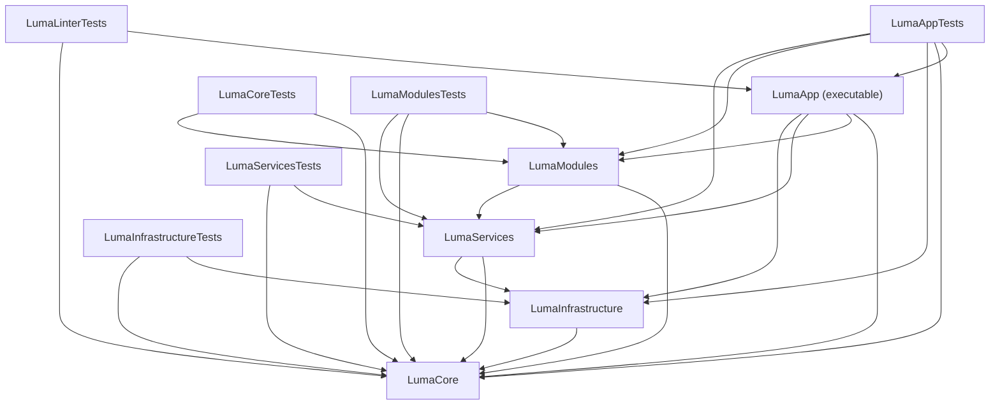
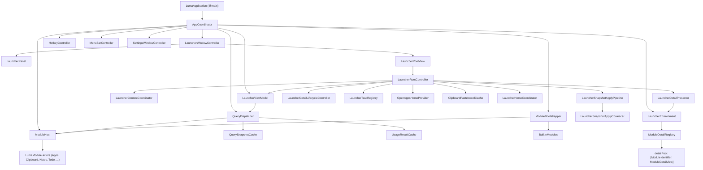
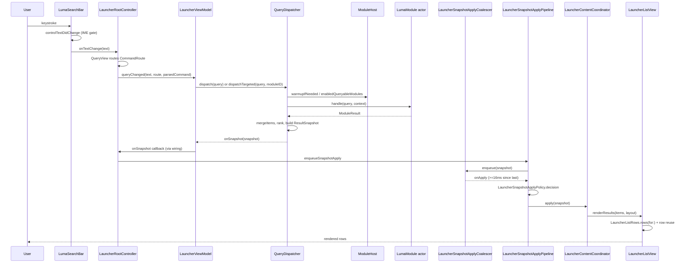
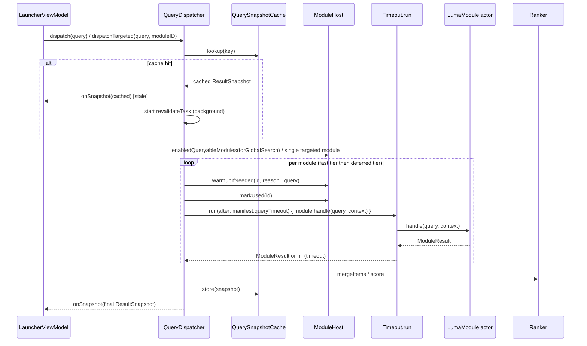
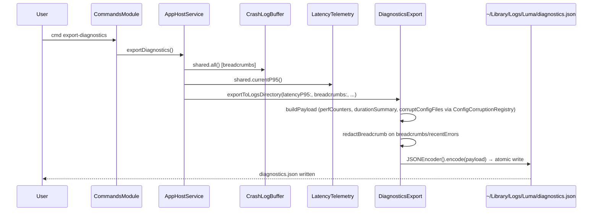

# Architecture Map

## Scope

This file documents the **current, as-built** architecture of Luma as of 2026-07-06. It is Phase 1 output following Phase 0 (`CURRENT_STATE.md`).

- This file describes **facts observable in the current code and docs**, with file path references (and line numbers where practical).
- This file does **not** propose refactors, does **not** fix bugs, and does **not** change source code or tests.
- Where code and documentation (`docs/ENGINEERING.md`, `docs/DECISIONS.md`, `docs/MODULES.md`, `docs/PERMISSIONS.md`) disagree, both are recorded as "Doc says" / "Code fact" without a ruling on which is correct.
- Where a chain could not be fully traced within the scope of this investigation, this is stated explicitly as "Not confirmed from the reading done for this report."
- No value judgments ("this is bad design", "this should be refactored") are included.

## Inputs

Files read directly for this report:

- `/Users/diaoyuxuan/Luma/CURRENT_STATE.md`
- `/Users/diaoyuxuan/Luma/Package.swift`
- `/Users/diaoyuxuan/Luma/README.md`
- `/Users/diaoyuxuan/Luma/docs/ENGINEERING.md`
- `/Users/diaoyuxuan/Luma/docs/DECISIONS.md`
- `/Users/diaoyuxuan/Luma/docs/MODULES.md`
- `/Users/diaoyuxuan/Luma/docs/QA.md`
- `/Users/diaoyuxuan/Luma/docs/PERMISSIONS.md`
- `/Users/diaoyuxuan/Luma/docs/swift6-appkit-boundaries.md`
- Directory listings of `Sources/LumaApp/**`, `Sources/LumaCore/**`, `Sources/LumaModules/**`, `Sources/LumaServices/**`, `Sources/LumaInfrastructure/**`, `Tests/**`, `scripts/**`, `docs/**`
- `Sources/LumaCore/Util/DiagnosticsExport.swift`, `Sources/LumaCore/Util/CrashLogRecording.swift`, `Sources/LumaInfrastructure/CrashLogBuffer.swift`, `Sources/LumaCore/Persistence/JSONConfigPersistence.swift` (read directly to cross-check subagent findings)
- `Sources/LumaModules/Clipboard/ClipboardHistoryStore.swift` (quarantine logic, grep-scoped)
- Filesystem probe of `~/Library/Application Support/Luma/` (see Known Unknowns / Links Back To Current State)
- Deep-dive investigations of app startup, hotkey show/hide, query dispatch, module contract, detail lifecycle, configuration/diagnostics, async task/cache ownership, and test coverage were performed by four read-only sub-investigations against the live source tree; their file:line citations are folded into the sections below and were partially cross-verified directly.

Phase 0 conclusions carried forward (from `CURRENT_STATE.md`, not re-verified here except where noted):

- `swift build` passed.
- `swift test --filter LumaAppTests` failed at `launcherFlowHarnessReplaysQuery`, assertion at `Tests/LumaAppTests/Flow/LauncherFlowHarness.swift:101` (`(harness.lastSnapshot?.items.isEmpty ?? true) == false`).
- `swift test --filter LumaCoreTests` passed (317 tests).
- `swift test --filter LumaModulesTests.simulatedUserTouchesEveryRequestedFeature` and `swift test --filter LumaModulesTests.appsModuleTopTargetedQueryStaysUnderBudget` passed.
- No running `Luma.app` process was found at snapshot time.
- `~/Library/Logs/Luma/diagnostics.json` and `~/Library/Logs/Luma/crash-log.txt` are missing; `~/Library/Logs/Luma/latency-report.json` exists with `hotkeyP95Milliseconds` ≈ 8344.97, `keystrokeP95Milliseconds` ≈ 19.13, `combinedP95Milliseconds` ≈ 8207.15.
- Three `Luma-*.ips` crash reports exist for 2026-07-06 in `~/Library/Logs/DiagnosticReports/`, with `SIGSEGV` and `SIGABRT` signals.
- The workspace has pre-existing uncommitted changes to `Sources/LumaApp/Launcher/LauncherListView.swift` and `scripts/scan_appkit_executor_risk.sh` of unknown origin; this report does not touch those files.

---

## Package And Target Graph

### Facts from `Package.swift`

Swift tools version 6.0, macOS 14+ platform, `defaultLocalization: "en"` (`Package.swift:1-8`).

**Products** (`Package.swift:9-15`):

| Product | Type | Target(s) |
| --- | --- | --- |
| `Luma` | executable | `LumaApp` |
| `LumaCore` | library | `LumaCore` |
| `LumaModules` | library | `LumaModules` |
| `LumaServices` | library | `LumaServices` |
| `LumaInfrastructure` | library | `LumaInfrastructure` |

**Targets and dependencies** (`Package.swift:17-70`):

| Target | Kind | Depends on | Notes |
| --- | --- | --- | --- |
| `LumaApp` | executable target | `LumaCore`, `LumaModules`, `LumaServices`, `LumaInfrastructure` | |
| `LumaCore` | target | (none) | Has `resources: [.process("Resources")]` |
| `LumaModules` | target | `LumaCore`, `LumaServices` | |
| `LumaServices` | target | `LumaCore`, `LumaInfrastructure` | Links `Translation`, `EventKit`, `AVFoundation`, `UserNotifications` frameworks on macOS |
| `LumaInfrastructure` | target | `LumaCore` | |
| `LumaCoreTests` | test target | `LumaCore`, `LumaModules` | |
| `LumaModulesTests` | test target | `LumaModules`, `LumaCore`, `LumaServices` | |
| `LumaInfrastructureTests` | test target | `LumaInfrastructure`, `LumaCore` | |
| `LumaServicesTests` | test target | `LumaServices`, `LumaCore` | |
| `LumaAppTests` | test target | `LumaApp`, `LumaCore`, `LumaInfrastructure`, `LumaModules`, `LumaServices` | |
| `LumaLinterTests` | test target | `LumaApp`, `LumaCore` | |

Note: `LumaCoreTests` depends on `LumaModules` even though `LumaCore` itself has no dependencies — i.e. some `LumaCore`-focused tests exercise built-in modules (`Package.swift:46-48`).

### Documented layer ownership (`docs/ENGINEERING.md:34-44`)

| Layer | Owns (per docs) | Must not own (per docs) |
| --- | --- | --- |
| `LumaApp` | App lifecycle, AppKit launcher, detail views, hotkey, settings | Module business logic |
| `LumaCore` | Protocols, models, query, ranking, actions, persistence helpers, design tokens | AppKit detail implementations |
| `LumaModules` | Built-in module actors, module stores/indexes, module actions | Launcher view hierarchy |
| `LumaServices` | System API wrappers for AX, CGWindow, EventKit, Keychain, AppleScript, processes | Product routing |
| `LumaInfrastructure` | Logging, metrics, configuration | User-facing flows |

**Code fact / cross-check**: several file names exist in **both** `LumaCore` and `LumaInfrastructure` with different contents:

- `LauncherPerfCounters.swift` and `LauncherDurationRecorder.swift` exist at `Sources/LumaCore/Metrics/` (full implementation) **and** `Sources/LumaInfrastructure/Metrics/` (the `LumaInfrastructure` copies are `public typealias LauncherPerfCounters = LumaCore.LauncherPerfCounters` / `public typealias LauncherDurationRecorder = LumaCore.LauncherDurationRecorder` — i.e. re-exports, not separate implementations).
- `Signposter.swift` exists **only** under `Sources/LumaInfrastructure/Metrics/Signposter.swift` (defines `LumaMetrics` with `OSSignposter`); there is no `LumaCore` counterpart.
- Diagnostics/crash-log logic (`DiagnosticsExport.swift`, `CrashLogRecording.swift`) lives under `Sources/LumaCore/Util/`, while `CrashLogBuffer.swift` (the actor that actually persists to disk) lives under `Sources/LumaInfrastructure/`. Doc text (`docs/ENGINEERING.md:180`, `docs/PERMISSIONS.md:26-29`) attributes "diagnostics/logging" to `LumaInfrastructure`, but the payload/redaction structures (`DiagnosticsPayload`, `DiagnosticsExport`) are defined in `LumaCore`.

### Target dependency graph



---

## Source Tree Responsibilities

Facts are directory-listing level (what kinds of files/types exist), not full-content audits, except where a section below dives deeper.

### `Sources/LumaApp`

| Subdirectory | Content observed |
| --- | --- |
| `App/` | `LumaApp.swift` (entry), `AppCoordinator.swift`, `ModuleBootstrapper.swift`, `MenuBarController.swift`, `LumaMenuBarIcon.swift`, `SettingsCoordinator.swift`, `Hotkey/` (`HotkeyController.swift`, `HotkeyConfig.swift`, `KeyCombo.swift`) |
| `Composition/` | `LauncherEnvironment.swift`, `ModuleDetailRegistry.swift`, `PanelSignalsCache.swift`, `LauncherPanelSignalsLoader.swift`, `ProjectsModuleMatcher.swift`, `DefaultWorkbenchCaptureService.swift`, `WorkbenchCaptureRunner.swift`, `WorkbenchCommandExecutor.swift`, `WorkbenchContextBuilder.swift` |
| `Design/` | `ColorTokens.swift`, `GeekStyleTokens.swift`, `TypographyTokens.swift` |
| `Infrastructure/` | `AppHostService.swift`, `AppLauncherUIService.swift`, `HomeLatencyTracker.swift`, `IconCache.swift`, `LatencyHUD.swift`, `LumaNotificationCenter.swift`, `LumaStandardEditShortcuts.swift`, `LumaWindow.swift`, `ModuleDetailReloadRouter.swift`, `SystemResourceSampler.swift` |
| `Launcher/` | Largest subtree: `LauncherRootController.swift`, `LauncherRootView.swift`, `LauncherViewModel.swift`, `LumaSearchBar.swift`, `QueryView.swift`, `LauncherListView.swift`, `LauncherListRow.swift`, `LauncherContentCoordinator.swift`, `LauncherPanel.swift`, `LauncherPanelChrome.swift`, `LauncherWindowController.swift`, `LauncherSnapshotApplyCoalescer.swift`, all per-module `*DetailView.swift` files (Clipboard, Notes, Todo, Translate, Wordbook, Snippets, Secrets, Media, Projects, Quicklinks, CurrentProject), `BaseDetailContainer.swift`, `ModuleDetailView.swift`, `HomeProviders/` (`OpenAppsHomeProvider.swift`, `ClipboardPasteboardCache.swift`, `LauncherHomeCoordinator.swift`), `Session/` (`LauncherDetailPresenter.swift`, `LauncherDetailLifecycleController.swift`, `LauncherKeyboardDispatcher.swift`, `LauncherSessionEffectApplier.swift`, `LauncherSnapshotApplyPipeline.swift`, `LauncherTaskRegistry.swift`) |
| `Settings/` | `SettingsSwiftUIView.swift`, `SettingsWindowController.swift`, `ActivitySettingsView.swift`, `SettingsFolderPicker.swift` |
| `UI/` | `LumaPresentationScreen.swift` |

### `Sources/LumaCore`

Subdirectories observed: `Actions/`, `Commands/`, `Context/`, `Design/`, `Diagnostics/` (`LumaDiagnostics.swift`), `Features/`, `Home/` (largest — launcher state/policy types: `LauncherContentMode`-adjacent `LauncherKeyRouter.swift`, `LauncherHomeAggregator.swift`, `LauncherSnapshotApplyPolicy.swift`, `LauncherDetailExitPlanner.swift`, `LauncherEscapePlanner.swift`, `LauncherPanelVisibilitySession.swift`, `LauncherSearchDetailMode.swift`, `NotesDetailRefreshGate.swift`, etc.), `Launcher/` (`LauncherQueryDispatchPolicy.swift`, `LauncherRuntimeState.swift`, `LauncherQueryLimits.swift`, `LauncherActionPanelInvalidationPolicy.swift`, `Session/LauncherSessionState.swift`), `Localization/`, `Metrics/` (`LauncherDurationRecorder.swift`, `LauncherPerfCounters.swift`), `Models/`, `Modules/` (`LumaModule.swift`, `ModuleHost.swift`, `ModuleContext.swift`, `ModuleBundle.swift`, `WarmupTier.swift`, `Timeout.swift`, `PlatformClients.swift`, client protocol files), `Persistence/` (`JSONConfigPersistence.swift`, `JSONFileStore.swift`, `ConfigCorruptionRegistry.swift`), `Query/` (`Query.swift`, `QueryDispatcher.swift`, `QuerySnapshotCache.swift`), `Ranking/`, `Resources/`, `Results/` (`ResultItem.swift`, `ModuleDiagnosticResults.swift`, `PermissionResultBuilder.swift`), `Security/`, `Util/` (`CancellationGeneration.swift`, `DiagnosticsExport.swift`, `CrashLogRecording.swift`, `CacheTTL.swift`, `StringNormalization.swift`), `Workbench/`.

### `Sources/LumaModules`

One subdirectory per built-in module (`Apps/`, `BrowserTabs/`, `Clipboard/`, `Commands/`, `KillProcess/`, `Media/`, `MenuItems/`, `Notes/`, `Projects/`, `Quicklinks/`, `Secrets/`, `Snippets/`, `Todo/`, `Translate/`, `WindowLayouts/`, `Windows/`, `Wordbook/`, `Workbench/`), each generally containing a `*Module.swift` (actor implementing `LumaModule`), a `*ModuleBundle.swift` (manifest/bundle wiring), an `*Action.swift`, and module-specific store/index files. Top-level files: `BuiltInModules.swift`, `ModuleRegistry.swift`, `BuiltInCommandRegistry.swift`, `FeatureCatalog.swift`, `LauncherSharedState.swift`, `ModuleHelp.swift`, `ModuleIdentifiers.swift`, `ModuleSearchHints.swift`.

### `Sources/LumaServices`

Subdirectories: `Accessibility/` (`AXService.swift` and window/menu/selection helpers), `BrowserTabs/` (`AppleScriptRunner.swift`, `BrowserAdapter.swift`, `BrowserTabsService.swift`, `ChromiumAdapter.swift`, `SafariAdapter.swift`), `EventKit/` (`RemindersService.swift`), `FileSystem/` (`FSEventsService.swift`), `Pasteboard/` (`ClipboardSnapshotService.swift`, `PasteboardService.swift`), `Persistence/` (`ApplicationSupportPaths.swift`), `Process/` (`NotificationService.swift`, `ProcessMemorySampler.swift`, `RunningProcessService.swift`, `ScriptRunnerService.swift`), `Speech/`, `Translation/`, `Workspace/` (`RunningApplicationsCache.swift`, `WorkspaceService.swift`).

### `Sources/LumaInfrastructure`

`Configuration/Configuration.swift`, `Logging/Log.swift`, `CrashLogBuffer.swift` (top level), `Metrics/` (`LauncherDurationRecorder.swift`, `LauncherPerfCounters.swift` as re-export typealiases, plus `Signposter.swift`).

### `Tests/*`

| Directory | Count observed | Notable groupings |
| --- | --- | --- |
| `Tests/LumaCoreTests` | ~62 files | Query dispatch, snapshot/cache, launcher home/session policies, persistence, ranking, workbench |
| `Tests/LumaAppTests` | ~24 files + `Flow/` subdir | Hotkey, panel show/hide, detail hierarchy, IME, permission banner, snapshot apply coalescing |
| `Tests/LumaModulesTests` | ~62 files | Per-module contract/integration/performance tests |
| `Tests/LumaServicesTests` | 10 files | Browser tabs, current project, FSEvents, process sampling, running apps |
| `Tests/LumaInfrastructureTests` | 3 files | Configuration store, crash log redaction, perf counters |
| `Tests/LumaLinterTests` | 2 files | Source-level wiring linters (`LauncherWiringLinterTests.swift`, `ModuleDisableWiringTests.swift`) |

### `scripts/*`

`build_app.sh`, `install_launchd.sh`, `install_local_codesign_cert.sh`, `measure_cold_start.sh`, `qa/` (subdirectory), `release/` (subdirectory, contains `common.sh` referenced by `build_app.sh` but not read in this report), `repair_accessibility_permission.sh`, `run_recorded_review.sh`, `scan_appkit_executor_risk.sh`, `test_unit.sh`, `uninstall_launchd.sh`, `verify_manual_qa.sh`, `verify_notes_portability.sh`.

### `docs/*`

`ENGINEERING.md`, `DECISIONS.md`, `MODULES.md`, `QA.md`, `PERMISSIONS.md`, `swift6-appkit-boundaries.md`; `docs/adr/`, `docs/qa/`, `docs/specs/` exist as **empty directories** (no tracked files found by directory listing).

---

## Runtime Object Graph

Core long-lived objects and their creation relationship, as traced through `Sources/LumaApp/App/AppCoordinator.swift` and related files:

- `LumaApplication` (`@main`, `Sources/LumaApp/App/LumaApp.swift:7-9`) creates `AppCoordinator` in `applicationDidFinishLaunching` (`LumaApp.swift:20-22`).
- `AppCoordinator` has eagerly-initialized stored properties (constructed synchronously as part of `AppCoordinator`'s own initialization, e.g. `LauncherWindowController()`, `LumaLogger()`, `LumaMetrics()`, `ApplicationSupportPaths()`, `PasteboardService()`, `AXService()`, `WorkspaceService()`, `FSEventsService()`, `ConfigurationStore()`, `ModuleDetailReloadRouter()`, `RemindersService()`, `ScriptRunnerService()`, `ProjectsModule()`, a selection-snapshot client adapter — `AppCoordinator.swift:10-42`) and `lazy` properties resolved on first access (`translation`, `clipboardSnapshotService`, `launcherUIService`, `menuBarTreeService`, `context`, `host` (`ModuleHost`), `dispatcher` (`QueryDispatcher`), `actionExecutor`, `viewModel` (`LauncherViewModel`), `openAppsProvider`, per-module actors, `homeCoordinator` — `AppCoordinator.swift:22-120`).
- `AppCoordinator.start()` constructs `SettingsCoordinator`-derived `settingsWindowController`, `MenuBarController`, registers the hotkey via `HotkeyController`, constructs `LauncherEnvironment` and calls `install()`, calls `windowController.configure(...)` (wiring `LauncherRootView`/`LauncherRootController` into the pre-built panel), then kicks off `ModuleBootstrapper.registerAndWarmup(...)` as an async `Task`.
- `LauncherWindowController` owns `LauncherPanel` (an `NSPanel` subclass, constructed at `LauncherWindowController` init time) and, after `configure`, a `LauncherRootView`.
- `LauncherRootView` lazily constructs `LauncherRootController` on first access and calls `controller.showHome(persist: false)`.
- `LauncherRootController` owns `LauncherViewModel` reference (via `AppCoordinator`), `LauncherContentCoordinator`, `LauncherSnapshotApplyPipeline` (which wraps `LauncherSnapshotApplyCoalescer`), `LauncherDetailPresenter`/`LauncherDetailLifecycleController` (`Session/` types), `LauncherTaskRegistry`, and home providers (`OpenAppsHomeProvider`, `ClipboardPasteboardCache`, `LauncherHomeCoordinator`).
- `LauncherViewModel` owns/uses `QueryDispatcher`, which owns `ModuleHost`, `QuerySnapshotCache`, `UsageResultCache`.
- `ModuleHost` registers and holds all `LumaModule` actor instances assembled by `BuiltInModules.makeAll(...)` (`Sources/LumaModules/BuiltInModules.swift`).
- `LauncherEnvironment` (a `@MainActor` singleton-style object set via `static weak var current`) holds callback closures and references to several module instances/services used by detail views (`ModuleDetailRegistry`, `clipboardModule`, `notesModule`, `snippetsModule`, `secretsModule`, `mediaModule`, `todoModule`, `wordbookStore`, `projectsModule`, `quicklinksModule`, `translation`, `config`, `accessibility`).
- `ModuleDetailRegistry` (owned via `LauncherEnvironment`) holds a pool of instantiated detail views (`detailPool: [ModuleIdentifier: any ModuleDetailView]`).



**Not confirmed from the reading done for this report**: whether `LauncherEnvironment` constitutes a formal dependency-injection framework, or is simply a hand-written aggregate of callbacks and references (`Sources/LumaApp/Composition/LauncherEnvironment.swift`).

---

## App Startup Flow

Traced through `Sources/LumaApp/App/LumaApp.swift`, `AppCoordinator.swift`, `ModuleBootstrapper.swift`, `Composition/LauncherEnvironment.swift`, `Launcher/LauncherWindowController.swift`, `Launcher/LauncherRootController.swift`, `App/MenuBarController.swift`, `App/LumaMenuBarIcon.swift`, `App/SettingsCoordinator.swift`.

1. **App entry**: `@main` is on `LumaApplication` (`Sources/LumaApp/App/LumaApp.swift:7-9`). A custom `main()` creates `NSApplication.shared`, sets the delegate, sets `setActivationPolicy(.accessory)`, and calls `app.run()` (`LumaApp.swift:12-17`).
2. **`applicationDidFinishLaunching`** (`LumaApp.swift:20-22`) creates `AppCoordinator()` and calls `.start()`.
3. **`AppCoordinator` construction**: stored properties construct several services/controllers synchronously, including `LauncherWindowController()` (`AppCoordinator.swift:10`); the explicit `init()` body calls `CurrentProjectService.bootstrap(...)` and `CrashLogRecording.setHandler { CrashLogBuffer.shared.record($0) }` (`AppCoordinator.swift:44-48`).
4. **`AppCoordinator.start()`** (large method, `AppCoordinator.swift` roughly lines 90-450) performs, in this order (per sub-investigation citations):
   - Constructs `settingsWindowController` via `SettingsCoordinator(...).makeWindowController(...)` (`AppCoordinator.swift:141-213`).
   - Constructs `AppHostService`/host client wiring (`AppCoordinator.swift:128-132` region).
   - Constructs `MenuBarController` with `onShow`/`onSettings` callbacks (`AppCoordinator.swift:242-248`).
   - Registers the global hotkey via `hotkeyController.register(HotkeyConfig.load())` (`AppCoordinator.swift:249-254`).
   - Constructs `LauncherEnvironment` (assembling module references and callbacks) and calls `launcherEnv.install()` (`AppCoordinator.swift:311-403`, install happens after this block per sub-investigation citation `:405-421`).
   - Calls `windowController.configure(...)`, which creates `LauncherRootView` (hosting `LauncherRootController` lazily) and attaches it into the already-existing `LauncherPanel`'s content host (`LauncherWindowController.swift:69-111`).
   - Starts `Task { await ModuleBootstrapper.registerAndWarmup(...) }` (`AppCoordinator.swift:422-447`), passing `host`, `config`, the module list from `BuiltInModules.makeAll(overrides:)`, `processMemorySampler`, and callbacks `onModulesReady` (→ `windowController.setModulesReady(true)`) and `onMemoryPressureReady` (→ `installMemoryPressureHandler()`).
5. **`ModuleBootstrapper.registerAndWarmup`** (`Sources/LumaApp/App/ModuleBootstrapper.swift`) runs, per sub-investigation citations:
   - `await config.migrateIfNeeded()` (`:18`)
   - Registers each module: `for module in modules { await host.register(module) }` (`:19-21`)
   - Reads `enabledModules()`, `pinnedModuleIDs()`, `warmupPolicy()` from config (`:22-24`)
   - `host.configureWarmupPolicy(pinned:)`, `host.configureGlobalSearchModuleIDs(...)`, `host.applyEnabledSet(enabled)` (`:25-27`)
   - `host.warmupIfNeeded(ids: pinned ∩ enabled, reason: .startup)` (`:29-30`)
   - Calls `onModulesReady()` (`:31`)
   - Starts `processMemorySampler.start()` in a `Task` (`:32-34`)
   - If `policy == .eagerAllEnabled`, calls `host.warmupRemainingEnabled()` (`:36-38`)
   - Calls `onMemoryPressureReady()` (`:39`)
6. **Panel pre-instantiation**: `LauncherPanel` is created as part of `AppCoordinator`'s stored-property initialization chain (`AppCoordinator.swift:10`, via `LauncherWindowController`'s own `private let panel = LauncherPanel()` at `LauncherWindowController.swift:9`), and `LauncherWindowController.init` immediately calls `panel.orderOut(nil)` (`LauncherWindowController.swift:38`) — i.e. the panel object exists (and is hidden) well before `LauncherRootView`/`LauncherRootController` are attached in step 4's `configure` call.
   - **Doc says** (`docs/DECISIONS.md` D-002, `docs/ENGINEERING.md:163`): "Pre-instantiate the launcher panel at app launch."
   - **Code fact**: consistent — the `NSPanel`-backed `LauncherPanel` object is constructed as part of `AppCoordinator`'s synchronous init chain, before `applicationDidFinishLaunching`'s `start()` runs the rest of the startup sequence.
7. **Menu bar / Settings wiring**: `MenuBarController`'s `onShow` closure calls `windowController.show()`; its `onSettings` closure calls `hideImmediatelyForAction()` then `settingsWindowController?.show()` (`AppCoordinator.swift:243-247`). `MenuBarController` builds an `NSStatusBar.system.statusItem` with Show / Settings / About / Quit menu items (`MenuBarController.swift:5-6,59-64`) and renders its icon via `LumaMenuBarIcon.make(state:)`, where `State` is `.normal` / `.vaultLocked` / `.vaultUnlocked` / `.hotkeyWarning` (`LumaMenuBarIcon.swift:4-10`). `AppCoordinator` calls `markHotkeyOK()` / `markHotkeyFailed()` after hotkey registration succeeds/fails (`AppCoordinator.swift:256-257,271,492,496`).
8. **`build_app.sh` (documented script behavior only, not verified at runtime)**: per script content, `set -euo pipefail`; sources `scripts/release/common.sh`; `APP_DIR="$ROOT/build/Luma.app"`; default `RESTART_AFTER_BUILD=1` (overridable with `--no-restart` / `--restart`); if restart is enabled, runs `pkill -x Luma || true` before building; calls `luma_swift_build_release "$ROOT"` then `luma_assemble_app "$ROOT" "$APP_DIR"`; prints "Built and signed: $APP_DIR"; if restart enabled, runs `open "$APP_DIR"` and prints "Restarted Luma". **Not confirmed from the reading done for this report**: the internal implementation of `luma_swift_build_release` / `luma_assemble_app` (defined in `scripts/release/common.sh`, not read for this report).

---

## Hotkey Show/Hide Flow

Traced through `Sources/LumaApp/App/Hotkey/HotkeyController.swift`, `HotkeyConfig.swift`, `KeyCombo.swift`, `AppCoordinator.swift`, `LauncherWindowController.swift`, `LauncherPanel.swift`, `Sources/LumaCore/Home/LauncherPanelVisibilitySession.swift`, and related metrics/test files.

### Registration

- `HotkeyController.register(_ combo: KeyCombo)` first calls `unregister()`, then calls Carbon's `RegisterEventHotKey(combo.virtualKeyCode, combo.carbonModifiers, hotkeyID, GetEventDispatcherTarget(), 0, &ref)` (`HotkeyController.swift:29-49`).
- Default combo is Space (keycode 49) + `cmdKey` (`HotkeyConfig.swift:4-5`).
- `AppCoordinator.start()` calls `try hotkeyController.register(HotkeyConfig.load())` (`AppCoordinator.swift:249-254`); re-registration happens on `activeSpaceDidChangeNotification` via `reRegisterHotkey()` (`AppCoordinator.swift:274-281,487-497`).

### Carbon callback bridging

- A C function `lumaHotKeyEventHandler` handles `kEventHotKeyPressed` (`HotkeyController.swift:6-14`), extracts an `Unmanaged<HotkeyController>` from `userData`, and calls `schedulePress()` (`:11-12`).
- `schedulePress()` is `nonisolated` and hops to MainActor: `Task { @MainActor [weak self] in self?.onPress() }` (`HotkeyController.swift:63-66`).
- `AppCoordinator` supplies `onPress = { self?.windowController.showFromCarbonHotkey() }` (`AppCoordinator.swift:250-251`).

### Visibility state ownership

- The authoritative visibility state lives in `LauncherWindowController`'s `visibilitySession: LauncherPanelVisibilitySession` (`LauncherWindowController.swift:16`); `isPanelVisible` reads `visibilitySession.isVisible` (`:24`).
- `LauncherPanelVisibilitySession.isVisible` is set `true` in `beginShow()` and `false` in `beginHide()` (`Sources/LumaCore/Home/LauncherPanelVisibilitySession.swift:9,15-27`).
- `LauncherPanel.performKeyEquivalent` separately checks AppKit's own `panel.isVisible` as a guard (`LauncherPanel.swift:146`).

### Two show/hide paths (per `docs/ENGINEERING.md:87-89`, confirmed in code)

**Path A — Carbon hotkey, only acts when hidden:**

```
lumaHotKeyEventHandler → HotkeyController.schedulePress() → onPress()
  → LauncherWindowController.showFromCarbonHotkey()
      guard !visibilitySession.isVisible else { return }   (LauncherWindowController.swift:177)
      120 ms debounce via lastCarbonShowAt                  (:179-182)
      → show()
```

**Path B — `LauncherPanel.performKeyEquivalent`, only acts when visible:**

```
LauncherPanel.performKeyEquivalent(with:)
  guard HotkeyConfig matches && isVisible                   (LauncherPanel.swift:145-146)
  → Task { onToggleHotkey?() }
    → LauncherWindowController.hideFromVisibleHotkey()
        guard visibilitySession.isVisible                   (:188)
        120 ms debounce via lastPanelHideAt                 (:190-193)
        → hide()
```

A third method, `toggle()`, exists with its own 120 ms debounce (`lastToggleAt`, `LauncherWindowController.swift:166-173`), but **not confirmed from the reading done for this report** whether any production hotkey path calls `toggle()` (Carbon and `performKeyEquivalent` paths call `showFromCarbonHotkey`/`hideFromVisibleHotkey` directly, not `toggle()`).

### `show()` steps (per sub-investigation citations, `LauncherWindowController.swift`)

`cancelDeferredShowWork()` → `cancelPanelHideAnimation()` → `visibilitySession.beginShow()` (bumps generation) → `onWillShow?()` → `HomeLatencyTracker.markHotkey()` → `positionPanel()` (`panel.position(on:)`) → `LauncherMenuTarget.set(bundleID:)` → `NSApp.activate` / `panel.orderFrontRegardless()` / `panel.makeKey()` → async (main queue) `focusSearchFieldAfterShow` (generation-guarded) → async-after 0.075 s deferred show work (permission polling, session restore, etc., also generation-guarded).

`focusSearchFieldAfterShow` calls `activatePanelForQueryApply()` on `LauncherRootController` (sets `isPanelActiveForQueryApply = true`).

**`show()` does not call** `cancelLauncherAsyncWork()` or `cancelActiveQueryAndSnapshotApply()` per the sub-investigation's reading of `LauncherWindowController.swift:197-237`.

### `hide()` steps

`visibilitySession.beginHide()` → `LauncherPerfCounters.increment(.panelHide)` → `cancelDeferredShowWork()` → `rootView?.cancelActiveQueryAndSnapshotApply()` → `rootView?.cancelPendingRestore()` → alpha fade animation (tracked via `panelHideTask`) → `finishHide(generationAtHide:)` (guarded by `shouldCompleteHide`) → `panel.orderOut(nil)`.

### Debounce / generation guards

| Mechanism | Purpose | Location |
| --- | --- | --- |
| `lastCarbonShowAt` + 120 ms | Debounce Carbon show | `LauncherWindowController.swift:19,179-182` |
| `lastPanelHideAt` + 120 ms | Debounce visible-hotkey hide | `LauncherWindowController.swift:20,190-193` |
| `lastToggleAt` + 120 ms | Debounce `toggle()` | `LauncherWindowController.swift:18,168-171` |
| `LauncherPanelVisibilitySession` generation | `beginShow`/`beginHide` bump a generation; `shouldCompleteDeferredShow`/`shouldCompleteHide` reject stale async completions | `Sources/LumaCore/Home/LauncherPanelVisibilitySession.swift:8-36` |
| `CancellationGeneration` (`homeRefreshGeneration`, `restoreGeneration`) | Cancels stale home refresh / session restore | `LauncherRootController.swift:43,78`; `Sources/LumaCore/Util/CancellationGeneration.swift:4-19` |
| `cancelPanelHideAnimation()` | Lets a rapid show cancel an in-flight hide animation | `LauncherWindowController.swift:245-254` |

### Async cancellation on show/hide

| Function | Defined | Called on hide | Called on show |
| --- | --- | --- | --- |
| `cancelLauncherAsyncWork()` | `LauncherRootController.swift:479-499` | Indirectly via `cancelActiveQueryAndSnapshotApply()` | No |
| `cancelActiveQueryAndSnapshotApply()` | `LauncherRootController.swift:502-509` | `hide()` and `hideImmediatelyForAction()` | No |
| `cancelPendingRestore()` | `LauncherRootController.swift:473-476` | `hide()` and `hideImmediatelyForAction()` | No |
| `cancelDeferredShowWork()` | `LauncherWindowController.swift:239-242` | `hide()`, `hideImmediatelyForAction()` | `show()` |
| `cancelPanelHideAnimation()` | `LauncherWindowController.swift:245-254` | — | `show()` |

`cancelActiveQueryAndSnapshotApply()` additionally sets `isPanelActiveForQueryApply = false` and applies a `panelHideBegan` session event; `activatePanelForQueryApply()` (called from `focusSearchFieldAfterShow`) re-enables it on show.

- **Doc says** (`docs/ENGINEERING.md:79-80`): describes `cancelLauncherAsyncWork()` as cancelling in-flight query dispatch, snapshot apply, home refresh, permission refresh, workbench preview, action panel, and detail presentation generation, without changing `isPanelActiveForQueryApply` itself; and `cancelActiveQueryAndSnapshotApply()` as the hide-specific wrapper that also flips `isPanelActiveForQueryApply`.
- **Code fact**: consistent with the call graph above.

### Metrics fields

- `LauncherPerfCounters.Key` (defined in `Sources/LumaCore/Metrics/LauncherPerfCounters.swift`, re-exported from `LumaInfrastructure`) includes keys such as `layout.panel`, `layout.hint`, `permission.refresh`, `session.persist`, `snapshot.apply`, `detail.viewMade`, `home.snapshot`, `openApps.refresh`, `snapshot.applyCoalesced`, `detail.open`, `back.home`, `query.cancelOnHide`, `snapshot.applyDropped`, `panel.hide`, `module.warmupStarted/Finished/TimedOut`, `module.handleCold`, `cache.query.hit/miss`.
- `LauncherDurationRecorder.Category` includes `module.warmup`, `module.handle`, `action.perform`, `panel.hide`; `exportSummary()` produces keys like `"<category>.<key>.p95"`.
- `~/Library/Logs/Luma/latency-report.json` is written by `LatencyTelemetry.exportReport()` in `Sources/LumaApp/Infrastructure/LatencyHUD.swift`, with fields `generatedAt`, `hotkeyP95Milliseconds` (from `hotkeySamples`), `keystrokeP95Milliseconds` (from `keystrokeSamples`), `combinedP95Milliseconds` (p95 over the merged sample set), `hotkeySampleCount`, `keystrokeSampleCount`, `hotkeySamples`, `keystrokeSamples`.
- Hotkey samples are recorded via `HomeLatencyTracker.markHotkey()` (called in `show()`, `LauncherWindowController.swift:203`) and via first-paint marking in `LauncherRootController`'s snapshot-applied callback (`LauncherRootController.swift:551-552`).
- **Code fact**: `LauncherPerfCounters` / `LauncherDurationRecorder` key names (e.g. `panel.hide.panel.p95`) do **not** share names with `latency-report.json`'s `hotkeyP95Milliseconds` etc. — the two metrics systems (`LauncherPerfCounters`/`LauncherDurationRecorder` vs. `LatencyTelemetry`) are separate. This report does not diagnose why the observed hotkey p95 is ~8.3 s; it only records which counters/recorders exist and where they are read/written. See "Links Back To Current State" below.
- `Signposter`/`LumaMetrics.mark` (`Sources/LumaInfrastructure/Metrics/Signposter.swift`) is defined but **not confirmed from the reading done for this report** to be invoked on the hotkey show/hide hot path.

```mermaid
sequenceDiagram
    participant Carbon as Carbon RegisterEventHotKey
    participant HC as HotkeyController
    participant AC as AppCoordinator
    participant WC as LauncherWindowController
    participant VS as LauncherPanelVisibilitySession
    participant Panel as LauncherPanel (NSPanel)
    participant Root as LauncherRootController

    Note over Carbon,HC: Path A - hotkey pressed while hidden
    Carbon->>HC: lumaHotKeyEventHandler (kEventHotKeyPressed)
    HC->>HC: schedulePress() [nonisolated]
    HC->>AC: Task { @MainActor in onPress() }
    AC->>WC: showFromCarbonHotkey()
    WC->>VS: guard !isVisible
    WC->>WC: 120ms debounce (lastCarbonShowAt)
    WC->>WC: show()
    WC->>WC: cancelDeferredShowWork(); cancelPanelHideAnimation()
    WC->>VS: beginShow() [bump generation]
    WC->>Panel: position(on:); orderFrontRegardless(); makeKey()
    WC->>Root: (async) focusSearchFieldAfterShow, generation-guarded
    Root->>Root: activatePanelForQueryApply() [isPanelActiveForQueryApply = true]

    Note over Panel,Root: Path B - Cmd+Space while visible
    Panel->>Panel: performKeyEquivalent(with:) guard isVisible
    Panel->>WC: Task { onToggleHotkey?() }
    WC->>WC: hideFromVisibleHotkey()
    WC->>VS: guard isVisible
    WC->>WC: 120ms debounce (lastPanelHideAt)
    WC->>WC: hide()
    WC->>VS: beginHide() [bump generation]
    WC->>Root: cancelActiveQueryAndSnapshotApply()
    Root->>Root: cancel query/snapshot tasks; isPanelActiveForQueryApply = false
    WC->>Root: cancelPendingRestore()
    WC->>Panel: alpha fade (panelHideTask)
    WC->>WC: finishHide(generationAtHide:) [guarded by shouldCompleteHide]
    WC->>Panel: orderOut(nil)
```

### Related tests (intent, one line each)

| Test file | Intent |
| --- | --- |
| `Tests/LumaAppTests/HotkeyDoubleFireTests.swift` | Carbon path only shows when hidden; visible-state Carbon press is a no-op; hide/toggle debounce behavior |
| `Tests/LumaAppTests/HotkeyReregisterTests.swift` | `register`/`unregister` toggles `isRegistered` correctly |
| `Tests/LumaAppTests/HotkeyToggleExecutorTests.swift` | `schedulePress()` hops to MainActor before invoking `onPress` |
| `Tests/LumaAppTests/LauncherShowHideStateTests.swift` | Source-level assertions that `LauncherWindowController`/`LauncherRootController` use the visibility session and generation guards |
| `Tests/LumaAppTests/HideDuringSnapshotApplyTests.swift` | Snapshot-apply policy behavior while panel inactive/query empty; hide calls the cancel functions |
| `Tests/LumaAppTests/MultiMonitorRepositionTests.swift` | `LauncherPanelRepositionPolicy.shouldReposition` logic for visible/hidden and frame-changed cases |
| `Tests/LumaCoreTests/LauncherPanelVisibilitySessionTests.swift` | Generation algebra: no-op re-hide, stale deferred-show rejection, rapid show-hide-show |
| `Tests/LumaCoreTests/CancellationGenerationTests.swift` | `bump()` invalidates prior generation values |

---

## Launcher Query-To-Render Flow

Traced through `Sources/LumaApp/Launcher/LumaSearchBar.swift`, `LauncherRootController.swift`, `LauncherViewModel.swift`, `QueryView.swift`, `LauncherListView.swift`, `LauncherListRow.swift`, `LauncherSnapshotApplyCoalescer.swift`, `Session/LauncherSnapshotApplyPipeline.swift`, `Sources/LumaCore/Query/*`, `Sources/LumaCore/Home/*`, and `Tests/LumaAppTests/Flow/LauncherFlowHarness.swift`.

### 1. Input reception

- `LumaSearchBar` acts as an `NSTextFieldDelegate`; `controlTextDidChange(_:)` (`LumaSearchBar.swift:336`) is the per-keystroke entry point.
- `LauncherQueryDispatchPolicy.shouldDispatchQuery(isComposing:)` gates dispatch (`LumaSearchBar.swift:343-347`; policy body at `Sources/LumaCore/Launcher/LauncherQueryDispatchPolicy.swift:6-8`) — while `isComposing` (IME marked text), dispatch is suppressed.
- On composition end, `controlTextDidEndEditing` re-dispatches (`LumaSearchBar.swift:350-356`); a 200 ms poll (`LauncherRootController.noteSearchTextChangedForQuerySync()` → `syncQueryIfNeeded()` → `handleTextChange`) also exists (`LauncherRootController.swift:279-282,301-308`).
- `searchBar.onTextChange` is wired to `LauncherRootController.handleTextChange(_:)` (`LauncherRootController.swift:148-149,784`).

### 2. Query formation

- `handleTextChange` builds a `CommandRoute` via `QueryView(raw: text, viewModel: viewModel)` (`LauncherRootController.swift:794`; `QueryView.swift:23-40`), then calls `viewModel.queryChanged(text, issuedAt:, route:, parsedCommand:)` (`LauncherRootController.swift:854-855`).
- `LauncherViewModel.queryChanged` constructs `Query(raw: text, sequence: sequence, command: parsed)` (`LauncherViewModel.swift:45`); `Query` is defined at `Sources/LumaCore/Query/Query.swift:3-23` (fields include `normalized`, `tokens`, `sequence`, `command`).
- Pre-dispatch gating in `handleTextChange`: empty query → `viewModel.cancel()`, no dispatch (`:801-811`); `modulesReady == false` → early return (`:814`); global search with `trimmed.count < 2` → `viewModel.cancel()`, no dispatch (`:838-851`); workbench-routed text bypasses `queryChanged` entirely (`:826-835`).

### 3. Dispatch trigger

`LauncherViewModel.queryChanged` (inside a `Task`) routes by `CommandRoute`:

| Route | Behavior |
| --- | --- |
| `.targeted` / `.help(moduleID)` | `dispatcher.dispatchTargeted(query, moduleID:)` (`LauncherViewModel.swift:57,95`) |
| `.globalSearch` | `Task.sleep(12ms)` then `dispatcher.dispatch(query)` (`LauncherViewModel.swift:48-50,103`) |
| `.help(nil)` / `.suggestion` / `.unknownPrefix` | Local `ResultSnapshot` built without touching the dispatcher (`LauncherViewModel.swift:66-92`) |
| `.empty` | No dispatch (`LauncherViewModel.swift:53-54`) |

`QueryDispatcher` entry points: `dispatch(_:onSnapshot:)` (`Sources/LumaCore/Query/QueryDispatcher.swift:26-63`) and `dispatchTargeted(_:moduleID:onSnapshot:)` (`:170-234`).

### 4. Snapshot generation and data structures

| Type | Defined at | Fields |
| --- | --- | --- |
| `ResultSnapshot` | `Sources/LumaCore/Results/ResultItem.swift:79-91` | `querySequence`, `items: [ResultItem]`, `layout: ResultListLayout` |
| `ResultItem` | `ResultItem.swift:32-69` | `id`, `title`, `icon`, `primaryAction`, `rankingHints`, `rowKind`, etc. |
| `ResultListLayout` | `Sources/LumaCore/Commands/CommandListLayout.swift:37-40` | `.flat` / `.sectioned([ResultSection])` |
| `ResultSection` | `CommandListLayout.swift:27-34` | `title`, `items` |
| `LauncherHomeSnapshot` | `Sources/LumaCore/Home/LauncherHomeSection.swift:25-36` | `sections: [LauncherHomeSection]` (home-only) |

Generation path: `LumaModule.handle` → `ModuleResult` → `QueryDispatcher.mergeItems` (ranking via `Ranker`, `QueryDispatcher.swift:254-294` region) → `QueryDispatcher.snapshot(from:sequence:)` (`:245-252`) → `LauncherViewModel.deliver` (truncates to 8, builds layout via `CommandListLayout.build`, `LauncherViewModel.swift:134-145`) → `onSnapshot` callback. Home snapshots come from `LauncherHomeAggregator.snapshot()` (`Sources/LumaCore/Home/LauncherHomeAggregator.swift:10-16`).

### 5. Snapshot apply pipeline and 16 ms coalescing

```
viewModel.onSnapshot
  → LauncherRootController.enqueueSnapshotApply (LauncherRootController.swift:165,936-937)
  → LauncherSnapshotApplyPipeline.enqueue (Session/LauncherSnapshotApplyPipeline.swift:27-28)
  → LauncherSnapshotApplyCoalescer.enqueue (LauncherSnapshotApplyCoalescer.swift:20-37)
  → (after coalescing window) onApply callback
  → LauncherSnapshotApplyPipeline.apply(snapshot:) (:11-13,35-48)
  → LauncherContentCoordinator.apply(snapshot:) (LauncherContentCoordinator.swift:192-198)
```

- `LauncherSnapshotApplyCoalescer` has `interval = .milliseconds(16)` (`LauncherSnapshotApplyCoalescer.swift:9`); when `elapsed < interval` it sleeps before flushing (`:29-33`); `flush()` invokes `onApply` (`:52-57`).
- `LauncherSnapshotApplyPipeline.apply` gates through `LauncherSnapshotApplyPolicy.decision` before forwarding to the content coordinator (`:36-44`); the policy drops applies when `isPanelActive == false` (incrementing a drop counter) or when the visible query is empty (no counter increment) (`Sources/LumaCore/Home/LauncherSnapshotApplyPolicy.swift:16-20`).
- A **separate** 16 ms coalescing interval exists on the query/dispatch side: `QueryDispatcher.performGlobalSearch`'s `snapshotCoalesceInterval = .milliseconds(16)` (`QueryDispatcher.swift:10`), independent of the UI-side coalescer.
- **Doc says** (`docs/ENGINEERING.md:170`): "UI snapshot apply uses the same 16 ms coalescer in `LauncherRootController`."
- **Code fact**: the 16 ms coalescing implementation lives in `LauncherSnapshotApplyCoalescer.swift`, which `LauncherRootController` holds indirectly through a lazily-constructed `snapshotPipeline` property (`LauncherRootController.swift:45-48`); `LauncherRootController` itself does not implement the coalescing logic.

### 6. ResultItem → LauncherListRow mapping

`LauncherContentCoordinator.apply(snapshot:)` → `renderResults` (`LauncherContentCoordinator.swift:192-198`) → `LauncherListView.renderResults(_:layout:)` (`LauncherListView.swift:100-104`) → `LauncherListRows.rows(for:...)` (three overloads: flat items, sectioned, and home snapshot — `Sources/LumaCore/Home/LauncherListRows.swift:18-76`) → `LauncherListView.apply(rows:)` (`:200`) → `makeView(for:)` constructs new `LauncherListRow` instances or calls `LauncherListRow.update(item:...)` on reused rows (`LauncherListView.swift:295-329`; `LauncherListRow.swift:122-128`). Row reuse decisions use `LauncherListRowReuse.canReuseRows`/`canReorderRows` (`Sources/LumaCore/Home/LauncherListRowReuse.swift:5-34`).

### 7. Content mode (home / results / detail)

- `LauncherContentMode` enum (`.home`, `.results`, `.detail(ModuleIdentifier?)`) is defined at `Sources/LumaCore/Home/LauncherKeyRouter.swift:13-31` with computed helpers `showingDetail`, `showingResults`, `detailModuleID`.
- `LauncherContentCoordinator` holds the live `mode` value (`LauncherContentCoordinator.swift:18`), set by `showHome`, `dismissResultsForEmptyQuery`, `resetResults`, `closeDetail` (→ `.home`); `beginShowingResults`, `renderResults` (→ `.results`); `present(_:moduleID:)` (→ `.detail`).
- A separate, narrower routing enum, `QueryView.ResultsRouteKind` (`.empty`, `.workbench`, `.command(CommandRoute)`), classifies raw input before it reaches content-mode logic (`QueryView.swift:7-11`).
- Empty-state copy comes from `SearchEmptyState.message(for:query:registry:)` (`Sources/LumaCore/Home/SearchEmptyState.swift:4-29`), invoked from `handleTextChange` for short global-search queries (`LauncherRootController.swift:843-848`).
- **Doc says** (`docs/ENGINEERING.md:85`): "`LauncherContentMode` in `LauncherContentCoordinator` is the single source for home/results/detail presentation."
- **Code fact**: the enum itself is defined in `LauncherKeyRouter.swift`, not in `LauncherContentCoordinator.swift`; `LauncherContentCoordinator` holds the live instance of that type.

### `launcherFlowHarnessReplaysQuery` (Phase 0 failing test)

- Location: `Tests/LumaAppTests/Flow/LauncherFlowHarness.swift:96-103`.
- Test body (as captured by the sub-investigation):

```swift
@Test @MainActor func launcherFlowHarnessReplaysQuery() async {
    let harness = await LauncherFlowHarness.makeWithBuiltInModules()
    harness.showPanel()
    harness.type("app")
    try? await Task.sleep(for: .milliseconds(200))
    #expect((harness.lastSnapshot?.items.isEmpty ?? true) == false)
    #expect(harness.lastSnapshot != nil)
}
```

- `LauncherFlowHarness` is a `@MainActor` scripted integration-test driver (file comment: "Scripted launcher flow driver for behavioral integration tests", `LauncherFlowHarness.swift:9`). It builds its own `ModuleHost` + `BuiltInModules.makeAll()` + `warmupAll()` + `QueryDispatcher` + `LauncherViewModel` (`:30-48`), independent of `AppCoordinator`.
- `harness.type(_:)` routes the text through `viewModel.commandRouter.route(raw:)` and calls `viewModel.queryChanged(...)` directly (`LauncherFlowHarness.swift:62-68`) — it does **not** go through `LauncherRootController.handleTextChange`, `LauncherSnapshotApplyPipeline`, or `LauncherSnapshotApplyPolicy`.
- Test intent (inferred from name + assertion): typing `"app"` while the harness's panel is "active" should produce a non-empty `ResultSnapshot.items` — i.e. an end-to-end check that a global/targeted query against built-in modules produces at least one row.
- Differences between the harness environment and the production path that the sub-investigation could identify as candidate factors (**not diagnosed as the root cause**):
  - The harness uses a `CommandRouter()` with an empty `CommandRegistry([])` by default (`LauncherViewModel.swift:18`), whereas production uses `ModuleRegistry.makeCommandRegistry()` (`AppCoordinator.swift:96-99`); this changes whether `"app"` routes as `.globalSearch("app")` or `.targeted(apps, "app", "")`.
  - The harness never calls `host.configureGlobalSearchModuleIDs(...)` (unlike `ModuleBootstrapper.swift:26` in production), which affects which modules `ModuleHost.enabledQueryableModules(forGlobalSearch: true)` returns (`Sources/LumaCore/Modules/ModuleHost.swift:100-109`).
  - `AppsModule`'s index/warmup is asynchronous disk-backed work (`Sources/LumaModules/Apps/AppsModule.swift:30-51`); whether it completes within the harness's 200 ms window, whether a sequence number mismatch causes `deliver` to drop the snapshot (`LauncherViewModel.swift:147`), or whether ranking removes all rows (`QueryDispatcher.swift:264-284` region) were identified as candidate mechanisms but **not confirmed from the reading done for this report** as the actual cause of the Phase 0 failure.
- Sibling test in the same file: `emptyQueryHomeGuideHasRows` (`LauncherFlowHarness.swift:105`).
- Related file `Tests/LumaAppTests/Flow/LauncherGoldenReplayTests.swift` contains `launcherGoldenReplayEmptyQueryDoesNotSnapshot` and `launcherGoldenReplayTargetedQueryProducesSnapshot`, using the same harness infrastructure.



---

## Module Dispatch Flow

Traced through `Sources/LumaCore/Query/QueryDispatcher.swift`, `Sources/LumaCore/Modules/ModuleHost.swift`, `LumaModule.swift`, `ModuleContext.swift`, `ModuleBundle.swift`, `WarmupTier.swift`, `Timeout.swift`, `Sources/LumaCore/Results/ResultItem.swift`, `Sources/LumaModules/ModuleRegistry.swift`, `BuiltInModules.swift`, and sampled module implementations (`AppsModule.swift`, `ClipboardModule.swift`).

### `LumaModule` protocol (`Sources/LumaCore/Modules/LumaModule.swift:49-56`)

| Member | Signature |
| --- | --- |
| `manifest` (static) | `static var manifest: ModuleManifest { get }` |
| `warmup` | `func warmup(_ context: ModuleContext) async` |
| `handle` | `func handle(_ query: Query, context: QueryContext) async -> ModuleResult` |
| `perform` | `func perform(_ action: Action, context: ActionContext) async throws` |
| `teardown` | `func teardown() async` |

Default protocol-extension implementations: `warmup` is a no-op; `perform` throws `ModuleError.unsupportedAction`; `teardown` is a no-op (`LumaModule.swift:58-66`). Associated types: `ModuleManifest` (`:24-46`), `ModuleResult` (`:68-81`), `ModuleDiagnostic` (`:84-98`).

### `ModuleHost` responsibilities

- **register**: `register(_ module: any LumaModule)` stores by `manifest.identifier`; adds to the enabled set if `defaultEnabled` (`ModuleHost.swift:68-74`).
- **warmup**: `warmupIfNeeded(id:reason:budget:)` guards against re-entrancy, tracks a generation, and wraps `module.warmup` in `Timeout.run` (`:144-173`); `warmupAll`/`warmupRemainingEnabled` batch-warm (`:215-218,271-273`); `warmupState(for:)` reports state (`:64-66`).
- **teardown**: single-module teardown happens inside `applyEnabledSet` when a module is removed from the enabled set (`:82-88`); idle teardown is `teardownIdleModules(olderThan:pinned:reason:)` (`:224-241`).
- **query forwarding**: `ModuleHost` itself does not call `handle`; `QueryDispatcher.runModuleBatch` does, per module: `host.warmupIfNeeded(id:reason:.query)` → `host.markUsed(id:)` → `host.makeQueryContext(deadline:)` → `module.handle(query, context:)` (`QueryDispatcher.swift:127-167` region for global, `:205-211` for targeted).

### Global vs. targeted query classification

- The distinction is made **upstream** of `QueryDispatcher`, in `CommandRouter.route` (`Sources/LumaCore/Commands/CommandRouter.swift:10-58`): empty prefix + no matching trigger → `.globalSearch`; trigger match with non-shadow bare behavior → `.targeted(module:trigger:payload:)`; `bareBehavior == .globalSearchShadow` with non-reserved payload → `.globalSearch`; single-character tokens → `.globalSearch`.
- `LauncherViewModel` then dispatches `.targeted`/`.help(module)` to `dispatchTargeted` and `.globalSearch` to `dispatch` (`LauncherViewModel.swift:52-109`).
- Global search fan-out scope is `ModuleHost.enabledQueryableModules(forGlobalSearch: true)` (`ModuleHost.swift:100-109`), narrowed by `configureGlobalSearchModuleIDs` in production to `GlobalSearchTiers.contributingModuleIDs` = apps, quicklinks, clipboard (`Sources/LumaCore/Modules/WarmupTier.swift:69-73`; `Sources/LumaModules/ModuleRegistry.swift:76-78`).
- Global search further splits modules into `fastModules` and `deferredModules`; fast modules run first, deferred modules are delayed ~1 ms (`QueryDispatcher.swift:73-77,117-120`).
  - **Doc says** (`docs/ENGINEERING.md:167-168`): tiered fan-out with fast modules (apps, quicklinks) first, and global search fan-out limited to contributing modules (apps, quicklinks, clipboard).
  - **Code fact**: consistent with the above.

### Timeout mechanism

`Timeout.run(after:operation:)` (`Sources/LumaCore/Modules/Timeout.swift:7-23`) races a `DispatchQueue.global` timer against a detached `Task`; on timeout it returns `nil`. Used for module `handle` calls (`QueryDispatcher.swift:142-151,210-219`) and module `warmup` (`ModuleHost.swift:165-167`). On timeout, `QueryDispatcher` returns `ModuleResult.empty(for:diagnostic: ModuleDiagnostic(kind: .timeout, message: "Module timed out"))` and logs/counts the timeout. The timeout budget comes from `manifest.queryTimeout` (`QueryDispatcher.swift:139,207`).

### `QuerySnapshotCache`

Defined at `Sources/LumaCore/Query/QuerySnapshotCache.swift:3-47` (an `actor`). Key facts:

- Cache key: `"\(moduleGeneration)|\(normalizedQuery)"` (`:44-46`).
- TTL 300 seconds (`:16`); max 64 entries with LRU eviction (`:15,34-37`).
- Excludes `luma.secrets` and `luma.snippets` modules from cached snapshots (`:4-7,31`) — clipboard is not excluded.
- Stale-while-revalidate: on a cache hit, `QueryDispatcher.dispatch` immediately calls `onSnapshot` with the cached value (`:35-45`), then starts a background `revalidateTask` running `performGlobalSearch` (`:47-53`).
- Written during `performGlobalSearch`'s `emitIfNeeded` (`:92-95`); invalidated via `QuerySnapshotCache.invalidateAll()` / `QueryDispatcher.invalidateSnapshotCache()` (`:241-243`).
- **Doc says** (`docs/DECISIONS.md:38`, `docs/ENGINEERING.md:171`): only secrets and snippets are excluded from the query cache; clipboard may appear in cached global snapshots. **Code fact**: consistent.

### ModuleResult / ResultItem / Action flow

```
module.handle → ModuleResult (LumaModule.swift:68-81)
  → QueryDispatcher.mergeItems (Ranker.score) → ResultSnapshot
  → LauncherViewModel.deliver (truncate to 8 + CommandListLayout.build)
  → onSnapshot callback
  → [production] LauncherSnapshotApplyPipeline → LauncherContentCoordinator.apply
  → LauncherListView.renderResults → LauncherListRows → LauncherListRow
```

User execution: selecting/Return on a row → `contentCoordinator.onRun` → `LauncherRootController.handleRun` → `dispatchAction` (`LauncherRootController.swift:1122,1140` region). Diagnostic rows are produced by `ModuleDiagnosticResults.informationalRow` when `result.diagnostic` is set and `items` is empty (`QueryDispatcher.swift:290-292`; `Sources/LumaCore/Results/ModuleDiagnosticResults.swift:4-31`). Permission rows come from `PermissionResultBuilder.row` (`Sources/LumaCore/Results/PermissionResultBuilder.swift:32+`; full call-site enumeration **not confirmed from the reading done for this report**).

### `handle` memory-only constraint: documentation vs. enforcement

- **Doc says** (`docs/ENGINEERING.md:113`): `handle` should "answer from memory only; no disk, network, AppleScript, AX traversal, process enumeration, or large JSON parsing."
- **Code fact**: there is no compile-time or runtime mechanism that prevents a module's `handle` implementation from doing disk/network/AX work. `QueryContext` only carries a `deadline` and `QueryPlatformClients` (`Sources/LumaCore/Modules/ModuleContext.swift:65-75`); it does not sandbox module code.
- No dedicated static-analysis script enforces this constraint for `handle` specifically; `scripts/scan_appkit_executor_risk.sh` targets a different concern (AppKit executor boundaries), not disk/network access in `handle`.
- Some tests assert source-level properties as a proxy for the constraint, e.g. `Tests/LumaModulesTests/ModuleHandleContractTests.swift` includes `snippetsHandleDoesNotAwaitAccessibility` (checks that `handle`'s source text does not contain `await accessibility`) and `browserTabsHandleUsesCacheOnlyPath` (checks that `handle` calls `cachedTabs()` rather than `searchableTabs()`).
- Example implementation patterns: `AppsModule.warmup` does disk-backed index loading/refresh (`AppsModule.swift:30-51`), while `AppsModule.handle` reads only `cachedSearch` / in-memory `cachedRunningBundleIDs` (`:125-131`) and returns a degraded/refreshing row plus a scheduled background refresh when the memory-top cache is cold (`:174-188`). `ClipboardModule.warmup` loads the store and starts polling (`:54-72`); `ClipboardModule.handle` only calls `store.search` (`:80-99`), requiring `count >= 3` characters for global search (`:97`).
- **Summary**: the constraint is documented and followed by observed module implementation patterns and partially checked by targeted tests, but is **not enforced by the type system or a generic static analysis rule** across all modules.



---

## Detail Lifecycle Flow

Traced through `Sources/LumaApp/Composition/ModuleDetailRegistry.swift`, `Launcher/ModuleDetailView.swift`, `Launcher/BaseDetailContainer.swift`, `Launcher/LauncherContentCoordinator.swift`, `Launcher/Session/LauncherDetailPresenter.swift`, `Launcher/Session/LauncherDetailLifecycleController.swift`, sampled detail views (`ClipboardDetailView.swift`, `TodoDetailView.swift`), `Sources/LumaCore/Home/LauncherDetailExitPlanner.swift`, `LauncherEscapePlanner.swift`.

### Registration

`ModuleDetailRegistry` holds three private members: `factories: [ModuleIdentifier: Factory]`, `detailPool: [ModuleIdentifier: any ModuleDetailView]`, `lastActivatedGeneration: [ModuleIdentifier: UInt64]` (`ModuleDetailRegistry.swift:36-38`). Registration key is `ModuleIdentifier`. `register(_ id:factory:)` writes into `factories` (`:40-42`). `makeDefault()` registers factories for translate, clipboard, notes, snippets, secrets, media, todo, wordbook, projects, quicklinks (`:77-131`); the projects factory branches between `ProjectsDetailView` and `CurrentProjectDetailView` based on `LauncherSharedState.pendingProjectsManage` (`:116-127`). The `ModuleDetailView` protocol is defined at `Sources/LumaApp/Launcher/ModuleDetailView.swift:4-15`, with a default `detailContentGeneration` of `0` (`:17-23`).

`ClipboardDetailView` and `TodoDetailView` are `NSObject, ModuleDetailView` conformers whose `init` constructs a `BaseDetailContainer()` as their chrome/root view (`ClipboardDetailView.swift:7-10,45-52`; `TodoDetailView.swift:7-12,37-42`). `BaseDetailContainer` is an `NSView` subclass providing toolbar/body/scroll/footer chrome (`BaseDetailContainer.swift:5-6`) — it is **not** a base class that `ModuleDetailView` conformers must inherit from; it is composed inside them.

### Opening a detail

Core entry point: `LauncherDetailPresenter.openModuleDetail(for:payload:)` (`LauncherDetailPresenter.swift:64-91`) → `presentModuleDetail(for:)` (`:111-181`). Observed trigger paths into `openModuleDetail`:

| User action | Call chain |
| --- | --- |
| Return on a result row carrying `ActionKind.openModuleDetail` | `activateReturn` → `activateSelectedItem` → `handleRun` → `dispatchAction` → `openModuleDetail` (`LauncherRootController.swift:948-1007,1117-1149` region) |
| Return on a bare module prefix (e.g. `clip`) | `activateReturn` → `performBareCommandAction` → `openModuleDetail` (`:957,1011-1038`) |
| Workbench capture result | `applyWorkbenchCaptureResult` → `openModuleDetail` (`:1458-1459`) |
| Workbench command outcome `.openDetail` | `applyWorkbenchCommandOutcome` → `openModuleDetail` (`:204-205`) |
| Session restore `.openModule` | `applyRestore` → `openModuleDetail` (`:921-922`) |

`LauncherRootController.openModuleDetail` forwards to `detailPresenter` (`:684-685`). Modules construct the action, e.g. `ClipboardModule` builds `.openModuleDetail(.clipboard, payload: nil)` (`Sources/LumaModules/Clipboard/ClipboardModule.swift:126` region) and `TodoModule` similarly (`TodoModule.swift:416` region). Before presenting, `isModuleEnabledForDetail` checks `config.enabledModules()`; if disabled, `showStatus` is called and presentation aborts (`LauncherDetailPresenter.swift:66-68,104-109`).

### Creation / reuse (pooling)

```swift
// ModuleDetailRegistry.swift:48-56
func makeDetailView(for id: ModuleIdentifier, context: ModuleUIContext) -> (any ModuleDetailView)? {
    if let cached = detailPool[id] {
        return cached
    }
    guard let detail = factories[id]?(context) else { return nil }
    detailPool[id] = detail
    LauncherPerfCounters.increment(.detailViewMade)
    return detail
}
```

`detail.viewMade` counter: key `LauncherPerfCounters.Key.detailViewMade = "detail.viewMade"` (`Sources/LumaCore/Metrics/LauncherPerfCounters.swift:10`), incremented only on first construction (`ModuleDetailRegistry.swift:54`), not on cache hits.

Content-generation guard on activation:

```swift
// ModuleDetailRegistry.swift:58-68
func activateDetailView(_ detail: any ModuleDetailView, moduleID: ModuleIdentifier) async {
    await detail.refreshDetailContentGeneration()
    let generation = detail.detailContentGeneration
    if lastActivatedGeneration[moduleID] == generation, generation > 0 {
        return
    }
    lastActivatedGeneration[moduleID] = generation
    detail.activate(generation: generation)
}
```

`ClipboardDetailView`/`TodoDetailView` refresh their generation via `module.detailContentRevision()` (`ClipboardDetailView.swift:33,41-43`; `TodoDetailView.swift:31,33-35`).

UI-hierarchy reuse in `LauncherContentCoordinator.present`: `reusingHierarchy = contentView.superview === detailContainer` (`LauncherContentCoordinator.swift:100`); reuse skips `removeFromSuperview` and just sets `isHidden = false` (`:102-106`); on close, a pooled view that stays in `detailContainer` is set `isHidden = true` rather than removed (`:155-159`).

Pool eviction: `evict(_ ids:)` clears `detailPool` and `lastActivatedGeneration` (`ModuleDetailRegistry.swift:70-75`); called from `LauncherEnvironment.evictDetailModules` (`LauncherEnvironment.swift:119-121`), triggered by `LauncherRootController.handleModulesDisabled` (`LauncherRootController.swift:517`).

### Closing: `closeDetail` vs. `exitDetailFromChrome`

Three layered `closeDetail` implementations (UI teardown, not query-restore policy):

1. `LauncherContentCoordinator.closeDetail` (`:152-172`): sets `mode` to `.results`/`.home`, calls `deactivate()`, hides or removes the pooled view, clears `currentDetailObject`/`detailModuleIDStorage`, hides `detailContainer`, calls `onHomeSessionSaved?()`.
2. `LauncherDetailLifecycleController.closeDetail` (`:51-73`): optionally runs a crossfade from detail to guide, then `tearDownAfterGuideCrossfade()` calls `contentCoordinator.closeDetail` + `searchBar.clearStuckDetailModeState()` + `onTearDown?()` + `onAfterClose?()` (`:79-84`).
3. `LauncherRootController.closeDetail` (`:759-774`): calls `reserveDetailModule(nil)`, sets `detailLifecycle.onTearDown` (which applies `applySessionEvent(.detailClosed)`), then delegates to `detailLifecycle.closeDetail`.

**`exitDetailFromChrome`** (the user-facing exit path — Esc / back / close chrome; `LauncherRootController.swift:722-728`):

1. `LauncherDetailExitPlanner.outcome(...)` computes a pure decision (`Sources/LumaCore/Home/LauncherDetailExitPlanner.swift:11-24`).
2. `executeDetailExitOutcome` (`LauncherRootController.swift:737-756`) branches:
   - `.reenableSearchOnly`: re-enables the search field and refocuses (does **not** call `closeDetail`).
   - `.restoreSuspendedQuery`: `endDetailMode()` + `closeDetail` + restore query text + `handleTextChange`.
   - `.returnToHome`: `endDetailMode()` + `closeDetail(animatedToGuide:)` + `restoreHomeFromDetail`.

Call sites of `exitDetailFromChrome`: Esc handling (`handleEscape`, `:713`), `dispatchDetailCloseFromKeyboard` (`:592`), module-disable handling (`:515`), `LauncherRootView.closeDetailAction` (`LauncherRootView.swift:187`), `LauncherWindowController.closeDetailIfShowing` (`:138-139`).

The `contentCoordinator.closeDetail` layer is called only from `LauncherDetailLifecycleController.tearDownAfterGuideCrossfade` (`:80`). A distinct function, `tearDownDetailIfNeeded`, is called from `showHome` (`LauncherRootController.swift:321`) and does perform `removeFromSuperview` (`LauncherContentCoordinator.swift:58-72`) — i.e. it is a harder teardown than the pooled `closeDetail`.

### Component responsibilities and generation guards

| Component | State it owns | Responsibility |
| --- | --- | --- |
| `ModuleDetailRegistry` | `detailPool`, `lastActivatedGeneration` | Factory registration; make/reuse; content-generation-gated `activate`; eviction |
| `LauncherDetailPresenter` | Uses `detailLifecycle.nextPresentationGeneration()` (no persistent generation field of its own) | `openModuleDetail`/`presentModuleDetail`; writes payload into `LauncherSharedState`; `enterDetailContext` (`beginDetailMode`); crossfade orchestration; emits `.detailOpened` session event |
| `LauncherDetailLifecycleController` | `detailPresentationGeneration: CancellationGeneration`, `detailCloseCrossfadeInFlight` | `nextPresentationGeneration`/`isPresentationGenerationCurrent`/`cancelPendingPresentation`; close-crossfade sequencing; delegates to coordinator + clears stuck detail-mode state |
| `LauncherContentCoordinator` | `mode`, `currentDetailObject`, `detailModuleIDStorage`, `currentItems`, `selectedIndex` | `present`/`closeDetail`/`showHome`/`renderResults`; UI hierarchy reuse; hard teardown via `tearDownDetailIfNeeded` |

Presentation-generation guard in `LauncherDetailPresenter.presentModuleDetail`: a generation is captured at the start (`:112`) and re-checked via `detailLifecycle.isPresentationGenerationCurrent(generation)` after warmup and after `makeDetailView`, and before `finishPresentation` (`:117,141`). `NotesDetailRefreshGate` (`Sources/LumaCore/Home/NotesDetailRefreshGate.swift:3-24`) is a separate, Notes-specific generation guard for async tree-refresh staleness (used at `NotesDetailView.swift:34`).

### Return-to-home/search state changes

`LauncherSearchDetailMode` (`Sources/LumaCore/Home/LauncherSearchDetailMode.swift`) manages search-field state: `beginDetailMode` suspends the visible query, clears the field, sets `isEditable = false` (`:22-27`); `endDetailMode` restores `isEditable = true` and returns the restored query while clearing suspended state (`:31-38`); `cancelDetailMode` (used when the user types while in detail) clears suspended state and restores editability without returning it (`:41-45`).

`LauncherDetailExitPlanner.outcome` decides between `restoreSuspendedQuery`, `returnToHome`, and `reenableSearchOnly` based on whether detail is showing and whether the suspended query is non-empty (see table above). `restoreHomeFromDetail` (`LauncherRootController.swift:381-410`) performs `cancelDetailMode`, resets query text, clears `lastSyncedQuery`, calls `showHome` (using cache when available or triggering `refreshHome`), and may persist session/resume state. Typing while in detail (non-empty query) triggers `exitDetailForUserTyping` = `cancelDetailMode` + `closeDetail`, which does **not** restore the suspended query (`LauncherRootController.swift:816-817,732-734`).

Session reducer: on `.detailClosed`, `detailMode = .inactive`, `content = .home`, with a `.clearDetailModeState` effect (`Sources/LumaCore/Launcher/Session/LauncherSessionState.swift:133-138`); a code comment there notes that restoring the search field itself is not the reducer's responsibility.

### Test coverage for detail reuse / exit / stale apply

| Test file | Intent |
| --- | --- |
| `Tests/LumaAppTests/DetailHierarchyReuseTests.swift` | `detailRegistrySkipsRedundantActivationWhenGenerationUnchanged`; `contentCoordinatorHidesPooledDetailViewOnClose`; `contentCoordinatorReusesPooledDetailViewOnSecondPresent` — pooling and generation-skip behavior |
| `Tests/LumaCoreTests/LauncherDetailExitPlannerTests.swift` | Exit-outcome planning: restore suspended query, empty-suspended returns home with crossfade, non-split-layout has no crossfade, non-detail state re-enables search only |
| `Tests/LumaCoreTests/DetailTypingEscapeConsistencyTests.swift` | Typing clears suspended query via `cancelDetailMode`; chrome exit restores suspended query; typing-then-Esc goes home without restoring suspended query |
| `Tests/LumaCoreTests/NotesDetailRefreshCancellationTests.swift` | `NotesDetailRefreshGate` invalidation / stale-token behavior for Notes detail's own async refresh (separate from the registry-level generation guard) |
| `Tests/LumaAppTests/BackHomeCacheTests.swift` | `homeCoordinatorReusesCachedSnapshotWithoutExtraBuild` — home-snapshot cache reuse on return from detail (not the detail-view pool itself) |

```mermaid
sequenceDiagram
    participant User
    participant Root as LauncherRootController
    participant Presenter as LauncherDetailPresenter
    participant Lifecycle as LauncherDetailLifecycleController
    participant Registry as ModuleDetailRegistry
    participant Coord as LauncherContentCoordinator
    participant Detail as ModuleDetailView instance

    User->>Root: Return / bare command / workbench outcome
    Root->>Presenter: openModuleDetail(for: moduleID, payload:)
    Presenter->>Presenter: isModuleEnabledForDetail check
    Presenter->>Lifecycle: nextPresentationGeneration()
    Presenter->>Registry: makeDetailView(for: moduleID)
    alt cached in detailPool
        Registry-->>Presenter: cached ModuleDetailView (no counter increment)
    else not cached
        Registry->>Detail: factory(context)
        Registry->>Registry: detailPool[id] = detail; increment detail.viewMade
        Registry-->>Presenter: new ModuleDetailView
    end
    Presenter->>Registry: activateDetailView(detail, moduleID)
    Registry->>Detail: refreshDetailContentGeneration()
    alt generation unchanged
        Registry-->>Presenter: skip activate()
    else generation changed
        Registry->>Detail: activate(generation:)
    end
    Presenter->>Coord: present(detail, moduleID:)
    Coord->>Coord: reuse hierarchy or attach view; mode = .detail
    Presenter->>Presenter: enterDetailContext (beginDetailMode on search bar)

    User->>Root: Esc / back / close chrome
    Root->>Root: LauncherDetailExitPlanner.outcome(...)
    alt returnToHome
        Root->>Lifecycle: closeDetail (crossfade)
        Lifecycle->>Coord: closeDetail (hide pooled view)
        Root->>Root: restoreHomeFromDetail
    else restoreSuspendedQuery
        Root->>Root: endDetailMode(); closeDetail; restore query; handleTextChange
    else reenableSearchOnly
        Root->>Root: reEnableSearchFieldIfNeeded
    end
```

---

## Configuration, Permissions, Diagnostics, Logging

Traced through `Sources/LumaInfrastructure/Configuration/Configuration.swift`, `Logging/Log.swift`, `CrashLogBuffer.swift`, `Sources/LumaCore/Diagnostics/LumaDiagnostics.swift`, `Sources/LumaCore/Persistence/*`, `Sources/LumaCore/Util/DiagnosticsExport.swift` and `CrashLogRecording.swift` (both read directly for this report), `Sources/LumaServices/Accessibility/*`, module doctor/export code, and `docs/PERMISSIONS.md`.

### Config storage locations and read/write entry points

- `ApplicationSupportPaths` centralizes `applicationSupportDirectory` + `"Luma"` (`Sources/LumaServices/Persistence/ApplicationSupportPaths.swift:7-11`); most module stores build their own file URL following the same pattern (e.g. `CommandsStore.defaultFileURL` → `.../Luma/commands.json`, `Sources/LumaModules/Commands/CommandsStore.swift:17-20`).
- `ConfigurationStore` (`Sources/LumaInfrastructure/Configuration/Configuration.swift:4-27`) is backed by **`UserDefaults.standard`** (or an injected `defaults`), not JSON files; keys include `enabledModules`, `clipboardMaxEntries`, etc. (`:6-23`).
- `JSONConfigPersistence` (JSON with quarantine-on-corruption) is used by: `CommandsStore` (`commands.json`), `NotesRootConfigStore` (Notes root config), `SecretsVault` (metadata JSON), `ProjectStore` (`projects.json`), and `WorkbenchActivity` (quarantine helper call).
- `JSONFileStore` (a separate JSON persistence helper) is used by `SnippetsStore` and `MediaStore`.
- **Observed on disk** (`~/Library/Application Support/Luma/`, probed directly for this report): `notes.json`, `projects.json`, `commands.json` region files exist per this pattern; `clipboard-history.json` (very large, ~38 MB at probe time) and a `clipboard-history.json.corrupt-1782301078.bak` file also exist.
- **Code fact**: `ClipboardHistoryStore` implements its **own separate** quarantine routine rather than using `JSONConfigPersistence` — `Sources/LumaModules/Clipboard/ClipboardHistoryStore.swift:187` calls `Self.quarantineCorruptFile(at: persistenceURL)`, whose implementation at `:477-483` names the quarantine file `<original>.corrupt-<ts>.bak` (`.bak` suffix). This differs from `JSONConfigPersistence.quarantineCorruptFile`'s `.corrupt-<ts>.json` naming (`Sources/LumaCore/Persistence/JSONConfigPersistence.swift:65-68`, confirmed by direct read for this report). `docs/ENGINEERING.md:182` lists the `JSONConfigPersistence`-quarantined files as `notes.json`, `commands.json`, `projects.json`, secrets metadata, `workbench-activity.json` — `clipboard-history.json` is **not** in that list, consistent with it having its own separate quarantine mechanism.

### Corrupt-config quarantine and doctor

`JSONConfigPersistence.load` calls `quarantineCorruptFile(at:)` on decode failure, then `ConfigCorruptionRegistry.record(fileName:)`, and (if quarantine succeeded) `CrashLogRecording.record(...)` (`JSONConfigPersistence.swift:29-38`, confirmed by direct read). `ConfigCorruptionRegistry` is an in-process `[String]` list with `record(fileName:)`/`snapshot()` (`Sources/LumaCore/Persistence/ConfigCorruptionRegistry.swift:4-18`). `JSONFileStore` has its own independent quarantine path that does **not** call `ConfigCorruptionRegistry`.

`cmd doctor`: implemented in `CommandsModule` — bare-command/prefix matching for `"doctor"` happens in `handlePayload`/`matchBuiltInOrDoctor` (`Sources/LumaModules/Commands/CommandsModule.swift:150-151,304-307`); `perform` executes `CommandsAction.doctor` → `doctorResult` (`:96-100,188-247`), which calls `ConfigCorruptionRegistry.snapshot()` to fill `LumaDoctorContext.corruptConfigFiles` (`:200,219`) and additionally records `"commands.json"` if `store.loadWasCorrupt()` (`:201-203`). `LumaDiagnostics.summarize` (`Sources/LumaCore/Diagnostics/LumaDiagnostics.swift:156-161`) turns each corrupt file into a warning-level issue.

- **Doc says** (`docs/MODULES.md:86`): "Bare global `doctor` without the commands prefix does **not** run doctor checks." **Not independently re-verified against the routing code in this report** beyond the `CommandsModule` matching logic cited above.

### Logging

`Sources/LumaInfrastructure/Logging/Log.swift` defines `LumaLogger: LoggingClient` using **`OSLog`'s `Logger`** type (`:5-18`); `debug`/`error` calls forward to `logger.debug`/`logger.error`. **No file-based logging was found in `Log.swift`** by the sub-investigation. `Signposter.swift`'s `LumaMetrics` similarly uses `OSLog` + `OSSignposter.emitEvent` (`:5-17`).

### Crash breadcrumbs (`CrashLogBuffer`)

Chain (confirmed by direct read of `Sources/LumaCore/Util/CrashLogRecording.swift` and `Sources/LumaInfrastructure/CrashLogBuffer.swift` for this report):

1. Call sites across the codebase call `CrashLogRecording.record(message)` (a static handler indirection, `CrashLogRecording.swift:14-18`).
2. `AppCoordinator.init` sets the handler: `CrashLogRecording.setHandler { CrashLogBuffer.shared.record($0) }` (`AppCoordinator.swift:46-48`).
3. `CrashLogBuffer` (`Sources/LumaInfrastructure/CrashLogBuffer.swift`) is an `actor` with a 50-entry ring buffer (`:8-9,14-16`); each `record(_:)` call redacts via `DiagnosticsExport.redactBreadcrumb` (`:12`), stamps with ISO8601 (`:13-14`), and calls `persist()`.
4. `persist()` writes the joined buffer to **`FileManager.default.urls(for: .applicationSupportDirectory, ...).first!.appendingPathComponent("Luma/crash-log.txt")`** (`CrashLogBuffer.swift:26-30`) — i.e. **`~/Library/Application Support/Luma/crash-log.txt`**, not `~/Library/Logs/Luma/crash-log.txt`.

**Filesystem probe performed for this report** (`ls -la ~/Library/Application\ Support/Luma/`) found a `crash-log.txt` file present (107 bytes, last modified 2026-07-06 18:12 local time) at that Application Support location, alongside `notes.json`, `projects.json`, `commands.json`-pattern files, `app-activations.json`, `app-index-v2.json`, `clipboard-history.json` (and its `.bak` quarantine sibling), `command-usage.json`, `launcher-resume.json`, `menu-items.json`, `quicklinks.json`, `recent-actions.json`, `secrets-metadata.json`.

- **Phase 0 observation** (`CURRENT_STATE.md`): `~/Library/Logs/Luma/crash-log.txt` is missing.
- **Code fact**: the file name `crash-log.txt` does exist in the code, but the write target is `~/Library/Application Support/Luma/crash-log.txt`, a different directory than `~/Library/Logs/Luma/` that Phase 0 checked. A file matching that name and recent modification time was found to exist at the Application-Support location during this Phase 1 investigation.

### Diagnostics export

Chain:

1. User runs `cmd export-diagnostics` → `CommandsModule.runBuiltIn` (`CommandsModule.swift:291-292` region).
2. → `context.host.exportDiagnostics()` → `AppHostService.exportDiagnostics` (`Sources/LumaApp/Infrastructure/AppHostService.swift:31-37`), which reads `CrashLogBuffer.shared.all()` and `LatencyTelemetry.shared.currentP95()`.
3. → `DiagnosticsExport.exportToLogsDirectory(...)` (`Sources/LumaCore/Util/DiagnosticsExport.swift:105-130`, confirmed by direct read for this report).
4. Output path (confirmed by direct read): `FileManager.default.urls(for: .libraryDirectory, ...).first!.appendingPathComponent("Logs/Luma")` then `.appendingPathComponent("diagnostics.json")` (`DiagnosticsExport.swift:113-119`, `defaultDirectoryName = "Luma"`, `defaultFileName = "diagnostics.json"` at `:66-67`) — i.e. **`~/Library/Logs/Luma/diagnostics.json`**.

`DiagnosticsPayload` fields (confirmed by direct read, `DiagnosticsExport.swift:3-61`): `generatedAt`, `appVersion`, `buildNumber`, `latencyP95Milliseconds`, `perfCounters`, `durationSummary`, `breadcrumbs`, `platform`, `modules`, `permissions`, `recentErrors`, `corruptConfigFiles`.

- **Code fact**: `AppHostService.exportDiagnostics` (per sub-investigation) explicitly passes only `latencyP95` and `breadcrumbs`; `buildPayload`'s defaults still populate `perfCounters`, `durationSummary`, and `corruptConfigFiles` (via `ConfigCorruptionRegistry.snapshot()`, confirmed by direct read `DiagnosticsExport.swift:87`), while `platform`, `modules`, `permissions`, `recentErrors` default to `nil`/`[]` unless explicitly supplied.
- **Doc says** (`docs/ENGINEERING.md:180`): DiagnosticsExport writes `platform`, `modules`, `permissions`, `recentErrors`, `corruptConfigFiles`. **Code fact**: the payload *struct* has all these fields, but the production call site cited above does not appear to populate `platform`/`modules`/`permissions`/`recentErrors` explicitly.
- **Phase 0 observation**: `diagnostics.json` is missing. **Consistent with code**: this file is only written when `export-diagnostics` is explicitly run; it is not written automatically at startup or on a timer, based on the call chain traced above.

### Permission detection and permission banner

- `LauncherRootController.refreshPermissionBannerNow` calls `currentAccessibilityGuidanceContext()` (`LauncherRootController.swift:880-906` region), which builds context from `AccessibilityGuidancePolicy`, current UI state (`showingDetail` + module, `searchBar.stringValue`-derived route, Open Apps window-control usage).
- `PermissionBannerController.refresh` calls `AccessibilityGuidancePolicy.shouldShowBanner(context:enabledModules:)` (`PermissionBannerController.swift:113-116`); polling checks `AXService.isProcessTrusted()` (`:136-138`); a grant action calls `AXService.requestPermission()` plus opening a System Settings URL (`:169-178`).
- `Tests/LumaAppTests/PermissionBannerContextTests.swift` performs source-level assertions that `LauncherRootController` routes the banner from `searchBar.stringValue` and `commandRouter.route`, not from a stale/normalized snapshot (`:11-20`).

### System capability wrappers

| Capability | Client protocol (if any) | Primary Service/Store | Path |
| --- | --- | --- | --- |
| Accessibility (AX) | `AccessibilityClient` | `AXService` | `Sources/LumaServices/Accessibility/AXService.swift` |
| Pasteboard | `PasteboardClient` | `PasteboardService` | `Sources/LumaServices/Pasteboard/PasteboardService.swift` |
| Clipboard snapshot | — | `ClipboardSnapshotService` | `Sources/LumaServices/Pasteboard/ClipboardSnapshotService.swift` |
| EventKit Reminders | `RemindersClient` | `RemindersService` | `Sources/LumaServices/EventKit/RemindersService.swift` |
| Keychain (Secrets) | — | `KeychainSecretsStore` + `SecretsVault` | `Sources/LumaModules/Secrets/KeychainSecretsStore.swift`, `SecretsVault.swift` |
| Automation (browser tabs) | via `BrowserTabsService` + `AppleScriptRunner` | `BrowserTabsService`, `SafariAdapter`, `ChromiumAdapter` | `Sources/LumaServices/BrowserTabs/` |
| User-script execution | `ScriptRunnerClient` | `ScriptRunnerService` | `Sources/LumaServices/Process/ScriptRunnerService.swift` |

Other `Sources/LumaServices/Accessibility/` files (role only, not read line-by-line): `AXWindowEnumerating.swift` (AX window enumeration protocol), `RunningAppsWindowCollector.swift`, `WindowFocusMatcher.swift`, `OpenWindowSnapshot.swift`, `MenuBarTreeService.swift`, `SelectionSnapshotService.swift`, `CurrentProjectService.swift`, `ContextClientAdapters.swift`, `MenuItemPresser.swift`, `LauncherMenuTarget.swift`, `IDEWindowTitle.swift`, `RunningAppMetadata.swift`, `CGWindowBoundsInfo.swift`.

### `latency-report.json`

Written by `LatencyTelemetry.exportReport()` in `Sources/LumaApp/Infrastructure/LatencyHUD.swift:77-95`, to `~/Library/Logs/Luma/latency-report.json` (`:79-82`). Structure `LatencyTelemetry.ExportReport` (`:66-75`) has fields `generatedAt`, `hotkeyP95Milliseconds`, `keystrokeP95Milliseconds`, `combinedP95Milliseconds`, `hotkeySampleCount`, `keystrokeSampleCount`, `hotkeySamples`, `keystrokeSamples` — matching the field names observed in the Phase 0 file read. Export is triggered from `HomeLatencyTracker.markHomeRendered` **when `LUMA_QA=1`** (`HomeLatencyTracker.swift:17-18`); **not confirmed from the reading done for this report** whether any other automatic (non-QA-mode) code path also calls `exportReport()`. This is a separate structure/file from `diagnostics.json`; `AppHostService` reads `LatencyTelemetry.shared.currentP95()` to populate `diagnostics.json`'s `latencyP95Milliseconds` field, but the two JSON files are independent artifacts.

### Diagnostics/logging related tests

| Test file | Intent |
| --- | --- |
| `Tests/LumaCoreTests/DiagnosticsExportRedactionTests.swift` | Breadcrumb/path redaction; `buildPayload` includes `perfCounters` |
| `Tests/LumaCoreTests/JSONConfigPersistenceTests.swift` | Corrupt-file quarantine + registry recording |
| `Tests/LumaCoreTests/JSONConfigPersistenceSaveTests.swift` | Atomic save/replace behavior |
| `Tests/LumaInfrastructureTests/CrashLogRedactionAtWriteTests.swift` | `CrashLogBuffer.record` redacts at write time |
| `Tests/LumaInfrastructureTests/ConfigurationStoreTests.swift` | `UserDefaults`-backed persistence of enabled modules/settings/pinned |
| `Tests/LumaInfrastructureTests/LauncherPerfCountersTests.swift` | Counter increment/reset and key stability |
| `Tests/LumaModulesTests/CommandsModuleDoctorTests.swift` | `cmd doctor` handle/perform using injected platform clients |
| `Tests/LumaAppTests/PermissionBannerContextTests.swift` | Permission banner routes from live search value/route, not a stale snapshot |



---

## Async Work, Caches, Warmup, Teardown Owners

| Owner | Creates | Cancels | Cache/State | Trigger | Files |
| --- | --- | --- | --- | --- | --- |
| `ModuleHost` warmup/teardown | `warmupIfNeeded` creates a `Task` per module (`ModuleHost.swift:164`); `warmupIfNeeded(ids:)` uses `withTaskGroup` (`:206-212`) | `invalidateWarmup` cancels `warmupTasks[id]` (`:196-203`); called from `applyEnabledSet` on disable (`:83`) and `teardownIdleModules` (`:237`) | `warmupStates`, `warmupTasks`, `warmupGenerations`, `warmupStartedAt`, `lastUsedAt`, `pinnedIDs`, `globalSearchModuleIDs`, `reservedModuleIDs`, `lastTeardownReason` (`:36-45`) | Startup pinned-warm via `ModuleBootstrapper` (`:29-30`); settings reload `host.warmupAll()` (`AppCoordinator.swift:136`); per-query `warmupIfNeeded(id:reason:.query)` (`QueryDispatcher.swift:136,205`); idle teardown scheduled from `AppCoordinator` after hide, cancelled on show (`AppCoordinator.swift:411-415,473-484`) | `Sources/LumaCore/Modules/ModuleHost.swift`, `Sources/LumaApp/App/ModuleBootstrapper.swift`, `Sources/LumaApp/App/AppCoordinator.swift` |
| `QueryDispatcher` timeout/revalidate/cache | `revalidateTask` on cache hit (`QueryDispatcher.swift:47-53`); `runModuleBatch` uses `withTaskGroup` per module (`:132-161`); `Timeout.run` wraps `handle` calls | New `dispatch` cancels prior `revalidateTask` (`:30-31`); `cancelRevalidation()` (`:236-239`); `Task.isCancelled` checks inside the task group | `snapshotCache: QuerySnapshotCache`, `resultCache: UsageResultCache` (stored but not read in dispatch logic per sub-investigation), `revalidateTask` (`:6,7,9,21,22`) | Cache lookup/store around `performGlobalSearch` (`:35-38,92-96`); `invalidateSnapshotCache()` called from `LauncherViewModel.invalidateSnapshotCache()` and `LauncherRootController.handleModulesDisabled` (`:513`) | `Sources/LumaCore/Query/QueryDispatcher.swift`, `QuerySnapshotCache.swift`, `Sources/LumaApp/Launcher/LauncherViewModel.swift` |
| `LauncherRootController` active query/snapshot/home refresh/workbench preview | `homeRefreshTask`, `workbenchPreviewTask`, `permissionRefreshTask`, restore-session `Task`, init-time `Task { refreshEnabledModuleCache() }` (`LauncherRootController.swift:122,343-374,828-831,860-873,566-578`) | `showHome` cancels `homeRefreshTask`/`viewModel.cancel()`/pending snapshot apply (`:312-314`); `cancelLauncherAsyncWork` cancels `viewModel`, `snapshotPipeline`, `homeRefreshTask`, `permissionRefreshTask`, `workbenchPreviewTask`, and `taskRegistry.cancelAll()` (`:487-495`) | `cachedEnabledModuleIDs`, `lastRenderedHomeGeneration`, `isPanelActiveForQueryApply`, `homeRefreshGeneration`/`restoreGeneration` (`CancellationGeneration`) (`:43,78,80,81,338`) | `handleTextChange` for query/workbench; `enqueueSnapshotApply` for snapshots | `Sources/LumaApp/Launcher/LauncherRootController.swift`, `LauncherViewModel.swift`, `Session/LauncherSnapshotApplyPipeline.swift`, `LauncherWindowController.swift` |
| `LauncherSnapshotApplyCoalescer` | `enqueue` creates a `Task` (`LauncherSnapshotApplyCoalescer.swift:26-37`) | `enqueue` cancels prior task first (`:25`); `flushNow`/`cancel` (`:41-49`) | `pending: ResultSnapshot?`, `lastApplyTime`, 16 ms interval (`:9,11,13`) | Driven by `LauncherSnapshotApplyPipeline.enqueue` (`Session/LauncherSnapshotApplyPipeline.swift:27-28`) | `Sources/LumaApp/Launcher/LauncherSnapshotApplyCoalescer.swift`, `Session/LauncherSnapshotApplyPipeline.swift`, `Sources/LumaCore/Home/LauncherSnapshotApplyPolicy.swift` |
| `LauncherTaskRegistry` | Does not itself create Tasks; `register(key:task:)` stores caller-provided tasks (`LauncherTaskRegistry.swift:8-11`) | Registering under an existing key cancels the old task (`:9`); `cancel(key:)` (`:13-16`); `cancelAll()` (`:18-23`) | `tasks: [String: Task<Void, Never>]` (`:6`) | Registered by `homeRefresh`, `workbenchPreview`, `permissionRefresh` (`LauncherRootController.swift:376,833,864,876`), `presentModuleDetail` (`LauncherDetailPresenter.swift:180`) | `Sources/LumaApp/Launcher/Session/LauncherTaskRegistry.swift`, `LauncherRootController.swift`, `Session/LauncherDetailPresenter.swift` |
| `OpenAppsHomeProvider` / `ClipboardPasteboardCache` / `LauncherHomeCoordinator` | `setActive(true)` starts `refreshTask`/`skeletonRefreshTask` loops (`OpenAppsHomeProvider.swift:70-71,112-115`); `Task.detached` for AX/CGWindow IPC (`:133-135`); `ClipboardPasteboardCache.setActive(true)` starts `refreshTask` (`ClipboardPasteboardCache.swift:23-24`); `LauncherHomeCoordinator.setActive` prefetches via `Task.detached` (`LauncherHomeCoordinator.swift:35-38`) | `setActive(false)` cancels the respective refresh tasks (`OpenAppsHomeProvider.swift:73-76`; `ClipboardPasteboardCache.swift:26-27`) | `cachedSnapshots` (Open Apps), `cachedValue` (Clipboard), `cachedSnapshot`/`snapshotGeneration` (HomeCoordinator) | Open Apps refresh loop every ~2 s (`:99-107`); Clipboard cache poll every ~1.5 s (`:31-36`); HomeCoordinator invalidation on `resetExpansion`/`toggleAppWindows` (`:28,48,63-65`) | `Sources/LumaApp/Launcher/HomeProviders/OpenAppsHomeProvider.swift`, `ClipboardPasteboardCache.swift`, `LauncherHomeCoordinator.swift` |
| Panel-visibility binding for home providers | — | — | — | `LauncherRootView.setPanelSignalsActive` calls `homeCoordinator.setActive(active)`; show sets active true, hide sets false (`LauncherRootView.swift:135-136`; `LauncherWindowController.swift:232,303,325`) | `Sources/LumaApp/Launcher/LauncherRootView.swift`, `LauncherWindowController.swift`, `AppCoordinator.swift` |
| `AppsModule` cached search/running apps/memory top | `indexRefreshTask`, `runningRefreshTask` (`startRunningRefreshLoop`), `memoryTopRefreshTask` (`scheduleMemoryTopRefresh`) (`AppsModule.swift:44-48,64-70,191-195`) | `teardown()` cancels all three (`:54-60`); `warmup` cancels a stale `indexRefreshTask` before restarting (`:44`) | `searchCache`/`searchCacheOrder` (LRU 32), `cachedTopResult`/`cachedTopAt` (TTL 2 s), `cachedRunningBundleIDs`, on-disk `AppIndexCache` (`:16-20,25,106,109-120,175-178`) | `refreshIndexFromDisk` clears `searchCache` (`:104-105`); stale memory-top triggers `scheduleMemoryTopRefresh` (`:180-184`) | `Sources/LumaModules/Apps/AppsModule.swift`, `AppIndexCache.swift` |
| Notes module watch/refresh/cache | `startWatching` → `watchTask` iterating an FSEvents batch stream (`NotesModule.swift:275-292`) | `teardown()` (`:50-55`); start of `reloadFromConfig` (`:236-241`) | `cachedConfig`; `NotesTreeIndex`/`NotesMetaIndex` rebuilt in `reloadFromConfig` (`:27,254-257`) | `warmup` → `reloadFromConfig` (`:44-46`); FSEvents batch → `index.rebuild` (`:278`) | `Sources/LumaModules/Notes/NotesModule.swift`, `NotesTreeIndex.swift`, `MarkdownContentScanner.swift` |
| Todo module cache | `dueCacheRefreshTask` (`TodoModule.swift:268-271`); `storeChangesTask` observing EventKit store changes (`:305-306`) | `teardown()` (`:95-98`) | `cachedDue`/`cachedAt` (TTL via `CacheTTL.dueListSeconds`); `cachedAuthorization` (`:53-54,83,257-263`) | `invalidateDueCache` on perform/actions (`:155-168,297-301`); Reminders store-change stream (`:309-315`) | `Sources/LumaModules/Todo/TodoModule.swift` |
| Wordbook module cache | `dataChangeTask` iterating `WordbookStoreChangeHub.dataChanges()` (`WordbookModule.swift:40-47`); `dueCacheRefreshTask` (`:121-124`) | `teardown()` (`:50-54`) | `cachedDue`/`cachedDueAt`/`cachedDueTodayCount`; `searchResultCache` (`:15-17,19,87-93`) | `invalidateDueCache` + `reloadSearchIndex` on data-change events (`:44-45`); `searchResultCache.removeAll` (`:247`) | `Sources/LumaModules/Wordbook/WordbookModule.swift` |
| Clipboard module cache | `pollingTask` (`startPolling`, `ClipboardModule.swift:244-251`) | `teardown()` (`:75-77`); `applyCaptureSettings(false)` (`:228-229`) | `ClipboardHistoryStore.listQueryCache`; per-entry `cachedSearchHaystack`; `bumpContentRevision` clears `listQueryCache` (`ClipboardHistoryStore.swift:16,109,167,170-173,265-279`) | Warmup starts polling if `historyEnabled` (`:70-72`); pasteboard `changeCount` change (`:264-265`) | `Sources/LumaModules/Clipboard/ClipboardModule.swift`, `ClipboardHistoryStore.swift` |

Notes on panel-visibility binding across owners (per sub-investigation): `ModuleHost` warmup/teardown, `QueryDispatcher` cache/timeout, `AppsModule`, Notes/Todo/Wordbook/Clipboard module-level caches are described as **not directly bound** to panel visibility (they are driven by `ModuleHost`'s own lifecycle calls and module-internal timers/streams); `LauncherRootController`'s active query/snapshot/task-registry state and the `OpenAppsHomeProvider`/`ClipboardPasteboardCache`/`LauncherHomeCoordinator` trio **are** bound to panel visibility via `setActive`/`cancelActiveQueryAndSnapshotApply`.

---

## Test Coverage Map

| Area | Tests | Notes |
| --- | --- | --- |
| Startup / hotkey / show-hide | `Tests/LumaAppTests/HotkeyDoubleFireTests.swift`, `HotkeyReregisterTests.swift`, `HotkeyToggleExecutorTests.swift`, `LauncherShowHideStateTests.swift`, `LauncherPanelExecutorTests.swift`, `HideDuringSnapshotApplyTests.swift`, `MultiMonitorRepositionTests.swift`, `LauncherSessionDebounceTests.swift`; `Tests/LumaCoreTests/LauncherPanelVisibilitySessionTests.swift`, `LauncherPanelGeometryTests.swift`, `CancellationGenerationTests.swift`, `LauncherSessionStateTransitionTests.swift` | Several of these are source-level/static assertions about wiring rather than full runtime UI simulation |
| Query dispatch | `Tests/LumaCoreTests/QueryDispatcherTargetedTests.swift`, `QueryDispatcherTierTests.swift`, `GlobalSearchDispatchTests.swift`, `QuerySnapshotCacheTests.swift`, `RevalidateCancellationTests.swift`, `ColdTargetedFirstSnapshotPerformanceTests.swift`, `QueryViewTests.swift`, `TimeoutTests.swift` | |
| Snapshot apply | `Tests/LumaAppTests/LauncherSnapshotApplyCoalesceTests.swift`, `HideDuringSnapshotApplyTests.swift`; `Tests/LumaCoreTests/LauncherSnapshotApplyPolicyTests.swift` | |
| Detail lifecycle | `Tests/LumaAppTests/DetailHierarchyReuseTests.swift`, `BackHomeCacheTests.swift`, `LauncherSearchDetailModeAppWiringTests.swift`, `NotesDetailViewOpensLocalFileTests.swift`; `Tests/LumaCoreTests/LauncherDetailExitPlannerTests.swift`, `DetailTypingEscapeConsistencyTests.swift`, `LauncherSearchDetailModeTests.swift`, `NotesDetailRefreshCancellationTests.swift` | |
| Module contract | `Tests/LumaModulesTests/ModuleHandleContractTests.swift`, `ModuleRegistryTests.swift`, `ModuleColdCacheTests.swift`; `Tests/LumaCoreTests/ModuleHostWarmupPolicyTests.swift`, `ModuleHostReentrancyTests.swift`; `Tests/LumaAppTests/ModuleDisableIntegrationTests.swift`; `Tests/LumaLinterTests/ModuleDisableWiringTests.swift` | |
| Diagnostics / permissions | `Tests/LumaCoreTests/DiagnosticsExportRedactionTests.swift`, `WorkbenchDiagnosticSummaryTests.swift`, `MemoryCoordinatorTests.swift`; `Tests/LumaAppTests/PermissionBannerContextTests.swift`; `Tests/LumaInfrastructureTests/CrashLogRedactionAtWriteTests.swift`, `ConfigurationStoreTests.swift`, `LauncherPerfCountersTests.swift`; `Tests/LumaModulesTests/CommandsModuleDoctorTests.swift` | |
| Launcher flow harness (query render, Phase 0 failure) | `Tests/LumaAppTests/Flow/LauncherFlowHarness.swift` (contains `launcherFlowHarnessReplaysQuery` and `emptyQueryHomeGuideHasRows`), `LauncherGoldenReplayTests.swift`, `StabilizationFlowTests.swift`, `ActionFailureFeedbackTests.swift` | `launcherFlowHarnessReplaysQuery` is the Phase 0 failing test; see "Launcher Query-To-Render Flow" section above for full detail |

### `launcherFlowHarnessReplaysQuery` detail (repeated for map completeness)

- File: `Tests/LumaAppTests/Flow/LauncherFlowHarness.swift:96-103`.
- Asserts that, after `showPanel()` and `type("app")` plus a 200 ms sleep, `harness.lastSnapshot` is non-nil and its `items` are non-empty.
- Uses `LauncherFlowHarness`, a `@MainActor` test-only driver that builds its own `ModuleHost` + `BuiltInModules.makeAll()` + `QueryDispatcher` + `LauncherViewModel`, independent of `AppCoordinator`'s production wiring (notably: an empty `CommandRegistry` by default, and no explicit call to `configureGlobalSearchModuleIDs`).

---

## Known Unknowns

Facts that could not be confirmed within the scope of this Phase 1 investigation:

- The internal implementation of `luma_swift_build_release` / `luma_assemble_app` in `scripts/release/common.sh` (not read for this report).
- Whether any production hotkey code path calls `LauncherWindowController.toggle()` (only `showFromCarbonHotkey` and `hideFromVisibleHotkey` were confirmed as called from the two hotkey entry points).
- Whether `LumaMetrics.mark` / `OSSignposter` (`Sources/LumaInfrastructure/Metrics/Signposter.swift`) is actually invoked anywhere on the hotkey show/hide or keystroke hot paths.
- The precise root cause of the `launcherFlowHarnessReplaysQuery` failure (candidate mechanisms — command-registry emptiness in the harness, missing `configureGlobalSearchModuleIDs` call, `AppsModule` warmup timing relative to the 200 ms sleep, snapshot sequence-number mismatch in `LauncherViewModel.deliver`, or ranking removing all rows — were identified but not isolated to a single cause).
- Full enumeration of every call site that constructs `PermissionResultBuilder.row` across all modules.
- Whether any code path other than `HomeLatencyTracker.markHomeRendered` under `LUMA_QA=1` writes `~/Library/Logs/Luma/latency-report.json`.
- Whether `~/Library/Application Support/Luma/crash-log.txt` was present at the exact Phase 0 snapshot time (Phase 0 only checked `~/Library/Logs/Luma/`); a file by that name was found at the Application Support location during this Phase 1 investigation, with a modification timestamp from the same day.
- Whether `ConfigCorruptionRegistry`'s in-process list survives across app restarts, or is purely a runtime cache re-populated by `load()` failures during that process's lifetime.
- Complete behavior of `docs/adr/`, `docs/qa/`, `docs/specs/` — these directories exist but were found empty during this investigation; whether they are meant to hold content not yet created, or are leftover from a prior documentation structure, is not determinable from their current (empty) state alone.

---

## Links Back To Current State

Mapping of Phase 0 signals (`CURRENT_STATE.md`) to the architectural chains documented above:

- **No running Luma app process** → maps to the "App Startup Flow" section (`LumaApp.swift` → `AppCoordinator` → `ModuleBootstrapper`) and to `scripts/build_app.sh`'s documented restart behavior (`pkill -x Luma`, `open "$APP_DIR"`). This report only records what the script/startup code does; it does not determine why no process was running at the Phase 0 snapshot.
- **Hotkey p95 ≈ 8.3 s (`latency-report.json`)** → maps to the "Hotkey Show/Hide Flow" section's metrics subsection: samples are recorded via `HomeLatencyTracker.markHotkey()` (called from `LauncherWindowController.show()`) and written by `LatencyTelemetry.exportReport()` in `Sources/LumaApp/Infrastructure/LatencyHUD.swift`. This report identifies the code paths and data structures involved (`hotkeySamples`, `hotkeyP95Milliseconds`) but does not diagnose why the observed p95 is far above the documented 50 ms target / 80 ms ceiling (`docs/ENGINEERING.md:155`).
- **`diagnostics.json` missing** → maps to the "Configuration, Permissions, Diagnostics, Logging" section's diagnostics-export subsection: the file is written only on explicit `cmd export-diagnostics` invocation via `AppHostService.exportDiagnostics` → `DiagnosticsExport.exportToLogsDirectory`, not automatically. Its absence is consistent with the export command not having been run in the current session, based on the traced call chain.
- **`crash-log.txt` missing (in `~/Library/Logs/Luma/`)** → maps to the "Configuration, Permissions, Diagnostics, Logging" section's crash-breadcrumbs subsection: the code writes this file to `~/Library/Application Support/Luma/crash-log.txt`, a different directory than the one Phase 0 checked. A file matching that name was found at the Application Support location during this investigation.
- **Three `.ips` crash reports with `SIGSEGV`/`SIGABRT`** → maps to the "Runtime Object Graph" and Swift 6 / AppKit executor-boundary material referenced in `docs/swift6-appkit-boundaries.md` (which specifically discusses `EXC_BAD_ACCESS` risk from `@MainActor` AppKit subclasses without proper executor handling). This report does not analyze the `.ips` files themselves or attribute the crashes to any specific code path; it only notes that the codebase has an existing ADR (`docs/swift6-appkit-boundaries.md`) and a CI scan (`scripts/scan_appkit_executor_risk.sh`) targeting this class of crash.
- **`launcherFlowHarnessReplaysQuery` failure** → maps to the "Launcher Query-To-Render Flow" and "Test Coverage Map" sections: the test lives in `Tests/LumaAppTests/Flow/LauncherFlowHarness.swift:96-103` and exercises a test-only harness around `LauncherViewModel`/`QueryDispatcher`/`ModuleHost` that bypasses several production-only components (`LauncherRootController.handleTextChange`, `LauncherSnapshotApplyPipeline`, `LauncherSnapshotApplyPolicy`, production `CommandRegistry`, `configureGlobalSearchModuleIDs`). This report records the harness's construction and the differences from the production path as candidate factors, without isolating a single root cause.

---

## Non-Goals

This document intentionally does not:

- Propose any refactor plan or architectural change.
- Modify any source code.
- Modify or add any test.
- Judge product priority (e.g. which module or bug to fix first).
- Disable, delete, or default-off any module.
- Rule on which of "doc description" vs. "code fact" is correct where the two diverge — both are recorded as observations.
