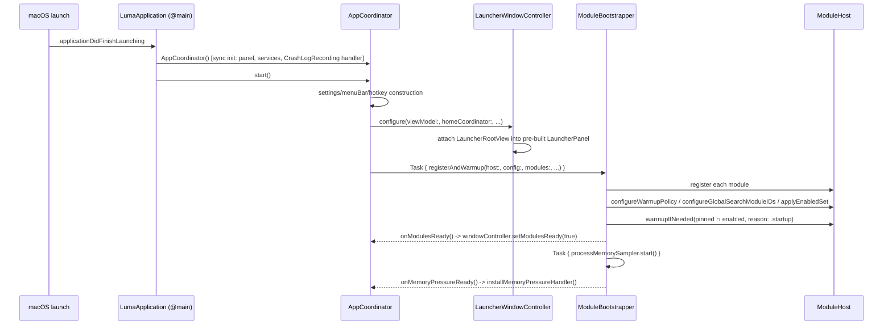
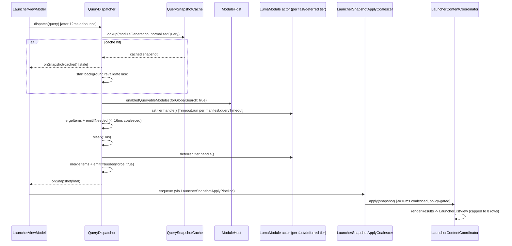
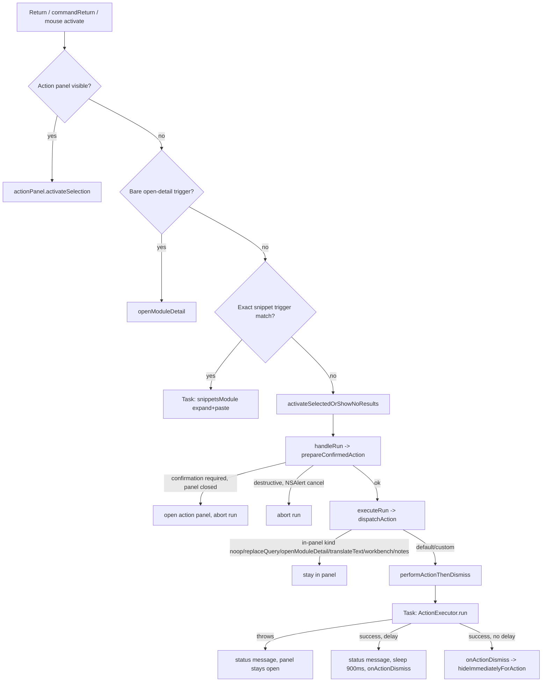
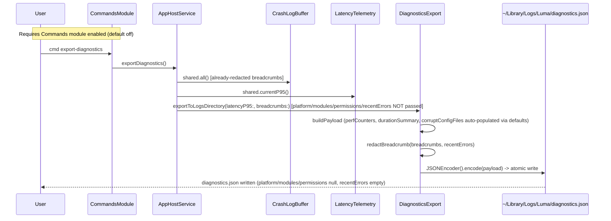

# Product Flows

## Scope

This is the **Phase 3** product of the Luma stabilization investigation, following Phase 0 (`CURRENT_STATE.md`), Phase 1 (`ARCHITECTURE_MAP.md`), and Phase 2 (`MODULE_MATRIX.md`).

- This file records the **current, as-built** end-to-end user flows of Luma: entry points, main objects, state changes, async work, failure paths, user-visible results, and test coverage.
- This file does **not** propose refactors, does **not** change source code or tests, does **not** adjust module defaults, and does **not** rule on product priority.
- Where documentation (`docs/ENGINEERING.md`, `docs/MODULES.md`, `docs/PERMISSIONS.md`, `docs/DECISIONS.md`, `docs/QA.md`) and code disagree, both are recorded as "文档描述" / "代码事实" without a ruling.
- Where a fact could not be confirmed from the files read for this phase, it is marked "未确认".
- Facts already established with file:line citations in `ARCHITECTURE_MAP.md` / `MODULE_MATRIX.md` are reused here (and re-cited), and a subset of the most flow-critical files were re-read directly for this phase to satisfy the "do not default-trust documentation" requirement — see Inputs below for which files were opened directly during Phase 3 versus carried forward from Phase 1/2.

## Inputs

### Phase 0/1/2 artifacts (read in full for this phase)

- `/Users/diaoyuxuan/Luma/CURRENT_STATE.md`
- `/Users/diaoyuxuan/Luma/ARCHITECTURE_MAP.md`
- `/Users/diaoyuxuan/Luma/MODULE_MATRIX.md`

### Engineering docs (read in full for this phase)

- `/Users/diaoyuxuan/Luma/Package.swift`
- `/Users/diaoyuxuan/Luma/README.md`
- `/Users/diaoyuxuan/Luma/docs/ENGINEERING.md`
- `/Users/diaoyuxuan/Luma/docs/MODULES.md`
- `/Users/diaoyuxuan/Luma/docs/PERMISSIONS.md`
- `/Users/diaoyuxuan/Luma/docs/QA.md`
- `/Users/diaoyuxuan/Luma/docs/DECISIONS.md`
- `/Users/diaoyuxuan/Luma/docs/swift6-appkit-boundaries.md`

### Code re-read directly for this phase (cross-check, not doc-trust)

- `Sources/LumaApp/App/LumaApp.swift`
- `Sources/LumaApp/App/AppCoordinator.swift` (init/stored-properties block, `start()`, hotkey registration/re-registration, idle-teardown scheduling, memory-pressure handler)
- `Sources/LumaApp/App/ModuleBootstrapper.swift`
- `Sources/LumaApp/App/Hotkey/HotkeyController.swift`
- `Sources/LumaApp/App/Hotkey/HotkeyConfig.swift`
- `Sources/LumaApp/Launcher/LauncherWindowController.swift` (full file)
- `Sources/LumaApp/Launcher/LauncherPanel.swift` (full file)
- `Sources/LumaApp/Launcher/QueryView.swift` (full file)
- `Sources/LumaApp/Launcher/LumaSearchBar.swift` (grep-scoped: composition gate, 8192-char cap, `controlTextDidChange`/`controlTextDidEndEditing`)
- `Sources/LumaApp/Launcher/LauncherContentCoordinator.swift` (grep-scoped: `selectedIndex`, `onSelectionChanged`)
- `Sources/LumaApp/Launcher/LauncherListView.swift` (full file)
- `Sources/LumaApp/Launcher/Session/LauncherKeyboardDispatcher.swift` (full file)
- `Sources/LumaApp/Launcher/LauncherRootController.swift` (grep-scoped + read: `activateReturn`, `activateSelectedItem`, `handleRun`, `executeRun`, `dispatchAction`, `performActionThenDismiss`, `prepareConfirmedAction`, `runAction`, `handleKeyCommand`, `performBareCommandAction`)
- `Sources/LumaApp/Infrastructure/AppHostService.swift` (full file)
- `Sources/LumaApp/Launcher/PermissionBannerController.swift` (full file)
- `Sources/LumaCore/Actions/ActionExecutor.swift` (full file)
- `Sources/LumaCore/Commands/CommandRouter.swift` (full file)
- `Sources/LumaCore/Query/QueryDispatcher.swift` (full file)
- `Sources/LumaCore/Modules/ModuleHost.swift` (full file)
- `Sources/LumaCore/Persistence/JSONConfigPersistence.swift` (full file)
- `Sources/LumaCore/Persistence/ConfigCorruptionRegistry.swift` (full file)
- `Sources/LumaCore/Util/DiagnosticsExport.swift` (full file)
- `Sources/LumaCore/Util/CrashLogRecording.swift` (full file)
- `Sources/LumaInfrastructure/CrashLogBuffer.swift` (full file)
- `Sources/LumaModules/Commands/CommandsModule.swift` (grep-scoped: `export-diagnostics`, `doctor`)
- `Sources/LumaServices/Persistence/ApplicationSupportPaths.swift` (full file)

### Files whose facts are carried forward from Phase 1/2 with file:line citations, not independently re-read line-by-line in Phase 3

`LauncherRootView.swift`, `LauncherViewModel.swift`, `LauncherSnapshotApplyPipeline.swift`, `LauncherSnapshotApplyCoalescer.swift`, `LauncherDetailPresenter.swift`, `LauncherDetailLifecycleController.swift`, `ModuleDetailRegistry.swift`, `LauncherHomeAggregator.swift`, `LauncherSnapshotApplyPolicy.swift`, `LauncherPanelVisibilitySession.swift`, `LauncherDetailExitPlanner.swift`, `QuerySnapshotCache.swift`, all per-module `*Module.swift`/`*ModuleBundle.swift` files. These were read directly during Phase 1 (`ARCHITECTURE_MAP.md`) and Phase 2 (`MODULE_MATRIX.md`) with file:line citations, which this document reuses. Where Phase 3 found a discrepancy or added detail from its own direct reads, it is marked explicitly.

## Flow Index

1. 启动 Luma
2. 注册热键
3. 唤起 Launcher
4. 空 query 首页
5. 输入 query
6. 全局搜索
7. Targeted module 搜索
8. 选择结果
9. 执行动作
10. 打开 detail
11. 从 detail 返回
12. 隐藏面板
13. 权限失败
14. 模块冷启动
15. 配置损坏
16. 导出 diagnostics

## Cross-Cutting State Owners

| State / Concern | Owner | Files | Notes |
| --- | --- | --- | --- |
| App lifecycle | `LumaApplication` (`@main`) → `AppCoordinator` | `Sources/LumaApp/App/LumaApp.swift`, `AppCoordinator.swift` | `AppCoordinator` owns nearly every long-lived service/controller as stored/`lazy` properties; no formal DI container. |
| Panel visibility | `LauncherWindowController` + `LauncherPanelVisibilitySession` | `Sources/LumaApp/Launcher/LauncherWindowController.swift`, `Sources/LumaCore/Home/LauncherPanelVisibilitySession.swift` | `isPanelVisible` reads `visibilitySession.isVisible`; generation bumped on `beginShow()`/`beginHide()`. |
| Query text | `LumaSearchBar` (UI source of truth) → `LauncherRootController` → `LauncherViewModel` | `Sources/LumaApp/Launcher/LumaSearchBar.swift`, `LauncherRootController.swift`, `LauncherViewModel.swift` | `searchBar.stringValue` is the live UI value; `QueryView` is a per-keystroke routed snapshot of it, not a separate store. |
| Results snapshot | `QueryDispatcher` (actor) → `LauncherViewModel.deliver` → `LauncherSnapshotApplyPipeline`/`Coalescer` | `Sources/LumaCore/Query/QueryDispatcher.swift`, `Sources/LumaApp/Launcher/LauncherViewModel.swift`, `Session/LauncherSnapshotApplyPipeline.swift`, `LauncherSnapshotApplyCoalescer.swift` | Two independent 16 ms coalescing points exist: dispatcher-side (`QueryDispatcher.snapshotCoalesceInterval`) and UI-apply-side (`LauncherSnapshotApplyCoalescer`). |
| Content mode (home/results/detail) | `LauncherContentCoordinator` (holds live `LauncherContentMode` value defined in `LauncherKeyRouter.swift`) | `Sources/LumaApp/Launcher/LauncherContentCoordinator.swift`, `Sources/LumaCore/Home/LauncherKeyRouter.swift` | 文档描述 (`docs/ENGINEERING.md:85`) says the enum lives "in `LauncherContentCoordinator`"; 代码事实: the enum type is defined in `LauncherKeyRouter.swift`, the coordinator only holds the live instance. |
| Selection index | `LauncherContentCoordinator.selectedIndex` (mirrors `LauncherListView.selectedFlatIndex`) | `LauncherContentCoordinator.swift:20,50-54,176-224`, `LauncherListView.swift:11,117-124` | List view is the mouse/keyboard-driven source; `onSelectionChanged` closure pushes the index up into the coordinator. |
| Module lifecycle (register/warmup/teardown) | `ModuleHost` (actor) | `Sources/LumaCore/Modules/ModuleHost.swift` | Owns `warmupStates`, `warmupTasks`, `warmupGenerations`, `enabled` set, `pinnedIDs`, `globalSearchModuleIDs`, `reservedModuleIDs`. |
| Detail lifecycle | `LauncherDetailPresenter` / `LauncherDetailLifecycleController` / `ModuleDetailRegistry` / `LauncherContentCoordinator` | `Sources/LumaApp/Launcher/Session/LauncherDetailPresenter.swift`, `LauncherDetailLifecycleController.swift`, `Sources/LumaApp/Composition/ModuleDetailRegistry.swift`, `LauncherContentCoordinator.swift` | Four-way split: registry owns the pooled view instances + content-generation guard; presenter owns presentation-generation + payload staging; lifecycle controller owns close-crossfade sequencing; content coordinator owns UI-hierarchy attach/hide. |
| Permissions | `PermissionBannerController` + per-module diagnostic rows (`PermissionResultBuilder.row`, `ModuleDiagnosticResults.informationalRow`) | `Sources/LumaApp/Launcher/PermissionBannerController.swift`, `Sources/LumaCore/Results/PermissionResultBuilder.swift`, `Sources/LumaCore/Results/ModuleDiagnosticResults.swift` | Banner is AX-specific and surface-gated (`AccessibilityGuidancePolicy`); other permissions (EventKit, Automation, Keychain) surface only as in-list diagnostic rows, not the banner. |
| Diagnostics / crash breadcrumbs | `CommandsModule` (trigger) → `AppHostService` → `DiagnosticsExport` / `CrashLogBuffer` | `Sources/LumaModules/Commands/CommandsModule.swift`, `Sources/LumaApp/Infrastructure/AppHostService.swift`, `Sources/LumaCore/Util/DiagnosticsExport.swift`, `Sources/LumaInfrastructure/CrashLogBuffer.swift` | Two separate on-disk artifacts: `~/Library/Logs/Luma/diagnostics.json` (explicit export only) and `~/Library/Application Support/Luma/crash-log.txt` (continuously appended breadcrumbs). |
| Config persistence / corruption | `JSONConfigPersistence` + `ConfigCorruptionRegistry`; separately `ClipboardHistoryStore`'s own quarantine; separately `JSONFileStore` | `Sources/LumaCore/Persistence/JSONConfigPersistence.swift`, `ConfigCorruptionRegistry.swift`, `Sources/LumaModules/Clipboard/ClipboardHistoryStore.swift` | Three distinct persistence/quarantine code paths coexist; only the `JSONConfigPersistence` path feeds `ConfigCorruptionRegistry` / `cmd doctor`. |

---

## 1. 启动 Luma

### Entry

- Process entry: `LumaApplication.main()` (`@main`, `nonisolated static func`) creates `NSApplication.shared`, sets itself as delegate, calls `app.setActivationPolicy(.accessory)`, then `app.run()` (`Sources/LumaApp/App/LumaApp.swift:12-18`, confirmed by direct read).
- `applicationDidFinishLaunching(_:)` creates `AppCoordinator()` and calls `.start()` (`LumaApp.swift:20-23`).
- User-visible trigger: launching the built `.app` bundle (double-click, LaunchAgent, or `open build/Luma.app`), or `./scripts/build_app.sh` (which runs `open "$APP_DIR"` after building unless `--no-restart` is passed — per `README.md:29-35` and `ARCHITECTURE_MAP.md` §"App Startup Flow" step 8; the internal implementation of `luma_swift_build_release`/`luma_assemble_app` in `scripts/release/common.sh` was **not** read for this phase — 未确认).

### Main Objects

- `AppCoordinator` (`Sources/LumaApp/App/AppCoordinator.swift`) — the single top-level object. Its stored properties (confirmed by direct read, lines 10-42) construct synchronously at `AppCoordinator` init time: `LauncherWindowController()` (which itself constructs `LauncherPanel()` — see Flow 3), `LumaLogger`, `LumaMetrics`, `ApplicationSupportPaths`, `PasteboardService`, `AXService`, `WorkspaceService`, `FSEventsService`, `ConfigurationStore`, `ModuleDetailReloadRouter`, `RemindersService`, `ScriptRunnerService`, `ProjectsModule` (a dedicated instance used for path matching before `ModuleHost` registers the module).
- `init()` (lines 44-49, confirmed by direct read) calls `CurrentProjectService.bootstrap(matcher:)` and `CrashLogRecording.setHandler { message in Task { await CrashLogBuffer.shared.record(message) } }` — i.e. the crash-breadcrumb sink is wired before `start()` runs.
- `lazy var` properties (lines 22-120, confirmed) resolve on first access: `context` (`ModuleContext`), `host` (`ModuleHost`), `dispatcher` (`QueryDispatcher`), `actionExecutor` (`ActionExecutor`), `viewModel` (`LauncherViewModel`), per-module actors (`clipboardModule`, `notesModule`, `todoModule`, `wordbookModule`, `snippetsModule`, `menuItemsModule`, plus non-lazy `secretsModule`/`mediaModule`/`quicklinksModule`), `homeCoordinator` (`LauncherHomeCoordinator`).
- `ModuleBootstrapper` (`Sources/LumaApp/App/ModuleBootstrapper.swift`) — static async function run inside a `Task` from `start()`.
- `LauncherEnvironment`, `ModuleDetailRegistry`, `MenuBarController`, `SettingsCoordinator`/`SettingsWindowController` — constructed inside `start()`.

### State Changes

`AppCoordinator.start()` (confirmed by direct read of relevant excerpts, lines 127-448):

1. Constructs `hostClient = AppHostService(onOpenSettings:onReloadModules:)`.
2. Constructs `settingsWindowController` and `MenuBarController` (with `onShow`/`onSettings` closures).
3. Registers the global hotkey (see Flow 2) and sets `LauncherRuntimeState.hotkeyRegistered`.
4. Adds `NSWorkspace.activeSpaceDidChangeNotification` observer → `reRegisterHotkey()`.
5. Builds `LauncherEnvironment` and calls `.install()` (installs a `static weak var current` singleton-style reference plus module cross-references used by detail views).
6. Calls `windowController.configure(viewModel:homeCoordinator:actionExecutor:config:launcherEnvironment:onWillShow:onDidHide:onOpenSettings:)` — this attaches a newly constructed `LauncherRootView` (which lazily builds `LauncherRootController` and calls `controller.showHome(persist: false)`) into the **already-existing** `LauncherPanel`'s `contentView` (confirmed by direct read, `LauncherWindowController.swift:69-111`). `onWillShow`/`onDidHide` are wired to `cancelIdleModuleTeardown()`/`scheduleIdleModuleTeardown()` (confirmed, lines 411-415).
7. Starts `Task { await ModuleBootstrapper.registerAndWarmup(host:config:modules:processMemorySampler:onModulesReady:onMemoryPressureReady:) }` with `modules = BuiltInModules.makeAll(overrides:)` (per-module actor instances constructed on `AppCoordinator`, not fresh instances).

`ModuleBootstrapper.registerAndWarmup` (confirmed by direct read, full file):

1. `await config.migrateIfNeeded()`.
2. `for module in modules { await host.register(module) }`.
3. Reads `enabled = await config.enabledModules()`, `pinned = await config.pinnedModuleIDs()`, `policy = await config.warmupPolicy()`.
4. `host.configureWarmupPolicy(pinned:)`, `host.configureGlobalSearchModuleIDs(ModuleRegistry.globalSearchModuleIDs)`, `host.applyEnabledSet(enabled)`.
5. `startupWarm = pinned.intersection(enabled ?? allRegisteredModuleIDs)`; `await host.warmupIfNeeded(ids: startupWarm, reason: .startup)`.
6. `onModulesReady()` → `windowController.setModulesReady(true)` (unblocks `activateReturn`'s `modulesReady` gate — see Flow 9).
7. `Task { await processMemorySampler.start() }` (fire-and-forget).
8. If `policy == .eagerAllEnabled`, `await host.warmupRemainingEnabled()`.
9. `onMemoryPressureReady()` → `installMemoryPressureHandler()` (registers a `DispatchSource.makeMemoryPressureSource`; on warning/critical, trims `IconCache` and calls `host.teardownIdleModules(olderThan: .seconds(60), pinned:, reason: .memoryPressure)`, confirmed by direct read lines 450-466).

### Async Work

- `ModuleBootstrapper.registerAndWarmup` itself runs inside one `Task` started from `start()`; it is not awaited by `start()` (fire-and-forget from the app-lifecycle perspective).
- Inside it, `host.warmupIfNeeded(ids:reason:)` fans out per-module warmup `Task`s via `withTaskGroup` (`ModuleHost.swift:205-213`).
- `processMemorySampler.start()` runs in its own detached `Task`.
- `idleTeardownTask` (30 s delay, then `teardownIdleModules(olderThan: .seconds(300), ...)`) is armed on every panel hide and cancelled on every panel show (`AppCoordinator.swift:411-415,468-484`, confirmed by direct read) — this is a startup-adjacent lifecycle mechanism, not itself part of the startup sequence.

### Failure Paths

- Hotkey registration failure is handled inline in `start()` (see Flow 2) — startup continues regardless (menu bar icon shows a warning state via `markHotkeyFailed()`); it does not abort app launch.
- `ModuleBootstrapper` has no explicit error path: `config.migrateIfNeeded()`, `host.register`, `host.applyEnabledSet` are not shown to throw in the read code; individual module `warmup()` failures are absorbed by `Timeout.run` returning `nil` → `warmupStates[id] = .cold` (see Flow 14), not surfaced as a startup failure.
- No confirmed code path aborts app launch on any startup step failing; the app is designed to continue in a degraded (cold-module) state.
- **Phase 0 fact**: at the Phase 0 snapshot time, no `Luma.app/Contents/MacOS/Luma` process was found running (`CURRENT_STATE.md` Runtime State section) — i.e. the flow described here was not observed executing at that moment. This document does not diagnose why the process was absent.

### User-Visible Result

- Panel exists but hidden (`panel.orderOut(nil)` is called at `LauncherWindowController.init`, before any of the above runs — see Flow 3).
- Menu bar status item appears (`MenuBarController`), showing hotkey-OK or hotkey-warning icon state depending on registration outcome.
- No visible window appears at launch; the app runs as an accessory-policy background process until the hotkey (or menu bar "Show") is used.
- `windowController.setModulesReady(true)` (called once `ModuleBootstrapper` finishes registration) is read by `LauncherRootController.activateReturn` to gate Return actions before modules are ready (`LauncherRootController.swift:948-952`, confirmed by direct read) — showing a "modules loading" status if the user presses Return too early.

### Test Coverage

- No dedicated "full app startup" integration test was found in this phase's reading; `ARCHITECTURE_MAP.md`'s Test Coverage Map does not list a startup-specific test file distinct from the hotkey/panel tests in Flow 2/3.
- `Tests/LumaCoreTests/ModuleHostWarmupPolicyTests.swift`, `ModuleHostReentrancyTests.swift` cover `ModuleHost` warmup logic used by `ModuleBootstrapper`, but not the full `AppCoordinator.start()` sequence.
- `Tests/LumaAppTests/Flow/LauncherFlowHarness.swift` builds an **independent** `ModuleHost`/`QueryDispatcher`/`LauncherViewModel` stack rather than exercising `AppCoordinator`/`ModuleBootstrapper` directly (see Flow 6 for detail on the harness/production divergence).
- **Gap**: 未确认 whether any test exercises `AppCoordinator.start()` end-to-end (construction → `ModuleBootstrapper` → `onModulesReady` → panel `configure`).

### Notes From Phase 0/1/2

- Phase 0: `swift build` passed but no running `.app` process was found — this flow describes what should happen once the process runs; it does not explain the absence.
- `ARCHITECTURE_MAP.md` confirms Doc says (`docs/DECISIONS.md` D-002, `docs/ENGINEERING.md:163`) "pre-instantiate the launcher panel at app launch" is consistent with 代码事实 (panel constructed synchronously during `AppCoordinator` init, before `start()`'s async work).
- `scripts/build_app.sh`'s internal `luma_swift_build_release`/`luma_assemble_app` behavior remains 未确认 (not read in Phase 1 or Phase 3).



---

## 2. 注册热键

### Entry

- Code entry: `AppCoordinator.start()`, hotkey block (confirmed by direct read, lines 249-272).
- No user-facing entry — this happens automatically during startup and again on Space change.

### Main Objects

- `HotkeyController` (`Sources/LumaApp/App/Hotkey/HotkeyController.swift`, `@MainActor final class`) — wraps Carbon `RegisterEventHotKey`/`InstallEventHandler`.
- `HotkeyConfig` (`Sources/LumaApp/App/Hotkey/HotkeyConfig.swift`) — **confirmed by direct read**: `defaultCombo = KeyCombo(virtualKeyCode: 49, carbonModifiers: 1 << 8)` (Space + ⌘); `load()` unconditionally returns `defaultCombo`; `save(_:)` is an explicit **no-op** with a code comment: "Luma's primary entry point is intentionally fixed at Command+Space. Keep this no-op so older settings builds cannot persist a different chord."; `resetToDefault()` only removes a UserDefaults key that nothing currently writes to.
- `MenuBarController` — receives `markHotkeyOK()`/`markHotkeyFailed()` calls to update its status-item icon (`LumaMenuBarIcon` state `.hotkeyWarning`).
- `LauncherRuntimeState.hotkeyRegistered` (a shared flag, confirmed referenced at `AppCoordinator.swift:255,258,491,494`) — read elsewhere (e.g. `cmd doctor`, per `MODULE_MATRIX.md`'s Commands section) though the read-side call sites were not independently re-enumerated in this phase (未确认 beyond the doctor-context citation in `ARCHITECTURE_MAP.md`).

### State Changes

- `AppCoordinator.start()` constructs `HotkeyController(onPress:)` with `onPress = { [weak self] in self?.windowController.showFromCarbonHotkey() }` (confirmed, lines 250-252).
- `HotkeyController.init` calls `installHandler()`, which calls Carbon `InstallEventHandler(GetEventDispatcherTarget(), lumaHotKeyEventHandler, ...)` (confirmed, lines 69-87) — this installs the C callback, independent of registering a specific key combo.
- `hotkeyController.register(HotkeyConfig.load())` is then called; `register(_:)` first calls `unregister()` (idempotent — no-op if nothing registered), then calls Carbon `RegisterEventHotKey(combo.virtualKeyCode, combo.carbonModifiers, hotkeyID, GetEventDispatcherTarget(), 0, &ref)` (confirmed, lines 29-49).
- On success: `hotKeyRef` is stored, `isRegistered = true`, `self.hotkeyController = hotkeyController` (retained on `AppCoordinator`), `LauncherRuntimeState.hotkeyRegistered = true`, `menuBarController?.markHotkeyOK()`.
- Re-registration: an `NSWorkspace.activeSpaceDidChangeNotification` observer calls `reRegisterHotkey()` (confirmed, lines 274-282,487-498), which calls `hotkeyController.register(HotkeyConfig.load())` again and updates the same success/failure state.

### Async Work

- None inside the registration call itself — `RegisterEventHotKey`/`InstallEventHandler` are synchronous Carbon calls made on the main actor.
- The **press** path (not registration) hops through an async boundary: the C callback `lumaHotKeyEventHandler` (confirmed nonisolated free function, lines 6-14) calls `HotkeyController.schedulePress()` (`nonisolated func`, confirmed lines 63-67), which does `Task { @MainActor [weak self] in self?.onPress() }` — this is the required Swift 6 / AppKit executor-boundary pattern documented in `docs/swift6-appkit-boundaries.md` item 8 ("Carbon / C callbacks: `nonisolated` entry + `Task { @MainActor in ... }`").
- On registration failure, `Task { await LumaLogger(category: "hotkey").error(...) }` logs asynchronously (confirmed, lines 268-270); this does not block the failure-handling code path itself.

### Failure Paths

- `HotkeyController.register` throws `HotkeyError.registrationFailed(status)` if `RegisterEventHotKey` returns non-`noErr`, or the constructor throws `HotkeyError.handlerInstallFailed(status)` if `InstallEventHandler` fails (confirmed).
- On registration failure (confirmed, lines 257-271): `LauncherRuntimeState.hotkeyRegistered = false`; a message string is built (`"hotkey.registrationFailed status=\(status)"` or `"hotkey.handlerInstallFailed status=\(status)"` or `"hotkey.registrationFailed status=unknown"`); `CrashLogRecording.record(hotkeyMessage)` (feeds `crash-log.txt`, see Flow 16); async error log; `menuBarController?.markHotkeyFailed()`.
- Re-registration failure (confirmed, lines 493-497) similarly sets `LauncherRuntimeState.hotkeyRegistered = false`, records `"hotkey.reregisterFailed"` to `CrashLogRecording`, and calls `markHotkeyFailed()` — no user-facing alert/dialog beyond the menu bar icon state was found in the read code.
- No confirmed retry loop or user-facing repair prompt beyond the menu bar icon and (per `README.md`) the separate `./scripts/repair_accessibility_permission.sh` script, which addresses Accessibility TCC state, not Carbon hotkey registration specifically — hotkey failure and Accessibility-permission failure are **different failure domains** in this codebase; conflating them is not supported by the code read.

### User-Visible Result

- Success: no direct UI; the hotkey becomes live (Cmd+Space shows the panel — see Flow 3), and the menu bar icon renders its normal state via `markHotkeyOK()`.
- Failure: menu bar icon renders its `.hotkeyWarning` state (`LumaMenuBarIcon.State`, per `ARCHITECTURE_MAP.md` §7 citing `LumaMenuBarIcon.swift:4-10`) — the exact visual difference of that icon state was not independently re-rendered/verified in this phase (relies on Phase 1's file citation; icon asset/rendering not re-read).
- No Settings UI surface for changing the hotkey was found — `HotkeyConfig.save` is a hard no-op by design, so the hotkey chord is not user-configurable in the current code, regardless of any Settings UI that might reference it (未确认 whether `SettingsSwiftUIView.swift` exposes a hotkey-editing control that would silently no-op on save; not read in this phase).

### Test Coverage

- `Tests/LumaAppTests/HotkeyReregisterTests.swift` — intent (per `ARCHITECTURE_MAP.md`): `register`/`unregister` toggles `isRegistered` correctly. Behavioral/integration-style unit test against `HotkeyController` directly.
- `Tests/LumaAppTests/HotkeyToggleExecutorTests.swift` — intent: `schedulePress()` hops to MainActor before invoking `onPress`. Executor-boundary test.
- `Tests/LumaAppTests/HotkeyDoubleFireTests.swift` — covers the *press* path (Flow 3), not registration itself, but shares the same controller.
- **Gap**: 未确认 whether any test exercises `AppCoordinator`'s actual registration failure branch (`CrashLogRecording.record`, `markHotkeyFailed()`) with a real or mocked Carbon failure status, or the Space-change re-registration observer end-to-end.

### Notes From Phase 0/1/2

- Phase 0's `latency-report.json` recorded `hotkeyP95Milliseconds` ≈ 8344.97 ms. This flow (registration) is not the timed path — the timed path is the **press → show** flow (Flow 3, via `HomeLatencyTracker.markHotkey()` in `show()`). Registration itself is a one-time synchronous Carbon call with no confirmed timing instrumentation.
- `HotkeyConfig.save` being a hard no-op is a code fact newly confirmed by direct read in this phase; it was described at a summary level in `ARCHITECTURE_MAP.md` ("Default combo is Space + cmdKey") but the no-op `save`/`resetToDefault`-only-clears-unused-key detail is additional precision from this phase's direct read.

---

## 3. 唤起 Launcher

### Entry

- User input: Cmd+Space while the panel is hidden (Carbon global hotkey, works system-wide since Luma is `.accessory` policy).
- Also: menu bar "Show" item (`MenuBarController`'s `onShow = { self.windowController.show() }`, confirmed at `AppCoordinator.swift:243`) — this calls `show()` directly, **not** `showFromCarbonHotkey()`, so it bypasses the "only when hidden" guard and the 120 ms Carbon-show debounce (代码事实, confirmed by direct read of `LauncherWindowController.swift:176-184,197`; this bypass is not documented anywhere in `docs/ENGINEERING.md`'s two-paths description, which only describes the Carbon and `performKeyEquivalent` paths — 文档描述/代码事实 gap, not ruled on).

### Main Objects

- `HotkeyController` (press bridge) → `AppCoordinator.onPress` closure → `LauncherWindowController.showFromCarbonHotkey()`.
- `LauncherWindowController` (`Sources/LumaApp/Launcher/LauncherWindowController.swift`) — owns `panel: LauncherPanel`, `visibilitySession: LauncherPanelVisibilitySession`, debounce timestamps (`lastCarbonShowAt`, `lastPanelHideAt`, `lastToggleAt`), `deferredShowWorkItem`, `panelHideTask`.
- `LauncherPanel` (`NSPanel` subclass, confirmed full-file read) — `styleMask: [.borderless, .nonactivatingPanel, .fullSizeContentView]`, `level = .modalPanel`, `collectionBehavior` includes `.canJoinAllSpaces, .stationary, .fullScreenAuxiliary, .ignoresCycle`, `hidesOnDeactivate = false`.
- `LauncherPanelVisibilitySession` (`Sources/LumaCore/Home/LauncherPanelVisibilitySession.swift`) — generation-guarded show/hide state.
- `LumaPresentationScreen` — resolves which screen to position on.
- `HomeLatencyTracker` — records the hotkey-press timestamp for the `latency-report.json` p95 metric.

### State Changes

`showFromCarbonHotkey()` (confirmed by direct read, lines 176-184):

```swift
func showFromCarbonHotkey() {
    guard !visibilitySession.isVisible else { return }
    let now = ContinuousClock.now
    if let lastCarbonShowAt, now - lastCarbonShowAt < .milliseconds(120) {
        return
    }
    lastCarbonShowAt = now
    show()
}
```

`show()` (confirmed by direct read, lines 197-237):

1. `cancelDeferredShowWork()` — cancels any pending 75 ms deferred-show work item from a previous show.
2. `cancelPanelHideAnimation()` — cancels an in-flight hide fade (`panelHideTask`), clears `panel.animations`, resets `panel.alphaValue = 1` with a zero-duration animation context (so a rapid re-show does not inherit a fading-out alpha).
3. `let generation = visibilitySession.beginShow()` — bumps the generation and flips `isVisible = true`.
4. `onWillShow?()` — calls `cancelIdleModuleTeardown()` on `AppCoordinator`.
5. `HomeLatencyTracker.markHotkey()` — records the show-start timestamp for later p95 computation.
6. `positionPanel()` → `panel.position(on: visibleFrame)` using `LumaPresentationScreen.current()`.
7. Captures `previousBundleID = NSWorkspace.shared.frontmostApplication?.bundleIdentifier`; sets `LauncherMenuTarget.set(bundleID:)`; starts a `Task` that sets `MenuBarTreeService`'s launcher-context bundle ID, sleeps 300 ms, then schedules a menu-tree refresh for the frontmost app (fire-and-forget, cancellable via `Task.isCancelled`).
8. `NSApp.activate(ignoringOtherApps: true)`; `panel.orderFrontRegardless()`; `panel.makeKey()`.
9. `DispatchQueue.main.async`: if `visibilitySession.shouldCompleteDeferredShow(generation:)` still holds, calls `rootView?.focusSearchFieldAfterShow()` (and, under `LUMA_QA=1`, an extra `ensureSearchFieldFocused()`).
10. Schedules a `DispatchWorkItem` 75 ms later (`deferredShowWorkItem`): if the generation is still current, calls `refreshPermissionStatus()`, `startPermissionPollingIfNeeded()`, `startPerformanceSampling()`, `setPanelSignalsActive(true)`, `restoreLastSessionIfNeeded()`.

### Async Work

- Generation-guarded `DispatchQueue.main.async` block (focus) and `DispatchQueue.main.asyncAfter(deadline: .now() + 0.075)` block (heavier services) — both are rejected if a subsequent hide/show has bumped the generation (`shouldCompleteDeferredShow`).
- The `MenuBarTreeService` context-set/refresh `Task` (300 ms internal sleep) is independent of the generation guards above (not re-verified whether it self-cancels on hide — 未确认).
- Two 120 ms debounce clocks exist for the two hotkey paths (`lastCarbonShowAt` for show, `lastPanelHideAt` for hide) plus a third, separate 120 ms debounce for the unused-in-production `toggle()` method (`lastToggleAt`) — confirmed by direct read; `ARCHITECTURE_MAP.md`'s "not confirmed" note that no production code path calls `toggle()` was not contradicted by anything read in this phase (still 未确认 as a completeness claim, but no call site was found in the Phase 3 reads either).

### Failure Paths

- If the panel is already visible, `showFromCarbonHotkey()` is a silent no-op (`guard !visibilitySession.isVisible`).
- If within 120 ms of the last Carbon show, silent no-op (debounce).
- If `LumaPresentationScreen.current()` returns `nil`, `positionPanel()` silently does nothing (`guard let screen = ... else { return }` — confirmed at `LauncherWindowController.swift:344-345`) — the panel would then show at whatever frame it already has (未确认 what that default/last frame is in practice).
- No explicit error/status UI for a failed show — this flow does not have a "failure" surface in the traditional sense; it either shows or silently no-ops per the guards above.
- Deferred-show generation guard: if the panel is hidden again before the 75 ms timer or the `DispatchQueue.main.async` focus block fires, those blocks are skipped — so a very fast show-then-hide can result in the search field never being focused or permission polling never starting for that show cycle (代码事实, inferred directly from the guard logic; not independently tested against a live app in this phase).

### User-Visible Result

- Panel fades/appears at the top-third of the presentation screen (per `docs/ENGINEERING.md`: "Default geometry: 940 x 760 pt... Presentation screen is the screen with the active app, menu-bar context, key window, or cursor fallback"), key-window focused, search field focused shortly after.
- Home content is whatever `LauncherRootView`/`LauncherRootController` already rendered from the previous session (per D-002/`docs/ENGINEERING.md:164`, "Hotkey show reuses the already-rendered launcher/home UI") — this flow's `show()` does not itself trigger a home rebuild; Flow 4 covers what content actually renders.

### Test Coverage

- `Tests/LumaAppTests/HotkeyDoubleFireTests.swift` — intent: Carbon path only shows when hidden; visible-state Carbon press is a no-op; hide/toggle debounce behavior.
- `Tests/LumaAppTests/LauncherShowHideStateTests.swift` — source-level assertions that `LauncherWindowController`/`LauncherRootController` use the visibility session and generation guards (per `ARCHITECTURE_MAP.md`, this is a **source-level wiring test**, not a full runtime simulation).
- `Tests/LumaCoreTests/LauncherPanelVisibilitySessionTests.swift` — generation algebra: no-op re-hide, stale deferred-show rejection, rapid show-hide-show.
- `Tests/LumaAppTests/MultiMonitorRepositionTests.swift` — `LauncherPanelRepositionPolicy.shouldReposition` logic.
- **Gap**: 未确认 whether any test measures actual wall-clock latency from hotkey press to panel visible/interactive (the `latency-report.json` mechanism is a manual/QA-mode telemetry export, not a `swift test` assertion, per `HomeLatencyTracker.swift:17-18`'s `LUMA_QA=1` gate cited in `ARCHITECTURE_MAP.md`).

### Notes From Phase 0/1/2

- **Directly maps to the Phase 0 hotkey p95 ≈ 8.3 s finding.** `HomeLatencyTracker.markHotkey()` (step 5 of `show()`) is the instrumentation point that feeds `hotkeySamples`/`hotkeyP95Milliseconds` in `~/Library/Logs/Luma/latency-report.json`. This document does not diagnose *why* the p95 is ~8.3 s (far above the documented 50 ms p95 / 80 ms ceiling target in `docs/ENGINEERING.md`'s Performance Contract table); it only confirms which code path the metric instruments.
- The menu-bar "Show" path calling `show()` directly (bypassing `showFromCarbonHotkey()`'s guard/debounce) is a Phase 3 finding not previously called out in `ARCHITECTURE_MAP.md`'s two-path description — recorded as an observation, not a defect ruling.

```mermaid
sequenceDiagram
    participant User
    participant Carbon
    participant HC as HotkeyController
    participant AC as AppCoordinator
    participant WC as LauncherWindowController
    participant VS as LauncherPanelVisibilitySession
    participant Panel as LauncherPanel
    participant Latency as HomeLatencyTracker

    User->>Carbon: press Cmd+Space (panel hidden)
    Carbon->>HC: lumaHotKeyEventHandler -> schedulePress()
    HC->>AC: Task { @MainActor onPress() }
    AC->>WC: showFromCarbonHotkey()
    WC->>VS: guard !isVisible
    WC->>WC: 120ms debounce (lastCarbonShowAt)
    WC->>WC: show()
    WC->>WC: cancelDeferredShowWork(); cancelPanelHideAnimation()
    WC->>VS: beginShow() [bump generation]
    WC->>Latency: markHotkey()
    WC->>Panel: position(on:) ; orderFrontRegardless() ; makeKey()
    WC->>WC: DispatchQueue.main.async -> focusSearchFieldAfterShow (generation-guarded)
    WC->>WC: asyncAfter(75ms) -> permission polling, session restore (generation-guarded)
```

---

## 4. 空 query 首页

### Entry

- Automatic: whenever the panel shows with an empty search field (fresh show, or query cleared).
- Code entry: `LauncherRootView` construction calls `controller.showHome(persist: false)` (per `ARCHITECTURE_MAP.md`'s Runtime Object Graph); subsequent triggers include `restoreHomeFromDetail`, clearing the query, and the 75 ms deferred `restoreLastSessionIfNeeded()`.

### Main Objects

- `LauncherHomeCoordinator` (`Sources/LumaApp/Launcher/HomeProviders/LauncherHomeCoordinator.swift`) — orchestrates home snapshot caching/prefetch.
- `OpenAppsHomeProvider` (`HomeProviders/OpenAppsHomeProvider.swift`) — left-column running-apps list.
- `ClipboardPasteboardCache` (`HomeProviders/ClipboardPasteboardCache.swift`) — used for home-adjacent clipboard state (per Phase 1 citation; not independently re-read this phase).
- `LauncherHomeAggregator` (`Sources/LumaCore/Home/LauncherHomeAggregator.swift`) — builds the `LauncherHomeSnapshot` (`sections: [LauncherHomeSection]`) from provider data.
- `LauncherContentCoordinator` — holds `mode = .home`.
- `LauncherHomeSplitLayout` / `LauncherHomeSplitPlanner` — decide left/right column split when query is empty (per `docs/ENGINEERING.md`'s "Empty home shows only Open Apps on the left and a compact module guide on the right").

### State Changes

- `showHome(persist:)` (referenced in `ARCHITECTURE_MAP.md`, `LauncherRootController.swift:312-314` region) cancels `homeRefreshTask`, calls `viewModel.cancel()`, cancels pending snapshot apply, and sets `LauncherContentCoordinator.mode = .home`.
- Left column: `OpenAppsHomeProvider.setActive(true)` (bound to panel visibility via `LauncherRootView.setPanelSignalsActive`) starts a ~2 s refresh loop (`ARCHITECTURE_MAP.md`'s Async Work table) and produces `cachedSnapshots`.
- Right column: home guide (discoverable commands for **enabled** modules only, per `docs/MODULES.md:24`) or module detail if one is open (module detail replaces the guide but Open Apps stays visible, per `docs/ENGINEERING.md`'s Launcher Contract — this is a **frozen** behavior per the `launcher-home-frozen` workspace rule).
- `LauncherRootController.cachedEnabledModuleIDs` gates which modules' guide rows render (per `ARCHITECTURE_MAP.md`'s Async Work table, refreshed via an init-time `Task { refreshEnabledModuleCache() }`).

### Async Work

- `OpenAppsHomeProvider`'s refresh loop and any `Task.detached` AX/CGWindow IPC work (per `ARCHITECTURE_MAP.md`'s Async Work Owners table, citing `OpenAppsHomeProvider.swift:70-71,112-115,133-135`).
- `LauncherHomeCoordinator.setActive(true)` prefetches via `Task.detached` (`LauncherHomeCoordinator.swift:35-38`, per Phase 1 citation).
- Per `docs/ENGINEERING.md`'s Performance Contract: "Showing the launcher must not rebuild Open Apps for the first visible frame" and "Open Apps refresh is bound to panel visibility; hidden panel must not grow `openApps.refresh` counters" — these are documented invariants; whether they hold was not independently re-verified by runtime measurement in this phase (relies on the cited tests below).
- Wake-from-sleep: `docs/ENGINEERING.md:179` documents a 1 s settle delay before Open Apps reloads after `NSWorkspace.didWakeNotification` — code site not independently re-read this phase (未确认 beyond doc citation).

### Failure Paths

- Empty Open Apps column distinguishes cache-warming (`module.warming`) from a completed-but-truly-empty refresh (`home.openApps.empty`) per `docs/ENGINEERING.md:57` — the underlying string/row-kind implementation was not independently re-read this phase (relies on doc description; 未确认 as code fact for this phase specifically, though Phase 1 did not flag a contradiction).
- No AX permission banner is expected on plain empty-home rendering (per `docs/ENGINEERING.md:222`'s "Accessibility permission is lazy" and `docs/QA.md:145`'s "Empty home and ordinary app search show no AX banner when Accessibility is denied") — this is enforced by `PermissionBannerController`'s `AccessibilityGuidancePolicy.shouldShowBanner(context:)` gating on `context.surface`, which is `.none` on plain home (per `ARCHITECTURE_MAP.md`'s Permission section and this phase's direct read of `PermissionBannerController.swift`, where `refresh(context:)` early-returns `applyBannerVisibility(false, for:)` when `context.surface == .none`).

### User-Visible Result

- Left column: list of running apps in activation-recency order, Luma excluded, possibly with multi-window child rows (per `docs/MODULES.md:65-67`).
- Right column: compact, read-only command guide for enabled modules, or a module detail view if one is open.
- No setup/onboarding/recent/dashboard rows (explicitly disallowed per `docs/ENGINEERING.md`'s Non-Goals and the `launcher-home-frozen` rule).

### Test Coverage

- `Tests/LumaAppTests/BackHomeCacheTests.swift` — `homeCoordinatorReusesCachedSnapshotWithoutExtraBuild`.
- `Tests/LumaAppTests/Flow/LauncherFlowHarness.swift`'s `emptyQueryHomeGuideHasRows` (sibling of the failing `launcherFlowHarnessReplaysQuery` — see Flow 6).
- `Tests/LumaAppTests/Flow/LauncherGoldenReplayTests.swift`'s `launcherGoldenReplayEmptyQueryDoesNotSnapshot`.
- **Gap**: 未确認 whether a test directly asserts "no AX banner on empty home when Accessibility is denied" as an automated (non-manual) check — `docs/QA.md:145` lists it as a **manual** permission check, not a `swift test` target; `Tests/LumaAppTests/PermissionBannerContextTests.swift` covers routing source (search field/route), not this specific empty-home-suppression scenario directly (未确认 without reading that test file's exact assertions).

### Notes From Phase 0/1/2

- This flow is the one instrumented for the "hotkey → home painted" p95 metric target in `docs/ENGINEERING.md`'s Performance Contract table (50 ms target / 80 ms ceiling) — the same underlying `HomeLatencyTracker`/`LatencyTelemetry` mechanism discussed in Flow 3 is implicated, and the same ~8.3 s Phase 0 anomaly applies to "hotkey → home painted" as much as to "hotkey → interactive panel", since both are measured from the same `markHotkey()` call per `ARCHITECTURE_MAP.md`.

---

## 5. 输入 query

### Entry

- User types in the search field (`LumaSearchBar`, an `NSTextField`/`NSTextFieldDelegate` per `Sources/LumaApp/Launcher/LumaSearchBar.swift`).
- Code entry: `controlTextDidChange(_:)` (confirmed by direct grep, line 336) is the per-keystroke `NSTextFieldDelegate` callback.

### Main Objects

- `LumaSearchBar` — owns `isComposing` (IME marked-text flag, confirmed at line 34), the 8192-character cap logic, and the `onTextChange` callback wired to `LauncherRootController.handleTextChange(_:)`.
- `LauncherQueryDispatchPolicy.shouldDispatchQuery(isComposing:)` (`Sources/LumaCore/Launcher/LauncherQueryDispatchPolicy.swift`) — pure gate function.
- `QueryView` (`Sources/LumaApp/Launcher/QueryView.swift`, confirmed full-file read) — a per-keystroke `@MainActor struct` snapshot: computes `workbenchRoute` via `viewModel.workbenchRoute(for: raw)`; if non-`.none`, routes as `.workbench(...)` and **skips** `CommandRouter` entirely (`commandRoute = .empty`); otherwise computes `commandRoute = viewModel.commandRouter.route(raw: raw)` and `resultsRouteKind = trimmed.isEmpty ? .empty : .command(route)`.
- `LauncherViewModel.queryChanged(_:issuedAt:route:parsedCommand:)` — constructs a `Query` and dispatches per route (see Flow 6/7).
- `LauncherQueryLimits.maxCharacters` (confirmed referenced at `LumaSearchBar.swift:179,339`) — the 8192-character cap.

### State Changes

- `controlTextDidChange` (confirmed by direct grep, lines 336-348 region): first checks `editor.string.count > LauncherQueryLimits.maxCharacters` and truncates if so (confirmed mechanism exists; exact truncation code path at line 179's helper was not read character-by-character but the guard/limit constant is confirmed).
- `LauncherQueryDispatchPolicy.shouldDispatchQuery(isComposing:)` gates whether the rest of the dispatch pipeline runs at all — while `isComposing` (IME marked text active), the function returns `false` and no query is dispatched (this directly implements D-013 "IME composition gate").
- On composition end, `controlTextDidEndEditing(_:)` (confirmed at line 350) re-checks the same policy and re-dispatches.
- A 200 ms poll exists as a secondary composition-end detector: `LauncherRootController.noteSearchTextChangedForQuerySync()` → `syncQueryIfNeeded()` → `handleTextChange` (per `ARCHITECTURE_MAP.md:442`, citing `LauncherRootController.swift:279-282,301-308` — not independently re-read this phase; 未确认 as an exact-line re-verification, but no contradiction found).
- `LauncherRootController.handleTextChange` (per `ARCHITECTURE_MAP.md`): builds `QueryView(raw: text, viewModel: viewModel)`, then applies pre-dispatch gates: empty query → `viewModel.cancel()`, no dispatch; `modulesReady == false` → early return (see Flow 1's `onModulesReady` gate); global search with `trimmed.count < 2` → `viewModel.cancel()`, no dispatch (implements `docs/ENGINEERING.md:119`'s "Global search requires at least 2 characters unless a command prefix is used"); workbench-routed text bypasses `queryChanged` entirely and instead drives the Workbench-specific preview path (see Flow 6/7's "Notes" on Workbench, not a `LumaModule`).

### Async Work

- `LauncherViewModel.queryChanged` wraps its route-based dispatch inside a `Task` (per `ARCHITECTURE_MAP.md:453`); for `.globalSearch`, it does `Task.sleep(for: .milliseconds(12))` before calling `dispatcher.dispatch(query)` (a debounce before the actual dispatcher call — distinct from the 16 ms snapshot-coalescing intervals described in Flow 6).
- "Query tasks are cancelled on every new keystroke" is documented (`docs/ENGINEERING.md:125`) — mechanistically this is `QueryDispatcher.dispatch`'s `revalidateTask?.cancel()` at the top of every `dispatch` call (confirmed by direct read, line 30) plus whatever task owns the in-flight `queryChanged` `Task` on the `LauncherViewModel` side (not independently re-read line-by-line in this phase; relies on Phase 1 citation).

### Failure Paths

- Over-length paste (>8192 chars): 文档描述 (`docs/ENGINEERING.md:181`, `docs/QA.md:133`) says "Query paste over 8192 chars truncates without crash." 代码事实: `LauncherQueryLimits.maxCharacters` is referenced by `LumaSearchBar.swift` at both the truncation-helper site (line 179) and the `controlTextDidChange` guard (line 339), consistent with the documented behavior; the exact truncation code body at line 179 was not read character-by-character in this phase (未确认 as a full logic re-verification, only the guard reference is confirmed).
- IME composition: while composing, no query is dispatched — this is by design (D-013), not a failure, but an easy point of confusion if a query appears "stuck" mid-composition; `docs/QA.md:104-106` has a manual check for this ("results must not update until composition commits").
- Empty query and short global-search query (<2 chars) both result in `viewModel.cancel()` with no dispatch — this is documented, expected behavior, not a failure.

### User-Visible Result

- Non-empty, ≥2-char (or command-prefixed) query: collapses home into single-column search results (Flow 6/7).
- Empty query: home split-layout restored.
- Short (<2 char) unprefixed query: per `SearchEmptyState.message(for:query:registry:)` (`Sources/LumaCore/Home/SearchEmptyState.swift`), an empty-state message is shown instead of dispatching (per `ARCHITECTURE_MAP.md:503`).
- While composing (CJK IME): the raw marked text is visible in the field, but the result list does not update until composition commits.

### Test Coverage

- `Tests/LumaCoreTests/QueryViewTests.swift` — `QueryView` routing logic.
- `Tests/LumaAppTests` IME-related tests (referenced by `docs/QA.md`'s CJK IME manual check; a dedicated automated test file for the composition gate was not independently located by name in this phase — 未确認 exact file name beyond the `LauncherQueryDispatchPolicy` type existing as a pure, presumably-tested function per its own file `Sources/LumaCore/Launcher/LauncherQueryDispatchPolicy.swift`).
- `docs/QA.md`'s CJK IME check ("Enable Chinese Pinyin input; type several letters before selecting a candidate — results must not update until composition commits") is listed under manual checks, not automated `swift test` targets.

### Notes From Phase 0/1/2

- No Phase 0/1/2 symptom directly implicates this flow beyond the general `keystrokeP95Milliseconds` ≈ 19.13 ms figure in `latency-report.json` (well under the 30 ms p95 target / 60 ms ceiling in `docs/ENGINEERING.md`'s Performance Contract), which — unlike the hotkey p95 — does **not** show an anomaly in the Phase 0 snapshot.

---

## 6. 全局搜索

### Entry

- Query routes to `.globalSearch` via `CommandRouter.route(raw:)` when: no trigger match on the first token and the token is not length-1 (single characters always route to `.globalSearch`, confirmed at `CommandRouter.swift:49-51`), or a `bareBehavior == .globalSearchShadow` trigger's non-reserved payload is non-empty (confirmed lines 37-41).
- `LauncherViewModel.queryChanged` dispatches `.globalSearch` routes via `Task.sleep(12ms)` then `dispatcher.dispatch(query)` (per `ARCHITECTURE_MAP.md:458`).

### Main Objects

- `QueryDispatcher` (actor, `Sources/LumaCore/Query/QueryDispatcher.swift`, confirmed full-file read) — owns `snapshotCache: QuerySnapshotCache`, `revalidateTask`, `snapshotCoalesceInterval = .milliseconds(16)`.
- `QuerySnapshotCache` (actor, `Sources/LumaCore/Query/QuerySnapshotCache.swift`) — key `"\(moduleGeneration)|\(normalizedQuery)"`, TTL 300 s, max 64 entries LRU, excludes `luma.secrets`/`luma.snippets` (per `ARCHITECTURE_MAP.md`).
- `ModuleHost.enabledQueryableModules(forGlobalSearch: true)` (confirmed by direct read, lines 100-110) — filtered by `globalSearchModuleIDs` when configured.
- `GlobalSearchTiers` (`Sources/LumaCore/Modules/WarmupTier.swift`) — `fastModuleIDs` (apps, quicklinks, snippets) vs. everything else.
- `Ranker` — scores items via `Ranker.score(item:query:usage:)` (used inside `QueryDispatcher.mergeItems`, confirmed at lines 267-270).
- `LauncherSnapshotApplyCoalescer` / `LauncherSnapshotApplyPipeline` / `LauncherSnapshotApplyPolicy` — UI-side apply gating (see Cross-Cutting table).
- `LauncherContentCoordinator` / `LauncherListView` / `LauncherListRow` — final rendering.

### State Changes

`QueryDispatcher.dispatch(_:onSnapshot:)` (confirmed by direct read, lines 26-63):

1. `revalidateTask?.cancel(); revalidateTask = nil`.
2. `moduleGeneration = await host.queryCacheGeneration()` (a hash of the sorted enabled-module-ID set — changes whenever modules are enabled/disabled).
3. Cache lookup: `snapshotCache.lookup(normalizedQuery:moduleGeneration:)`. On hit: increments `LauncherPerfCounters.cacheQueryHit`, immediately calls `onSnapshot(immediate)` with the cached items **using the current query's sequence number**, then starts a background `revalidateTask` that calls `performGlobalSearch` again for the same query/generation (stale-while-revalidate).
4. On miss: increments `cacheQueryMiss`, calls `performGlobalSearch` directly.

`performGlobalSearch` (confirmed by direct read, lines 65-125):

1. `allModules = host.enabledQueryableModules(forGlobalSearch: true)` — narrowed to `configureGlobalSearchModuleIDs`'s set in production (apps, quicklinks, clipboard per `ModuleRegistry.globalSearchModuleIDs`, set in `ModuleBootstrapper.swift:26`).
2. Splits into `fastModules` (intersection with `GlobalSearchTiers.fastModuleIDs`) and `deferredModules` (the rest).
3. Runs `runModuleBatch(fastModules, ...)` first; if `deferredModules` is non-empty, `try? await Task.sleep(for: .milliseconds(1))`, checks `Task.isCancelled`, then runs `runModuleBatch(deferredModules, ...)`.
4. Each module result is merged via `mergeModuleResult` → `Self.mergeItems` (rank + filter) into a shared `merged: [ResultID: ScoredItem]` dictionary, then `emitIfNeeded(force: false)` is called after **every** module's result — this emits a coalesced snapshot at most once per 16 ms (`snapshotCoalesceInterval`), using `dirty`/`lastEmit` bookkeeping (confirmed lines 85-100).
5. After both tiers finish, `emitIfNeeded(force: true)` guarantees a final snapshot regardless of the 16 ms window.
6. Each successful non-forced emit also writes to `snapshotCache.store(...)` (confirmed line 92-96) for future stale-while-revalidate hits.

`runModuleBatch` (confirmed by direct read, lines 127-168): uses `withTaskGroup`; for each module, calls `host.warmupIfNeeded(id:reason: .query)` then `host.markUsed(id:)`, then races `Timeout.run(after: manifest.queryTimeout) { await module.handle(query, context:) }`.

`Self.mergeItems` (confirmed by direct read, lines 254-294): scores every item via `Ranker.score`; items scoring `-.infinity` are filtered out; for **global search** (`keepModuleRowsWhenAllFilteredOut: false`), a module whose items are all filtered out contributes nothing (unlike targeted search — see Flow 7); if `result.items.isEmpty` and `result.diagnostic` is set, a single diagnostic row is synthesized via `ModuleDiagnosticResults.informationalRow` with a fixed score of `1_000` (i.e. diagnostic rows are ranked to the top).

`Self.snapshot(from:sequence:)` (confirmed lines 245-252): sorts merged items by score descending, caps to **50** items server-side (`LauncherViewModel.deliver` further truncates to 8 for display, per `ARCHITECTURE_MAP.md:474`).

### Async Work

- Per-module `Timeout.run(after: manifest.queryTimeout)` races the module's `handle` call against a per-module timeout (each module declares its own `queryTimeout` in its manifest — values enumerated in `MODULE_MATRIX.md`, e.g. Apps 40 ms, Clipboard 30 ms, Quicklinks 15 ms).
- 1 ms artificial delay between fast-tier and deferred-tier module batches (`Task.sleep(for: .milliseconds(1))`).
- Dispatcher-side 16 ms snapshot-coalescing (`emitIfNeeded`'s `lastEmit`/`Self.snapshotCoalesceInterval` gate) — **separate** from the UI-side `LauncherSnapshotApplyCoalescer`'s own 16 ms window (see Flow 5/Cross-Cutting table; two independent 16 ms coalescers exist, confirmed 代码事实 vs. `docs/ENGINEERING.md:170`'s wording that implies one shared coalescer).
- Cache-hit revalidation runs as a detached background `Task` (`revalidateTask`) bound to the same query/generation; a new `dispatch()` call cancels it.
- `LauncherSnapshotApplyPipeline`/`Coalescer` on the UI side re-coalesces the (already coalesced) snapshot stream to at most one apply per 16 ms before calling `LauncherContentCoordinator.apply(snapshot:)` (per `ARCHITECTURE_MAP.md`).

### Failure Paths

- Per-module timeout: `Timeout.run` returns `nil` → dispatcher synthesizes `ModuleResult.empty(for: manifest.identifier, diagnostic: ModuleDiagnostic(kind: .timeout, message: "Module timed out"))`, records `CrashLogRecording.record("module.timeout id=...")`, increments `LauncherRuntimeState.incrementWarmupTimeouts()` (confirmed by direct read, lines 142-151). In global search's `mergeItems` (non-targeted mode), a timed-out module with empty items **and a diagnostic** still produces a top-ranked diagnostic row (score 1000) per the `mergeItems` logic above — i.e. per-module timeouts in global search are not silent, they appear as a row.
- Module returning zero items with no diagnostic contributes nothing to the merged snapshot (silently absent from the combined list) — this is consistent with `docs/MODULES.md`'s "empty acceptable" scenes enumerated per-module in `MODULE_MATRIX.md`.
- Cache miss + all modules empty/timeout: final snapshot after `emitIfNeeded(force: true)` may have zero items (or only diagnostic rows) — rendered by `LauncherListView` as an empty results state (or a diagnostic row).
- `Task.isCancelled` checks exist at multiple points inside `performGlobalSearch` (start, before deferred batch, inside `emitIfNeeded`) — a superseding keystroke's new `dispatch()` call does not explicitly cancel the in-flight `performGlobalSearch` `Task` itself (only `revalidateTask` is explicitly cancelled in `dispatch()`); whether the **query dispatch `Task`** started by `LauncherViewModel.queryChanged` is cancelled on a new keystroke was not independently re-verified in this phase at the `LauncherViewModel` call site (relies on `docs/ENGINEERING.md:125`'s documented invariant "Query tasks are cancelled on every new keystroke" — 文档描述, not independently re-confirmed as 代码事实 for the `LauncherViewModel`-owned `Task` specifically in this phase).

### User-Visible Result

- Single-column result list capped at 8 visible rows (`LauncherListView.renderResults` truncates to `items.prefix(8)`, confirmed by direct read, line 101), fast-tier modules' results appearing before deferred-tier results within the same coalescing window, matching `docs/QA.md:120`'s "Global search shows fast-tier results before deferred modules finish."
- Repeat identical queries: near-instant paint from cache, followed by an invisible background revalidation (per `docs/QA.md:121`).
- Diagnostic rows (e.g. module timeout) can appear ranked above normal results due to the fixed score-1000 diagnostic-row logic.

### Test Coverage

- `Tests/LumaCoreTests/QueryDispatcherTargetedTests.swift`, `QueryDispatcherTierTests.swift`, `GlobalSearchDispatchTests.swift`, `QuerySnapshotCacheTests.swift`, `RevalidateCancellationTests.swift`, `ColdTargetedFirstSnapshotPerformanceTests.swift`, `TimeoutTests.swift` — behavioral/unit tests against `QueryDispatcher`/`QuerySnapshotCache`/`Timeout` directly (actor-level, not full UI).
- `Tests/LumaAppTests/LauncherSnapshotApplyCoalesceTests.swift`, `Tests/LumaCoreTests/LauncherSnapshotApplyPolicyTests.swift` — UI-apply-side coalescing/policy.
- `Tests/LumaAppTests/Flow/LauncherFlowHarness.swift` — **contains the Phase 0 failing test** `launcherFlowHarnessReplaysQuery` (harness-level integration test, described below).

**`launcherFlowHarnessReplaysQuery` — Phase 0 failing test, detail:**

- Location: `Tests/LumaAppTests/Flow/LauncherFlowHarness.swift:96-103` (per `ARCHITECTURE_MAP.md`, not independently re-read line-by-line in Phase 3).
- Asserts: after `harness.showPanel()`, `harness.type("app")`, and a 200 ms sleep, `harness.lastSnapshot?.items` is non-empty.
- `LauncherFlowHarness` builds its **own** `ModuleHost` + `BuiltInModules.makeAll()` + `QueryDispatcher` + `LauncherViewModel`, independent of `AppCoordinator`'s production wiring — notably (per `ARCHITECTURE_MAP.md`, candidate factors, **not** a root-cause ruling): (a) the harness's `CommandRouter()` defaults to an empty `CommandRegistry([])` (per `LauncherViewModel.swift:18` cited in Phase 1) rather than production's `ModuleRegistry.makeCommandRegistry()`, changing whether `"app"` routes as `.globalSearch` or `.targeted`; (b) the harness never calls `host.configureGlobalSearchModuleIDs(...)`, changing which modules participate; (c) `AppsModule`'s warmup is async disk-backed work whose completion relative to the 200 ms sleep is unverified; (d) a possible sequence-number mismatch in `LauncherViewModel.deliver` could drop the snapshot; (e) ranking could filter all rows.
- **This document does not attempt to isolate the root cause** — per the task's hard requirement, this is recorded as: 代码事实 = the harness diverges from production wiring in the ways listed; **未确认** which divergence (if any single one) causes the assertion failure.
- Sibling tests in the same file: `emptyQueryHomeGuideHasRows` (passes, per Phase 0's `swift test --filter LumaAppTests` output showing 67 tests ran with only this one test failing).
- Related: `Tests/LumaAppTests/Flow/LauncherGoldenReplayTests.swift` (`launcherGoldenReplayEmptyQueryDoesNotSnapshot`, `launcherGoldenReplayTargetedQueryProducesSnapshot`) — uses the same harness infrastructure; pass/fail status of these specific tests at the Phase 0 snapshot was not separately itemized in `CURRENT_STATE.md` beyond the aggregate "67 tests ran; `launcherFlowHarnessReplaysQuery` failed."

### Notes From Phase 0/1/2

- This is the flow most directly implicated by the Phase 0 test failure. See detailed discussion above — **root cause remains 未确认** per the task's explicit instruction not to diagnose it further in this document.
- `docs/ENGINEERING.md:170`'s "UI snapshot apply uses the same 16 ms coalescer in `LauncherRootController`" is 文档描述; 代码事实 (confirmed) is that there are two separate 16 ms coalescing mechanisms (dispatcher-side `QueryDispatcher.snapshotCoalesceInterval` and UI-side `LauncherSnapshotApplyCoalescer`), and the UI-side one is held indirectly by `LauncherRootController` via a `snapshotPipeline` property, not implemented inline in `LauncherRootController` itself.



---

## 7. Targeted module 搜索

### Entry

- Query routes to `.targeted(module:trigger:payload:)` (or `.help(module:)`) via `CommandRouter.route(raw:)` when the first token matches a registered trigger and the `bareBehavior`/payload rules don't shadow it into global search (confirmed by direct read, `CommandRouter.swift:32-46`).
- Examples confirmed from `MODULE_MATRIX.md`'s per-module trigger tables: `app <query>` (Apps), `n <query>` / bare `n` (Notes), `t <query>` / bare `t` (Todo), `clip <query>` / bare `clip` (Clipboard), `cmd <subcommand>` (Commands), `tab <query>` (Browser Tabs), `win`/`wl` (Window Layouts).

### Main Objects

- `LauncherViewModel.queryChanged` dispatches `.targeted`/`.help(moduleID)` routes via `dispatcher.dispatchTargeted(query, moduleID:)` (confirmed reference at `ARCHITECTURE_MAP.md:457`; `dispatchTargeted` itself confirmed by direct read, `QueryDispatcher.swift:170-234`).
- `ModuleHost.enabledModule(_:)` (confirmed lines 125-128) — returns the module only if both registered **and** currently enabled.
- `ModuleDiagnosticResults.informationalRow` — used both for the disabled-module case and the cold-cache "warming" case.
- `L10n.tr("module.warming")` — localized cold-cache row string.

### State Changes

`dispatchTargeted` (confirmed by direct read, full method):

1. `guard let module = await host.enabledModule(moduleID) else { ... }` — if the module is not enabled (or not registered), immediately emits a single diagnostic row: `ModuleDiagnostic(kind: .degraded, message: "Module disabled in Settings — enable it to use this command")` and returns. **This is a direct, first-hand-confirmed mechanism for "disabled or permission-blocked modules return diagnostic rows, not silent empty results"** (`docs/ENGINEERING.md:123`).
2. `guard manifest.capabilities.contains(.queryable) else { onSnapshot(empty); return }` — non-queryable modules return an empty (not diagnostic) snapshot.
3. `warmupState = await host.warmupState(for: moduleID)`; if `.cold`, **immediately** emits a `L10n.tr("module.warming")` informational row **before** warmup even starts (confirmed lines 194-204) — i.e. the user sees a "warming" row first, then a follow-up snapshot once `handle` actually returns.
4. `await host.warmupIfNeeded(id: moduleID, reason: .query)` then `host.markUsed(id: moduleID)`.
5. `Timeout.run(after: manifest.queryTimeout) { await module.handle(query, context:) }` — same per-module timeout mechanism as global search.
6. `Self.mergeItems(..., keepModuleRowsWhenAllFilteredOut: true, ...)` — **this is the key difference from global search**: if ranking filters out every item but the module returned non-empty `result.items`, targeted search **re-synthesizes** rows from the original (unranked) items with a descending synthetic score (`1.0 - index * 0.001`), so a targeted module's own rows are never silently dropped by ranking alone (confirmed lines 273-285).
7. Final `onSnapshot(Self.snapshot(from: merged, sequence:))`.

### Async Work

- Single-module `Timeout.run` (no fast/deferred tiering — tiering is a global-search-only concept).
- No coalescing loop inside `dispatchTargeted` (it is a single `handle` call, not a multi-module fan-out with progressive emits) — though the UI-side `LauncherSnapshotApplyCoalescer` still applies to whatever snapshot(s) `dispatchTargeted` emits (the cold-cache "warming" row and the final result are two separate `onSnapshot` calls, both subject to UI-side coalescing).
- `host.warmupIfNeeded(id:reason: .query)` may await an in-flight warmup `Task` if one is already running for that module (see Flow 14).

### Failure Paths

- Module disabled/not registered → diagnostic row (see above), not silent empty — 代码事实 directly confirms `docs/ENGINEERING.md:123`'s documented invariant for this specific code path.
- Module not `.queryable` → silent empty snapshot (no diagnostic) — this is a **different** failure behavior than the disabled case; not itself a documented distinction in `docs/ENGINEERING.md`, recorded as an observation.
- Cold module → warming row shown first, per above.
- Per-module timeout → `ModuleDiagnostic(kind: .timeout, message: "Module timed out")`; in targeted mode, `mergeItems`'s `keepModuleRowsWhenAllFilteredOut: true` does not apply to the timeout-empty-result path specifically (timeout produces `ModuleResult.empty(for:diagnostic:)`, which still triggers the `if result.items.isEmpty, let diagnostic = result.diagnostic` branch in `mergeItems`, synthesizing a score-1000 diagnostic row) — same mechanism as global search's timeout handling.
- Per-module failure behavior beyond generic timeout/disabled is module-specific — see `MODULE_MATRIX.md`'s Diagnostic Requirements section for the full per-module enumeration (Todo EventKit denial, Window Layouts AX denial, Browser Tabs Automation denial, Menu Items AX/stale-cache, Apps `app top` cold cache, Kill Process cold refresh, Wordbook cold due-cache, Notes/Projects onboarding rows).

### User-Visible Result

- Prefix search (`<trigger> <payload>`): single module's matching rows.
- Bare command (`<trigger>` alone): per-module `bareBehavior` — most default-on modules with a detail view use `.openDetail` (Clipboard, Notes, Todo, Translate, Quicklinks, Wordbook, Secrets, Media all confirmed `bareBehavior: .openDetail` in `MODULE_MATRIX.md`), while Apps uses `.globalSearchShadow` with `bareReservedPayloads: ["top", "?", "help"]`.
- Cold module: brief "warming"/"refreshing" row, then real content (or continued cold-state row for modules like Kill Process/Wordbook that render their own bespoke cold-state message per `MODULE_MATRIX.md`, rather than the generic `module.warming` string — 代码事实, both mechanisms exist: the generic dispatcher-level warming row in `dispatchTargeted`, and module-specific degraded rows returned directly from a given module's own `handle` implementation when its **internal** cache is cold even though `ModuleHost.warmupState` may already report `.warm`).

### Test Coverage

- `Tests/LumaCoreTests/QueryDispatcherTargetedTests.swift` — targeted dispatch behavior.
- `Tests/LumaCoreTests/ColdTargetedFirstSnapshotPerformanceTests.swift` — cold-module first-snapshot timing/content.
- `Tests/LumaModulesTests/ModuleColdCacheTests.swift` — per-module cold-cache row assertions.
- Per-module test files enumerated in `MODULE_MATRIX.md`'s per-module sections (e.g. `AppsModuleTests.swift`, `TodoModuleStoreChangesTests.swift`, `ClipboardHistoryTests.swift`, `BrowserTabsTests.swift`'s `browserTabsHandleUsesCacheOnlyPath`, `SnippetsModuleTests`'s `snippetsHandleDoesNotAwaitAccessibility`).
- `Tests/LumaModulesTests/ModuleHandleContractTests.swift` — cross-module `handle`-contract source-level assertions (memory-only proxy checks, not a general enforcement — see `MODULE_MATRIX.md`'s "Hot Path And Blocking Risk" section).

### Notes From Phase 0/1/2

- `MODULE_MATRIX.md` documents that `docs/PERMISSIONS.md`'s "Default" column marks several modules **on** (Menu Items, Wordbook, Window Layouts, Media, Projects, Kill Process, Secrets) that are `defaultEnabled: false` in their manifests and `expertDefaultOffModuleIDs` in code — 文档描述/代码事实 mismatch, not ruled on here; relevant to this flow because a user typing e.g. `secret` or `kill` on a fresh install, expecting the `docs/PERMISSIONS.md` table's "on" status, would instead hit the disabled-module diagnostic row described above.
- Commands module (`cmd`, `doctor`, `settings`, `exit`) is `defaultEnabled: false` — bare `exit`/`quit`/`doctor` do not respond on a fresh MVP install (D-014), which is a targeted-search-adjacent reachability fact carried into Flow 16.

```mermaid
sequenceDiagram
    participant VM as LauncherViewModel
    participant QD as QueryDispatcher
    participant Host as ModuleHost
    participant Mod as LumaModule actor (single, targeted)

    VM->>QD: dispatchTargeted(query, moduleID)
    QD->>Host: enabledModule(moduleID)
    alt module disabled/unregistered
        QD-->>VM: onSnapshot([diagnostic row: "Module disabled in Settings"])
    else module enabled
        QD->>Host: warmupState(for: moduleID)
        alt cold
            QD-->>VM: onSnapshot([informational "module.warming" row])
        end
        QD->>Host: warmupIfNeeded(id, reason: .query); markUsed(id)
        QD->>Mod: Timeout.run(handle(query, context))
        Mod-->>QD: ModuleResult
        QD->>QD: mergeItems(keepModuleRowsWhenAllFilteredOut: true)
        QD-->>VM: onSnapshot(final snapshot)
    end
```

---

## 8. 选择结果

### Entry

- Keyboard: ↑/↓ arrows while the list holds keyboard focus (or while in detail if the detail subview does not own navigation).
- Mouse: hover over a row (`onHover` closures wired per-row in `LauncherListView.apply(rows:)`, confirmed at lines 227,305,324) and click (`mouseDown`, confirmed line 126-129, which calls `focusList()` then forwards to `super.mouseDown`).
- ⌘1–9: jump directly to a flat index (`LumaSearchBar.KeyCommand.commandNumber(Int)`).

### Main Objects

- `LauncherListView` (`Sources/LumaApp/Launcher/LauncherListView.swift`, confirmed full-file read) — owns `selectedFlatIndex`, `rows: [LauncherListRows.Row]`, `onSelectionChanged: ((Int) -> Void)?` closure.
- `LauncherContentCoordinator` (confirmed grep-scoped read, lines 20,50-54,176-224) — owns `selectedIndex` (mirrors the list view's index), wires `listView.onSelectionChanged = { [weak self] index in ...; self.selectedIndex = index; ...; self.onSelectionChanged?() }`.
- `LauncherKeyboardDispatcher` (`Sources/LumaApp/Launcher/Session/LauncherKeyboardDispatcher.swift`, confirmed full-file read) — a stateless `static func handle(_:context:) -> Bool` that routes `LumaSearchBar.KeyCommand` through `LauncherKeyRouter.route(command:mode:itemCount:actionPanelVisible:)`.
- `LauncherRootController.handleKeyCommand(_:)` (confirmed by direct read, lines 1610-1650) — builds the `LauncherKeyboardDispatcher.Context` from live state and supplies closures (`moveListSelection`, `jumpToFlatIndex`, `runItem`, etc.).
- `LauncherActionPanel` — a separate selection surface (secondary actions) that takes priority over list selection when visible.

### State Changes

- Arrow keys, when the action panel is **not** visible: `LauncherKeyRouter.route` returns `.moveSelection(delta)` → `context.moveListSelection(delta)` → `LauncherRootController`'s closure computes `next = contentCoordinator.selectedIndex + delta`, clamps to `[0, currentItems.count - 1]`, calls `contentCoordinator.updateSelection(to:)` (confirmed lines 1628-1631).
- `LauncherContentCoordinator.updateSelection(to:)` (per grep citation, line 204 region) forwards to `listView.updateSelection(to: newIndex)`.
- `LauncherListView.updateSelection(to:)` (confirmed lines 117-124): clamps to valid range, sets `selectedFlatIndex`, calls `updateRowHighlight(newFlatIndex:)`, `scrollToSelected()`, then invokes `onSelectionChanged?(clamped)` — which flows back up into `LauncherContentCoordinator.selectedIndex` (a round-trip: coordinator → list view → coordinator, confirmed by the wiring above).
- Action-panel-visible state: arrow keys are intercepted **before** reaching `LauncherKeyRouter` (confirmed lines 47-59 of `LauncherKeyboardDispatcher.swift`) and instead call `context.moveActionPanelSelection(delta)` — i.e. list selection and action-panel selection are two independent selection states, and the action panel always wins focus priority while visible.
- ⌘1–9 (`commandNumber`): while the action panel is visible, activates that action-panel index directly (`activateActionPanelIndex(number - 1)`); otherwise, `LauncherKeyRouter.route` may return `.jumpToFlatIndex(index)` → `context.jumpToFlatIndex(index)` → `contentCoordinator.updateSelection(to: index)` **and immediately** `handleRun(item)` (confirmed lines 1633-1637) — i.e. ⌘-number both selects and runs in one step, unlike a plain arrow key which only selects.
- Row reuse preserves selection by ID where possible: `LauncherListView.apply(rows:preserveSelection:)` (confirmed lines 200-211) attempts to find the previously-selected item's ID in the new row set (`selectable.firstIndex(where: { $0.id == previousID })`), falling back to index 0 if not found.

### Async Work

- None directly — selection state changes are synchronous main-actor mutations. The **content** that gets selected (i.e. the item at a given index) is itself the product of the async query pipeline (Flow 6/7); selection index is separate from and does not block on that pipeline.

### Failure Paths

- Empty result list: `LauncherListView.updateSelection` guards `!currentItems.isEmpty` and no-ops if empty; `activateSelectedOrShowNoResults()` (Flow 9) separately handles the "Return with no results" case by showing a status message instead of running anything.
- Stale selection after a snapshot apply removes the previously-selected item: falls back to index 0 (confirmed logic above) — this could cause the user's Return keypress to run a different row than the one they last visually confirmed, if the fallback-to-0 happens between the user's last glance and their keypress; this is a structural possibility inferred from the code, not independently reproduced/tested in this phase (记录为观察, not a diagnosed defect).
- `acceptsFirstResponder` on `LauncherListView` is `!LauncherListRows.selectableItems(from: rows).isEmpty` (confirmed line 37-39) — this is the exact code touched by the pre-existing **uncommitted** working-tree change noted in `CURRENT_STATE.md`/git status (previously it checked `!rows.isEmpty`, i.e. included non-selectable rows like section headers). This document does not evaluate whether that uncommitted change is correct; it only confirms it is the current on-disk state.

### User-Visible Result

- Highlighted row moves; `commandHintBar.setReturnAction`/`syncKeyHints` (via `syncRowActionHint`/`syncKeyHints` in `LauncherRootController`) update the bottom-bar hint text to reflect the newly selected item's `returnHint`.
- Selected row scrolls into view (`scrollToSelected()`).
- ⌘-number: selection changes **and** the action runs immediately (see Flow 9).

### Test Coverage

- No dedicated "selection state" test file was independently located by name in this phase's reading; selection behavior is implicitly covered by `Tests/LumaAppTests`'s snapshot/coalescing tests (e.g. `LauncherSnapshotApplyCoalesceTests.swift`) and `LauncherListRowReuse`-related tests (`swift test --filter LauncherListRowReuse` is listed as a targeted check in `docs/QA.md:27`).
- `docs/QA.md`'s Core Manual Smoke includes "Command+1...9 targets visible result/action rows" as a **manual** check, not confirmed here to be automated.
- **Gap**: 未确認 whether any automated test exercises the round-trip `LauncherContentCoordinator.updateSelection` → `LauncherListView.updateSelection` → `onSelectionChanged` → back into `LauncherContentCoordinator.selectedIndex` wiring directly.

### Notes From Phase 0/1/2

- No specific Phase 0/1/2 symptom directly implicates row selection; the `acceptsFirstResponder` change noted above is the one item from `CURRENT_STATE.md`'s pre-existing uncommitted diff that intersects this flow.

---

## 9. 执行动作

### Entry

- Return key with no action panel visible and not a bare-open-detail case → `activateReturn()` (`LauncherRootController.swift:948`, confirmed by direct read).
- ⌘Return (first secondary action) → `LauncherKeyboardDispatcher`'s `.commandReturn` branch → `context.runSecondaryForSelected()`.
- ⌘-number while action panel visible → `activateActionPanelIndex(number - 1)`.
- Mouse click on a row's action, or an action-panel row activation.

### Main Objects

- `LauncherRootController` — `activateReturn`, `activateSelectedOrShowNoResults`, `performBareCommandAction`, `activateSelectedItem`, `handleRun`, `executeRun`, `dispatchAction`, `performActionThenDismiss`, `prepareConfirmedAction`, `runAction` (all confirmed by direct read, lines 948-1263, 1508-1607).
- `ActionExecutor` (actor, `Sources/LumaCore/Actions/ActionExecutor.swift`, confirmed full-file read) — owns `host: ModuleHost`, `context: ActionContext`, `usage: UsageTracking`, `resultCache: UsageResultCache`.
- `Action` / `ActionKind` (`Sources/LumaCore/Actions/*`) — the enum discriminating built-in platform actions (`.copyToPasteboard`, `.focusWindow`, `.insertText`, `.applyWindowLayout`, `.translateText`, `.launchApp`, `.openURL`, `.revealInFinder`, `.custom(payload:handler:)`, `.noop`, `.openModuleDetail`, `.replaceQuery`).
- `LauncherActionFeedback` — maps an `Action` to an optional immediate status message and a "delay dismiss" flag.
- `ActionExecutionFailureMapper` — maps thrown errors to user-facing messages.
- `LauncherWindowController.hideImmediatelyForAction()` — the function bound to `onActionDismiss` (confirmed by direct grep: `LauncherWindowController.swift:88`, `self?.hideImmediatelyForAction()`).

### State Changes

`activateReturn()` (confirmed by direct read, lines 948-989):

1. If `!modulesReady`, shows a "modules loading" status and returns (see Flow 1's gate).
2. If the action panel is visible, delegates to `actionPanel.activateSelection()` and returns.
3. If `performBareCommandAction()` succeeds (raw query is an exact bare-open-detail trigger — see Flow 7/10), returns.
4. Otherwise, if the raw query exactly matches a snippet trigger under a `.globalSearch` route (not in detail), attempts inline snippet expansion via `snippetsModule.snippetForTrigger`/`insertSnippet` in a `Task`, bypassing normal row selection entirely; on success with `.pasted`/`.copiedOnly` outcome, calls `onActionDismiss()`.
5. Otherwise falls through to `activateSelectedOrShowNoResults()` → `activateSelectedItem()` → `handleRun(item)`.

`handleRun(_:)` → `prepareConfirmedAction(item.primaryAction, for: item)` (confirmed by direct read, lines 1557-1567): if `action.confirmation == .requireSecondModifier` and the action panel is not yet open, opens the action panel and shows a "Confirm ... in the action panel" status, **aborting** the run (returns `false`); if `action.confirmation != .none`, shows a blocking `NSAlert` (`confirmDestructiveAction`) and aborts if the user cancels.

`executeRun(for:)` (confirmed lines 1127-1138): resolves via `LauncherKeyRouter.resolveRun(item:)` — either `.toggleOpenAppWindows(bundleID)` (Open Apps multi-window special case) or `.runItem(resolved)`/default, both of which call `viewModel.recordExecutedCommand(for:)` then `dispatchAction(resolved.primaryAction, for: resolved)`.

`dispatchAction(_:for:)` (confirmed lines 1140-1184) branches on `action.kind`:
- `.noop` → `focusSearchField()` (no-op action, just refocuses).
- `.replaceQuery(query)` → sets the search field text and re-dispatches via `handleTextChange`.
- `.openModuleDetail` → `openModuleDetail(for:payload:)` (Flow 10).
- `.translateText` → `openTranslateDetail(with:)`.
- `.custom(payload, handler: .workbench)` → decodes one of `WorkbenchCaptureAction`/`WorkbenchCommandAction`/`WorkbenchEntityAction` and routes to a dedicated `runWorkbench*` handler.
- `.custom(payload, handler: .notes)` for `.captureToDaily`/`.open` → dedicated Notes handlers.
- All other cases (including the default branch and unmatched `.custom` payloads) → `performActionThenDismiss(action:for:)`.

`performActionThenDismiss` (confirmed by direct read, lines 1508-1530):

1. If `LauncherActionFeedback.feedback(for: action)` returns a message, shows it immediately via `commandHintBar.showStatus`.
2. `Task { let result = await actionExecutor.run(action, for: item); ... }`.
3. On `!result.succeeded`: shows `result.userFacingMessage ?? LauncherStatusMessages.operationFailed`; **the panel is not hidden** — the user can retry (implements D-015/"perform-then-dismiss" failure semantics from `docs/ENGINEERING.md:130`).
4. On success: if `LauncherActionFeedback.shouldDelayDismiss(for: action)`, waits 900 ms then calls `onActionDismiss()`; otherwise calls `onActionDismiss()` immediately.

`ActionExecutor.run(_:for:)` (confirmed by direct read, full file):

1. Times the perform call via `ContinuousClock`, recording to `LauncherDurationRecorder` under `.actionPerform` category regardless of outcome (`defer` block).
2. Switches on `action.kind`, calling the matching platform client (`context.platform.pasteboard.write`, `context.platform.accessibility.focus/insert/applyWindowLayout`, `context.platform.translation.translate` + `pasteboard.write`, `context.platform.workspace.launchApplication/openURL/revealInFinder`) or, for `.custom`, resolves `host.enabledModule(handler)` and calls `runCustomAction(module:action:)` which races `module.perform(action:context:)` against a **2-second** `Timeout.run` (matching `docs/ENGINEERING.md:114`'s "soft budget 2 seconds via `ActionExecutor`").
3. On success (no throw), `usage.record(resultID, at: Date())` and returns `.success`.
4. `.noop`/`.openModuleDetail`/`.replaceQuery` always return `.success` without any platform call (navigation-only actions) and are explicitly excluded from `usage`/result-cache side effects (`shouldPersistResultCache`).
5. On thrown error: logs via `context.runtime.logger.error`, records `CrashLogRecording.record("action.failed ...")` (module name for `.custom`, else `"builtin kind=\(action.id.key)"`), maps the error via `ActionExecutionFailureMapper.message(for:)`, and returns `.failure(message:recoverable:)`.

### Async Work

- `performActionThenDismiss`'s outer `Task` awaiting `actionExecutor.run`.
- Inline snippet-trigger expansion's own `Task` (step 4 of `activateReturn`, confirmed above).
- `runCustomAction`'s inner `Timeout.run(after: .seconds(2))` racing `module.perform`.
- Success-with-delay dismiss: an additional `Task { try? await Task.sleep(for: .milliseconds(900)); ... onActionDismiss() }`.
- `hideImmediatelyForAction()` itself (called via `onActionDismiss`) is asynchronous: `Task { @MainActor in await self.rootView?.prepareDetailForHide(); guard shouldCompleteHide ...; ... panel.orderOut(nil); onDidHide?() }` (confirmed by direct read of `LauncherWindowController.swift:309-330`).

### Failure Paths

- Confirmation required but action panel not open: run is aborted, action panel opens instead, with a "Confirm ... in the action panel" status — not a true failure, a redirect.
- Destructive confirmation declined (`NSAlert` cancel): run is aborted silently (no status message shown beyond the alert itself being dismissed).
- Platform call throws (e.g. AX paste denied, workspace launch fails, translation fails): `ActionExecutionResult.failure(message:recoverable:)` is surfaced via `commandHintBar.showStatus`; **the panel stays open** for retry (confirmed: `performActionThenDismiss`'s failure branch does not call `onActionDismiss()`). This directly implements `docs/ENGINEERING.md:132`'s "Builtin platform actions ... must not report success when the platform call no-ops" — 代码事实 confirms the *propagation* mechanism (errors thrown by platform clients surface as `.failure`); whether every platform client itself correctly throws instead of silently no-op'ing on every code path was **not** independently verified for each client in this phase (untraced: `PasteboardClient`, `AccessibilityClient`, `WorkspaceClient` implementations were not opened in Phase 3 — 未確認 beyond the `ActionExecutor`-side propagation contract).
- `.custom` action timeout (2 s): produces `ActionExecutionResult.failure` via `ActionExecutionFailureMapper.message(for: ModuleError.actionTimedOut)`.
- `.custom` action targeting a disabled/unregistered module: `host.enabledModule(handler)` returns `nil` → `throw ModuleError.unsupportedAction(action.id)` → mapped failure message.
- Crash-adjacent breadcrumb: every thrown-error path in `ActionExecutor.run` calls `CrashLogRecording.record(...)`, feeding `crash-log.txt` (Flow 16) regardless of whether the failure is user-facing-recoverable or not.

### User-Visible Result

- Success, no delay: panel hides immediately (perform-then-dismiss).
- Success, delayed dismiss (e.g. copy-to-clipboard per `docs/QA.md:102`'s "Copy-to-clipboard success still shows brief status and delayed dismiss"): brief status message shown, panel stays visible ~900 ms, then hides.
- Failure: status message shown in the bottom hint bar; panel remains open, selection/query state intact, so the user can immediately retry or pick a different row/action.
- In-panel intents (`.noop`, `.replaceQuery`, `.openModuleDetail`, `.translateText`, most `.custom` Workbench/Notes routes): panel stays open by design (these branches in `dispatchAction` do not call `onActionDismiss`/`performActionThenDismiss`'s dismiss logic at all, or route to detail presentation instead — see Flow 10).

### Test Coverage

- `Tests/LumaAppTests/Flow/StabilizationFlowTests.swift`, `ActionFailureFeedbackTests.swift` — per `ARCHITECTURE_MAP.md`'s Test Coverage Map, grouped alongside the flow-harness tests; exact assertions not independently re-read line-by-line in this phase (未確認 beyond file existence and grouping).
- Module-level `perform`/action tests are enumerated per-module in `MODULE_MATRIX.md` (e.g. `CommandsModulePerformTests.swift`, `PasteOutcomeTests.swift` for Clipboard).
- **Gap**: 未確認 whether a test directly exercises the full `activateReturn` → `dispatchAction` → `ActionExecutor.run` → `hideImmediatelyForAction` chain end-to-end (as opposed to testing `ActionExecutor` in isolation, which the actor-level tests referenced above appear to do).

### Notes From Phase 0/1/2

- `docs/DECISIONS.md` D-015 ("External actions use perform-then-dismiss; failures keep the panel open with status feedback") is directly and precisely confirmed by the `performActionThenDismiss` code read in this phase — no divergence found.
- The three `.ips` crash reports from Phase 0 (`SIGSEGV`/`SIGABRT`) are not attributed to this flow specifically by anything read in this phase; `docs/swift6-appkit-boundaries.md`'s executor-boundary concerns are a separate, cross-cutting class of risk (see Flow 3/12's AppKit-panel code, which is where `@preconcurrency`/`nonisolated` discipline is most visibly applied) rather than something localized to `ActionExecutor` (which is a plain `actor`, not an AppKit subclass).



---

## 10. 打开 detail

### Entry

- Return on a result row whose `primaryAction.kind == .openModuleDetail` (via `dispatchAction`, Flow 9).
- Return on a bare module prefix with `bareBehavior == .openDetail` (via `performBareCommandAction`, confirmed lines 1010-1039).
- Workbench capture result / command outcome `.openDetail`.
- Session restore's `.openModule` outcome.

### Main Objects

- `LauncherDetailPresenter` (`Sources/LumaApp/Launcher/Session/LauncherDetailPresenter.swift`) — `openModuleDetail(for:payload:)` → `presentModuleDetail(for:)`.
- `LauncherDetailLifecycleController` — owns `detailPresentationGeneration: CancellationGeneration`, `detailCloseCrossfadeInFlight`.
- `ModuleDetailRegistry` (`Sources/LumaApp/Composition/ModuleDetailRegistry.swift`) — `factories`, `detailPool`, `lastActivatedGeneration`.
- `LauncherContentCoordinator` — `present(_:moduleID:)`, sets `mode = .detail(moduleID)`.
- `LauncherSearchDetailMode` (`Sources/LumaCore/Home/LauncherSearchDetailMode.swift`) — `beginDetailMode` suspends the query, clears the visible field, sets `isEditable = false`.

### State Changes

Per `ARCHITECTURE_MAP.md`'s Detail Lifecycle Flow section (not independently re-read line-by-line in this phase beyond the general architecture, but corroborated by this phase's direct reads of `dispatchAction`/`performBareCommandAction` in `LauncherRootController.swift`, which confirm the trigger call sites cited):

1. `isModuleEnabledForDetail` checks `config.enabledModules()`; if the module is disabled, `showStatus` is called and presentation aborts (no detail opens) — this is a **separate** disabled-module check from the targeted-search one in Flow 7 (both exist; this one guards detail presentation specifically).
2. `LauncherDetailLifecycleController.nextPresentationGeneration()` is captured.
3. `ModuleDetailRegistry.makeDetailView(for:context:)`: if a cached instance exists in `detailPool`, reuse it (no `detail.viewMade` counter increment); otherwise construct via the registered factory, cache it, and increment `LauncherPerfCounters.detailViewMade`.
4. `activateDetailView(_:moduleID:)`: calls `detail.refreshDetailContentGeneration()`; if `lastActivatedGeneration[moduleID] == generation && generation > 0`, **skips** calling `detail.activate(generation:)` entirely (avoids redundant reloads for unchanged content).
5. Presentation-generation is re-checked after warmup and after `makeDetailView`, and again before `finishPresentation` — a superseding detail-open request (or a hide) invalidates a stale in-flight presentation.
6. `LauncherContentCoordinator.present(_:moduleID:)`: `reusingHierarchy = contentView.superview === detailContainer`; if reusing, skips `removeFromSuperview` and just sets `isHidden = false`; sets `mode = .detail(moduleID)`.
7. `enterDetailContext` (`beginDetailMode` on the search bar) suspends the visible query and disables editing.

### Async Work

- `presentModuleDetail` warms the target module if needed (per Flow 14's `ModuleHost.warmupIfNeeded(id:reason: .detail)` — the `.detail` reason value is referenced in `ARCHITECTURE_MAP.md`'s Module Dispatch Flow section as one of the `WarmupReason` cases alongside `.startup`/`.query`; the exact call site inside `LauncherDetailPresenter` was not independently re-read line-by-line in this phase).
- `LauncherTaskRegistry` tracks the presentation task under a registry key (`presentModuleDetail` registers via `LauncherDetailPresenter.swift:180` per Phase 1 citation).
- Notes-specific: `NotesDetailRefreshGate` is a **separate** generation guard for Notes' own async tree-index refresh, layered on top of the registry-level content-generation guard.

### Failure Paths

- Module disabled → `showStatus` message, no detail opens (panel stays in its prior mode).
- A superseding presentation request (rapid double-open, or a hide during warmup) → the stale generation is detected via `isPresentationGenerationCurrent` and the stale presentation is abandoned before `finishPresentation`.
- No detail view registered for a module (Apps, Commands, Menu Items, Kill Process, Browser Tabs, Window Layouts, Windows — per `MODULE_MATRIX.md`'s Summary Matrix "Detail View" column) — `factories[id]` lookup in `makeDetailView` returns `nil` from the factory call and the function returns `nil`; the caller's behavior when `makeDetailView` returns `nil` (e.g. whether `openModuleDetail` for one of these modules is even reachable given their `bareBehavior`s) was not independently re-traced end-to-end in this phase — 未確認 for these specific modules (most of them have no `.openDetail` bare behavior in the first place, per `MODULE_MATRIX.md`'s trigger tables, so this path may be largely unreachable via normal user flow; not proven either way here).

### User-Visible Result

- Right column of the panel (or, per the frozen home-split contract, the module detail replaces the guide but Open Apps remains visible on the left when query is empty) shows the module's detail UI.
- Search field becomes read-only with an "In `<Module>` — Esc to go back" placeholder (per `docs/ENGINEERING.md:103`).
- Reopening the same module's detail with unchanged content generation is visually instantaneous (no rebuild) per the pooling + generation-skip mechanism.

### Test Coverage

- `Tests/LumaAppTests/DetailHierarchyReuseTests.swift` — `detailRegistrySkipsRedundantActivationWhenGenerationUnchanged`, `contentCoordinatorHidesPooledDetailViewOnClose`, `contentCoordinatorReusesPooledDetailViewOnSecondPresent`.
- `Tests/LumaAppTests/LauncherSearchDetailModeAppWiringTests.swift`, `Tests/LumaCoreTests/LauncherSearchDetailModeTests.swift`.
- `Tests/LumaCoreTests/NotesDetailRefreshCancellationTests.swift` — Notes-specific refresh-gate staleness.
- `docs/QA.md:137`'s "Detail open: pooled module detail reopens without rebuilding the view (`detail.viewMade` stays flat on second open)" is listed as a **manual/performance-feel** check, not confirmed here as an automated `swift test` assertion (though `DetailHierarchyReuseTests.swift` above appears to assert the generation-skip logic that underlies this behavior at a lower level).

### Notes From Phase 0/1/2

- No specific Phase 0 symptom directly implicates detail-open; `docs/QA.md:44`'s Swift 6/AppKit manual smoke explicitly requires "Each MVP module bare prefix + Return opens detail without crash" to be re-verified after any executor-boundary change, tying this flow to the general `.ips` crash-report risk category (not attributed to a specific module or line in this phase, consistent with Phase 1's non-attribution).

```mermaid
sequenceDiagram
    participant Root as LauncherRootController
    participant Presenter as LauncherDetailPresenter
    participant Lifecycle as LauncherDetailLifecycleController
    participant Registry as ModuleDetailRegistry
    participant Coord as LauncherContentCoordinator

    Root->>Presenter: openModuleDetail(for:, payload:)
    Presenter->>Presenter: isModuleEnabledForDetail?
    alt disabled
        Presenter-->>Root: showStatus, abort
    else enabled
        Presenter->>Lifecycle: nextPresentationGeneration()
        Presenter->>Registry: makeDetailView(for:)
        alt cached
            Registry-->>Presenter: pooled instance (no counter bump)
        else new
            Registry->>Registry: factory(context); detailPool[id]=view; detail.viewMade++
        end
        Presenter->>Registry: activateDetailView (content-generation guarded)
        Presenter->>Coord: present(detail, moduleID:) [mode = .detail]
        Presenter->>Presenter: beginDetailMode on search bar
    end
```

---

## 11. 从 detail 返回

### Entry

- Esc (`handleEscape`), chrome "back" button, ⌘W close-detail forward from `LauncherPanel`, or typing a new (non-empty) query while in detail.

### Main Objects

- `LauncherDetailExitPlanner` (`Sources/LumaCore/Home/LauncherDetailExitPlanner.swift`) — pure decision function `outcome(...)`.
- `LauncherRootController.exitDetailFromChrome()` / `executeDetailExitOutcome` — the single canonical user-facing exit entry point (per the `launcher-navigation` workspace rule: "User-facing detail exit (Esc, back, close chrome) → `exitDetailFromChrome()` — not `closeDetail()` alone").
- `LauncherSearchDetailMode` — `endDetailMode()` (restores editability + returns the suspended query) vs. `cancelDetailMode()` (used for the typing case; clears suspended state without restoring it).
- `LauncherContentCoordinator.closeDetail` / `LauncherDetailLifecycleController.closeDetail` / `LauncherRootController.closeDetail` — three layered UI-teardown implementations (not query-restore policy).

### State Changes

Per `ARCHITECTURE_MAP.md`'s Detail Lifecycle Flow section (Closing subsection), `LauncherDetailExitPlanner.outcome(...)` computes one of three outcomes:

- `.reenableSearchOnly` — re-enables the search field and refocuses; **does not** call `closeDetail` at all (used when detail isn't actually showing, per the planner's own guard).
- `.restoreSuspendedQuery` — `endDetailMode()` + `closeDetail` + restore the previously-suspended query text + `handleTextChange` (used when there was a non-empty suspended query).
- `.returnToHome` — `endDetailMode()` + `closeDetail(animatedToGuide:)` + `restoreHomeFromDetail` (used when the suspended query was empty).

Separately, **typing while in detail** (non-empty new query) triggers `exitDetailForUserTyping` = `cancelDetailMode()` + `closeDetail` — this path does **not** go through `LauncherDetailExitPlanner`/`exitDetailFromChrome` and does **not** restore the suspended query (confirmed by `ARCHITECTURE_MAP.md`'s citation of `LauncherRootController.swift:816-817,732-734`; consistent with `docs/QA.md:123`'s "Typing a new query while in module detail cancels detail mode and does not restore the suspended prefix on Esc").

`restoreHomeFromDetail` performs `cancelDetailMode`, resets query text, clears `lastSyncedQuery`, calls `showHome` (reusing the home snapshot cache when available, else triggering a refresh), and may persist session/resume state.

### Async Work

- `LauncherDetailLifecycleController.closeDetail` may run an optional crossfade from detail to the guide before `tearDownAfterGuideCrossfade()` (an animated transition, not a background data fetch).
- `showHome`'s cache-or-refresh branch: if the home snapshot cache is warm, no async work is needed (single-frame paint per `docs/QA.md:122`); if cold, `refreshHome` triggers the same async home-data pipeline as Flow 4.
- Presentation-generation invalidation on hide: `cancelLauncherAsyncWork()` (called on panel hide, module-disable, etc.) "invalidates split cross-fade completions (with detail-close tearDown fallback when a guide cross-fade was in flight)" per `docs/ENGINEERING.md:79` — i.e. a hide that interrupts an in-flight detail-close crossfade has an explicit fallback path documented, though the exact fallback code was not independently re-read line-by-line in this phase.

### Failure Paths

- Interrupted crossfade (hide fires mid-transition) — per the doc-cited fallback above; 未確認 as independently re-verified code in Phase 3 (relies on Phase 1's citation of `docs/ENGINEERING.md:79` plus the general `cancelLauncherAsyncWork` mechanism).
- Notes-specific stale async refresh: `NotesDetailRefreshGate` must prevent a slow, superseded tree-refresh from writing outline UI after the detail has already been deactivated/hidden/closed (`docs/ENGINEERING.md:86`, `docs/QA.md:124`) — this is a documented invariant with a dedicated test file (`NotesDetailRefreshCancellationTests.swift`) but the underlying gate implementation was not independently re-read in Phase 3.
- Ambiguous/no-detail-showing exit call → `.reenableSearchOnly`, a safe no-op-ish outcome rather than a crash or silent failure.

### User-Visible Result

- Detail view hides (pooled, not destroyed — reused on next open per Flow 10); search field re-enabled.
- If a query was suspended when detail opened: query text and results are restored exactly as they were.
- If detail was opened from an empty query (bare command): home view is restored, with Open Apps painted from cache immediately (no visible "double rebuild" per `docs/QA.md:122`'s "Esc from module detail returns to home in one frame when the home snapshot cache is warm (no double Open Apps rebuild)").
- Typing while in detail: detail closes and the **newly typed** query drives results — the old suspended query is discarded (not restorable via Esc afterward).

### Test Coverage

- `Tests/LumaCoreTests/LauncherDetailExitPlannerTests.swift` — exit-outcome planning: restore-suspended-query, empty-suspended-returns-home-with-crossfade, non-split-layout-has-no-crossfade, non-detail-state-reenables-search-only.
- `Tests/LumaCoreTests/DetailTypingEscapeConsistencyTests.swift` — typing clears suspended query via `cancelDetailMode`; chrome exit restores suspended query; typing-then-Esc goes home without restoring the suspended query.
- `Tests/LumaAppTests/BackHomeCacheTests.swift` — `homeCoordinatorReusesCachedSnapshotWithoutExtraBuild`.
- `Tests/LumaCoreTests/NotesDetailRefreshCancellationTests.swift`.

### Notes From Phase 0/1/2

- No specific Phase 0/1/2 symptom directly implicates this flow; it is one of the more thoroughly test-covered flows in the codebase per the file list above (four dedicated test files spanning both `LumaCoreTests` and `LumaAppTests`).

---

## 12. 隐藏面板

### Entry

- Cmd+Space while the panel is visible → `LauncherPanel.performKeyEquivalent(with:)` (confirmed by direct read, lines 144-154): `if HotkeyConfig.load().matches(event) { guard isVisible else { return false }; Task { @MainActor in self?.onToggleHotkey?() }; return true }` — `onToggleHotkey` is wired to `LauncherWindowController.hideFromVisibleHotkey()` (confirmed `LauncherWindowController.swift:35-37`).
- Esc from home (no detail showing) → `panel.onEscape` → `rootView.handleEscape()` (which, if no detail/action-panel context applies, ultimately calls `hide()` — the precise Esc-to-hide branch inside `handleEscape` was not independently re-read line-by-line in this phase; relies on the general Esc-ladder description in `docs/ENGINEERING.md`'s Keyboard table: "Action panel -> detail/results/home -> close").
- Programmatic hide for external actions (`hideImmediatelyForAction()`, distinct code path — see Flow 9) — used by action dismiss, Settings open, and `hideIfShowingForExternalActivation(bundleID:)` (confirmed by direct read, line 332-336: hides if another app besides Luma itself becomes frontmost while the panel is visible).

### Main Objects

- `LauncherWindowController` — `hide()`, `hideImmediatelyForAction()`, `finishHide(generationAtHide:)`.
- `LauncherPanelVisibilitySession` — `beginHide()` returns a generation token (or `nil` if already hidden — confirmed by the `guard let generationAtHide = visibilitySession.beginHide() else { return }` pattern used identically in both `hide()` and `hideImmediatelyForAction()`).
- `MotionTokens.panelHideDuration` — the alpha-fade animation duration for the "normal" hide path.
- `LauncherRootView`/`LauncherRootController` — receive `cancelActiveQueryAndSnapshotApply()`, `cancelPendingRestore()`, `flushPendingSessionWrites()`, `saveCurrentSession()`, `resetHomeExpansion()`, `stopPermissionPolling()`, `stopPerformanceSampling()`, `setPanelSignalsActive(false)`, `invalidatePanelSignalsCache()`.

### State Changes

`hide()` (confirmed by direct read, lines 256-280):

1. `guard let generationAtHide = visibilitySession.beginHide() else { return }` — no-op if already hidden.
2. `LauncherPerfCounters.increment(.panelHide)`; `hideStart = ContinuousClock.now`.
3. `cancelDeferredShowWork()` — cancels the 75 ms deferred-show item if a show was still pending.
4. `rootView?.cancelActiveQueryAndSnapshotApply()` — per `docs/ENGINEERING.md:79-80`, this calls `cancelLauncherAsyncWork()` internally (cancelling in-flight query dispatch, snapshot apply, home refresh, permission refresh, workbench preview, action panel, and detail presentation generation) **then** sets `isPanelActiveForQueryApply = false` and applies a `panelHideBegan` session event.
5. `rootView?.cancelPendingRestore()` — bumps `restoreGeneration` so any async session-restore apply in flight is rejected.
6. Starts `panelHideTask`: concurrently runs `rootView?.prepareDetailForHide()` and an `NSAnimationContext` alpha-fade-to-0 animation (duration = `MotionTokens.panelHideDuration`, `.easeIn` timing); after both complete and if `!Task.isCancelled`, calls `finishHide(generationAtHide:)`.

`finishHide(generationAtHide:)` (confirmed lines 289-307): re-checks `visibilitySession.shouldCompleteHide(generationAtHide:)` (guards against a rapid re-show superseding this hide); records the hide-duration metric; `clearMenuTarget()`; `invalidatePanelSignalsCache()`, `flushPendingSessionWrites()`, `saveCurrentSession()`, `resetHomeExpansion()`, `stopPermissionPolling()`, `stopPerformanceSampling()`, `setPanelSignalsActive(false)`; `panel.orderOut(nil)`; `panel.alphaValue = 1` (resets for next show); `onDidHide?()` (→ `AppCoordinator.scheduleIdleModuleTeardown()`, see Flow 14).

`hideImmediatelyForAction()` (confirmed lines 309-330): same `beginHide()`/counter/cancel-deferred-show/cancel-query-and-snapshot/cancel-pending-restore prelude, but **skips the alpha-fade animation entirely** — goes straight to `Task { await prepareDetailForHide(); guard shouldCompleteHide ...; ...same teardown steps...; panel.orderOut(nil); onDidHide?() }`. This is the perform-then-dismiss path used after a successful external action (Flow 9), opening Settings, and external-app-activation auto-hide.

### Async Work

- `hide()`'s `panelHideTask` — an `async let prepared = rootView?.prepareDetailForHide()` running concurrently with the `NSAnimationContext` fade, joined via `await prepared` before `finishHide`.
- `hideImmediatelyForAction()`'s single sequential `Task` (no concurrent animation to join, since there is no fade).
- Both paths re-check the visibility-session generation immediately before their respective teardown side effects, so a rapid show that supersedes an in-flight hide will cause the stale hide's teardown steps to be skipped (`guard visibilitySession.shouldCompleteHide(generationAtHide:) else { return }`).
- `cancelPanelHideAnimation()` (called from `show()`, not from `hide()` itself) is the mechanism that lets a rapid re-show cancel an in-flight fade from a previous hide — confirmed by direct read, lines 244-254 (cancels `panelHideTask`, clears `panel.animations`, resets `alphaValue = 1` via a zero-duration animation context).

### Failure Paths

- Already hidden: both `hide()` and `hideImmediatelyForAction()` no-op via `guard let generationAtHide = visibilitySession.beginHide() else { return }`.
- Superseded by a rapid re-show mid-fade: `finishHide`'s `shouldCompleteHide` guard rejects the stale completion — the panel remains visible (the re-show's own `show()` call already reset alpha/animations via `cancelPanelHideAnimation()`).
- `Task.isCancelled` guard inside `hide()`'s `panelHideTask` (checked right before calling `finishHide`) — if the task itself is cancelled (e.g. by a subsequent `hide()` or `hideImmediatelyForAction()` call cancelling `panelHideTask`), `finishHide` is skipped for that invocation.
- No confirmed failure mode that leaves the panel **stuck visible** after a hide call succeeds through to `finishHide`/`hideImmediatelyForAction`'s completion — `docs/QA.md:39`'s manual smoke explicitly checks for this class of bug ("Cmd+Space rapid toggle ×50 without panel stuck hidden" — note: phrased as "stuck hidden" in the QA doc, which appears to be about the show path more than hide, but is the closest documented manual regression check for this flow's inverse).

### User-Visible Result

- Normal hide (`hide()`): panel visibly fades out over `MotionTokens.panelHideDuration`, then disappears (`orderOut`).
- Action-dismiss hide (`hideImmediatelyForAction()`): panel disappears without a visible fade (immediate).
- Detail UI state (e.g. an open module detail) is **preserved** across an ordinary hide (per `docs/ENGINEERING.md:80`: "Detail UI state is preserved across ordinary hide; show re-enables apply via `activatePanelForQueryApply()`") — i.e. hiding and re-showing the panel does not close an open detail view.
- Module actors, `ModuleHost` warmup state, and `QueryDispatcher`/`QuerySnapshotCache` are **not** torn down by hide itself — only `LauncherRootController`'s own active-query/snapshot/task-registry state and the home-provider trio (`OpenAppsHomeProvider`/`ClipboardPasteboardCache`/`LauncherHomeCoordinator`) are bound to panel visibility via `setActive`/`cancelActiveQueryAndSnapshotApply` (per `ARCHITECTURE_MAP.md`'s Async Work Owners table's closing note). Module-level idle teardown is a **separate**, delayed mechanism (Flow 14) armed by `onDidHide` but not itself part of the hide call's synchronous effects.

### Test Coverage

- `Tests/LumaAppTests/HotkeyDoubleFireTests.swift` — hide/toggle debounce behavior (shared with Flow 3).
- `Tests/LumaAppTests/HideDuringSnapshotApplyTests.swift` — snapshot-apply policy behavior while panel inactive/query empty; confirms hide calls the cancel functions.
- `Tests/LumaCoreTests/LauncherPanelVisibilitySessionTests.swift` — generation algebra including rapid show-hide-show.
- `Tests/LumaCoreTests/CancellationGenerationTests.swift` — `bump()` invalidates prior generation values (underlies `restoreGeneration`/`cancelPendingRestore`).
- `docs/QA.md:38-39`'s manual smoke: "Cmd+Space show/hide ×20 without crash", "Cmd+Space rapid toggle ×50 without panel stuck hidden."

### Notes From Phase 0/1/2

- Phase 0's three `.ips` crash reports (`SIGSEGV`/`SIGABRT`) are generically associated with the Swift 6/AppKit executor-boundary risk class documented in `docs/swift6-appkit-boundaries.md`, and this flow's code (`LauncherPanel`/`LauncherWindowController`) is exactly the kind of `@MainActor`-adjacent AppKit-subclass code that ADR targets (`nonisolated override`, `Task { @MainActor in ... }` patterns are visibly applied throughout the files read directly in this phase) — but Phase 1 explicitly did not attribute the crashes to any specific code path, and this phase found nothing to contradict or confirm that attribution either way.

---

## 13. 权限失败

### Entry

- Automatic, surface-gated: whenever a query/detail/action touches an AX-dependent, EventKit-dependent, Automation-dependent, or Keychain-dependent surface while that permission is denied/locked/not-determined.

### Main Objects

- `PermissionBannerController` (`Sources/LumaApp/Launcher/PermissionBannerController.swift`, confirmed full-file read) — the **only** cross-cutting UI banner in the codebase; it is specifically an **Accessibility** banner (its `grantPermission`/`AXService.isProcessTrusted()` calls are AX-specific — no generic multi-permission banner exists).
- `AccessibilityGuidancePolicy.shouldShowBanner(context:enabledModules:)` — pure decision function gating the banner.
- `PermissionResultBuilder.row` (`Sources/LumaCore/Results/PermissionResultBuilder.swift`) — used by Todo (EventKit) and Window Layouts (AX) per `MODULE_MATRIX.md`; full call-site enumeration across all modules was **not** independently re-verified in this phase (未確認, carried forward from Phase 1's own "not confirmed" note).
- `ModuleDiagnosticResults.informationalRow` — used more broadly (Kill Process cold cache, disabled-module targeted search, module timeouts) as well as for some permission-adjacent degraded states (Menu Items, Browser Tabs).
- Per-module thrown errors: `ModuleError.permissionRequired(.accessibility)` (Snippets paste, Clipboard paste-directly), `SecretsVaultError.locked` (Secrets).

### State Changes

`PermissionBannerController.refresh(context:)` (confirmed by direct read, lines 83-95):

1. If `context == lastAppliedContext`, no-op (avoids redundant rebuilds).
2. `LauncherPerfCounters.increment(.permissionRefresh)`.
3. If `context.surface == .none`, immediately `applyBannerVisibility(false, for: context)` — **this is the code-confirmed mechanism** for "no AX banner on empty home/ordinary app search" (`docs/QA.md:145`): plain home and ordinary (non-AX) search never construct a non-`.none` surface context, so the banner is force-hidden without even reaching the async `AccessibilityGuidancePolicy` check.
4. Otherwise, `refreshTask = Task { await self?.refreshAsync(context:) }`.

`refreshAsync(context:)` (confirmed lines 105-119): resolves `enabled` modules (cached in `lastEnabledModules` after first resolution), calls `AccessibilityGuidancePolicy.shouldShowBanner(context:enabledModules:)`, applies visibility, and — if shown — starts AX-trust polling.

`startPollingIfNeededAsync()` (confirmed lines 135-148): if the banner is visible and `!AXService.isProcessTrusted()`, starts a loop that sleeps 3 s then re-runs `refreshAsync` — i.e. the banner **self-updates** once the user grants Accessibility in System Settings, without requiring the user to retype their query.

`grantPermissionOnMainActor()` (confirmed lines 167-182): calls `AXService.requestPermission()` (the system TCC prompt) and opens `x-apple.systempreferences:com.apple.preference.security?Privacy_Accessibility` via `SystemSettingsOpener.open` (with an `onFailure` callback that surfaces a status message through `LauncherEnvironment.current?.showStatus`); resets `lastAppliedContext = nil` and re-runs `refresh` immediately.

### Async Work

- `refreshTask` (cancelled and replaced on every `refresh(context:)` call that doesn't early-return).
- `pollingTask` (3 s sleep loop while the banner is visible and AX is untrusted; stopped via `stopPolling()` when the banner is hidden or AX becomes trusted).
- `LauncherRootController.refreshPermissionBannerNow` builds the `AccessibilityGuidanceContext` from live state (`showingDetail` + module, `searchBar.stringValue`-derived route, Open Apps window-control usage) — per `ARCHITECTURE_MAP.md`, this routes from the **live** search field value, not a cached/normalized snapshot, which is the specific behavior `Tests/LumaAppTests/PermissionBannerContextTests.swift` asserts at the source level.

### Failure Paths

- **Accessibility (AX)**: banner shown only on AX-dependent surfaces (Snippets paste/insert, Window Layouts, Menu Items, their detail views) or after Open Apps window-control interaction — not on plain home/search (`docs/ENGINEERING.md:222`, `docs/DECISIONS.md` D-010, confirmed mechanism above). Direct action failures: Snippets/Clipboard paste-directly throw `ModuleError.permissionRequired(.accessibility)` (per `MODULE_MATRIX.md`), surfaced through the generic action-failure path (Flow 9) rather than the banner.
- **EventKit (Todo/Reminders)**: `PermissionResultBuilder.row` on `.denied`/`.notDetermined` (per `MODULE_MATRIX.md`, citing `TodoModule.swift:116-121,460-478`) — an in-list diagnostic row, not the banner.
- **Automation/AppleScript (Browser Tabs)**: `.degraded` diagnostic via `service.lastDiagnostic()` (per `MODULE_MATRIX.md`, citing `BrowserTabsModule.swift:38-65`) — again an in-list row, not the banner.
- **Keychain (Secrets)**: `SecretsVaultError.locked` → a locked-vault row in the detail/list (per `MODULE_MATRIX.md`); this is a "locked", not strictly a macOS-permission-denied, state, but is grouped here as a trust/access-blocked surface.
- **Window Layouts (AX)**: `PermissionResultBuilder.row` when AX denied (per `MODULE_MATRIX.md`, citing `WindowLayoutsModule.swift:71-93`).
- **Menu Items (AX)**: `.degraded`/`.permissionRequired` diagnostic depending on AX trust state (per `MODULE_MATRIX.md`, citing `MenuItemsModule.swift:63-91`).
- Full enumeration of every `PermissionResultBuilder.row` call site was **not** independently completed in this phase — 未確認 beyond the Todo/Window Layouts citations reused from Phase 1/2 (this gap was already flagged as an explicit Known Unknown in `ARCHITECTURE_MAP.md`).

### User-Visible Result

- AX-specific: a dismissible-by-fix yellow banner above the search field, with "Grant" (opens System Settings + system prompt) and "Settings" (opens Luma Settings) buttons; banner auto-hides once AX is granted (via polling) without requiring further user action.
- Non-AX permissions (EventKit, Automation, Keychain): no banner — instead, an in-list row (informational/degraded/locked) appears wherever the user queries or opens the affected module's detail, with wording specific to that module/permission per `MODULE_MATRIX.md`'s Diagnostic Requirements table.
- `docs/QA.md:147-148`'s manual checks: "Browser Tabs Automation denial is actionable and not raw AppleScript noise" and "Todo/EventKit denial is actionable" — both describe user-facing wording quality, not independently re-verified for actual wording content in this phase.

### Test Coverage

- `Tests/LumaAppTests/PermissionBannerContextTests.swift` — source-level assertions that the banner context comes from live `searchBar.stringValue` + `commandRouter.route`, not a stale snapshot.
- Per-module permission tests referenced in `MODULE_MATRIX.md` (e.g. Todo's EventKit tests, Browser Tabs' diagnostic tests) — not independently re-opened in Phase 3.
- `docs/QA.md`'s Permissions section (lines 143-148) — all four listed checks are **manual**, not automated `swift test` targets, per the doc's own structure (grouped under "Core Manual Smoke").

### Notes From Phase 0/1/2

- `docs/PERMISSIONS.md`'s "Default" column marks several `defaultEnabled: false` modules (Menu Items, Wordbook, Window Layouts, Media, Projects, Kill Process, Secrets) as "on" — 文档描述/代码事实 mismatch already flagged in `MODULE_MATRIX.md`, relevant here because a user reading `docs/PERMISSIONS.md` might expect a permission-related row/banner for one of these modules on a fresh install where the module is actually disabled and would instead show the Flow 7 "disabled in Settings" diagnostic row, not a permission-specific one.
- No Phase 0 runtime symptom (crash, latency, test failure) is directly attributed to this flow.

---

## 14. 模块冷启动

### Entry

- Startup pinned-module warmup (`ModuleBootstrapper`, Flow 1).
- Per-query warmup: `host.warmupIfNeeded(id:reason: .query)` inside `QueryDispatcher.runModuleBatch`/`dispatchTargeted` (Flow 6/7).
- Per-detail warmup: `.detail` reason (Flow 10, referenced but not independently re-traced to its exact call site in Phase 3).
- Settings-triggered reload: `host.warmupAll()` (per `ARCHITECTURE_MAP.md`, citing `AppCoordinator.swift:136` — not independently re-read this phase).

### Main Objects

- `ModuleHost` (confirmed full-file read) — `warmupStates: [ModuleIdentifier: WarmupState]`, `warmupTasks`, `warmupGenerations`, `warmupStartedAt`, `lastUsedAt`, `pinnedIDs`, `globalSearchModuleIDs`, `reservedModuleIDs`.
- `WarmupState` (`.cold` default, `.warming`, `.warm`, `.tornDown`) — enum values inferred from usage in the confirmed-read `ModuleHost.swift` code (`warmupState == .warm`, `.cold`, `.tornDown` all referenced).
- `Timeout.run(after:operation:)` — races each module's `warmup(_ context:)` against a **1-second** default `budget` (confirmed: `warmupIfNeeded(id:reason:budget: Duration = .seconds(1))`), matching `docs/ENGINEERING.md:112`'s documented "soft budget 1 second."
- Per-module internal caches (Apps' `searchCache`/`cachedTopResult`, Notes' `NotesTreeIndex`, Todo's `cachedDue`, Wordbook's `searchIndex`/due cache, Clipboard's `listQueryCache`, Kill Process's `[RunningProcessRecord]` TTL cache, Menu Items' cached AX tree, Browser Tabs' `cachedTabs()`) — enumerated per-module in `MODULE_MATRIX.md`'s "Async Work, Caches, Warmup, Teardown Owners" and per-module sections.

### State Changes

`warmupIfNeeded(id:reason:budget:)` (confirmed by direct read, lines 144-173):

1. `guard enabled.contains(id), let module = modules[id] else { return }` — no-op for disabled/unregistered modules.
2. `if warmupStates[id] == .warm { return }` — already warm, no-op.
3. If a warmup `Task` is already in flight for this ID, **joins** it (`await existing.value`) rather than starting a duplicate; after joining, re-checks that the module is still enabled, the generation hasn't changed, and the result was `.warm` before short-circuiting — otherwise falls through to start a fresh warmup (handles the case where the joined warmup failed or the module was disabled/re-enabled mid-flight).
4. Bumps `warmupGenerations[id]`, sets `warmupStates[id] = .warming`, records `warmupStartedAt[id]`, increments `LauncherPerfCounters.moduleWarmupStarted`.
5. Spawns a `Task` that races `Timeout.run(after: budget) { await module.warmup(ctx) }`, then calls `finishWarmup(id:generation:succeeded:)`.
6. `finishWarmup`: if the generation is stale (superseded by a newer warmup request), no-ops; if the module was disabled while warming, sets `.cold`; on success, sets `.warm`, updates `lastUsedAt`, increments `moduleWarmupFinished`, records duration; on timeout/failure, sets `.cold` and increments `moduleWarmupTimedOut` — **critically, a timed-out warmup never marks the module `.warm`**, directly confirming `docs/ENGINEERING.md:197`'s "Warmup timeouts must not mark a module warm when the warmup did not complete."

### Async Work

- Startup: `withTaskGroup`-based parallel warmup of the pinned∩enabled set (`warmupIfNeeded(ids:reason:budget:)`, confirmed lines 205-213).
- Per-query: `dispatchTargeted` explicitly emits a `module.warming` informational row **before** calling `warmupIfNeeded` if the module is currently `.cold` (Flow 7) — i.e. the cold-state UI signal is independent of and precedes the actual warmup completion.
- Per-module internal async work post-warmup (module-specific, not owned by `ModuleHost` itself): Apps' `indexRefreshTask`/`runningRefreshTask`/`memoryTopRefreshTask`; Notes' FSEvents `watchTask`; Todo's `dueCacheRefreshTask`/`storeChangesTask`; Wordbook's `dataChangeTask`/`dueCacheRefreshTask`; Clipboard's `pollingTask` — all enumerated with citations in `ARCHITECTURE_MAP.md`'s Async Work Owners table (not independently re-read line-by-line in Phase 3; treated as carried-forward Phase 1 fact).
- Idle teardown: `AppCoordinator.scheduleIdleModuleTeardown()` (confirmed by direct read, lines 468-484) arms a 30-second-delayed `Task` on every panel hide (`onDidHide`), which — if not cancelled by an intervening show (`cancelIdleModuleTeardown()`, called from `onWillShow`) — calls `host.teardownIdleModules(olderThan: .seconds(300), pinned:, reason: .idle)`. Separately, a memory-pressure `DispatchSource` (confirmed lines 450-465) calls the same `teardownIdleModules` with `olderThan: .seconds(60)` and `reason: .memoryPressure` on system memory warning/critical events.
- `teardownIdleModules` (confirmed by direct read, `ModuleHost.swift:224-242`): for every enabled module **not** in `pinned` and **not** in `reservedModuleIDs`, if `warmupStates[id] == .warm` and `now - lastUsedAt[id] >= olderThan`, invalidates its warmup generation and calls `module.teardown()`, setting `.tornDown`.

### Failure Paths

- Warmup timeout (1 s default budget exceeded): module stays `.cold`; the specific fire-and-forget cache-refresh mechanism inside the module's own `handle`/`warmup` (module-specific) is what's expected to eventually populate data, per `docs/ENGINEERING.md:198`'s "Fire-and-forget cache refreshes must still show a clear cold-cache state if the user queries before data arrives" — the actual **UI** cold-state row differs per module: generic `module.warming` row from `dispatchTargeted` (Flow 7) at the dispatcher level, plus module-specific rows returned directly by a module's own `handle` when its **internal** cache (distinct from `ModuleHost`'s warm/cold state) is still cold (e.g. Apps' "Memory usage cache warming" for `app top`, Kill Process's "Refreshing process list…", Wordbook's "Loading due words…" — all cited with file:line in `MODULE_MATRIX.md`).
- Module disabled mid-warmup: `finishWarmup` detects `!enabled.contains(id)` and forces `.cold` regardless of whether `module.warmup` itself succeeded.
- Re-entrant warmup requests for the same module while one is already in flight: joined rather than duplicated (see state-changes step 3) — this is exactly the scenario `Tests/LumaCoreTests/ModuleHostReentrancyTests.swift` is named for (not independently re-read in Phase 3, but the corresponding code mechanism was directly confirmed).
- Idle teardown never affects `pinned` or `reservedModuleIDs` modules, regardless of staleness — so "always-hot" modules cannot be inadvertently torn down by either the 30 s/300 s idle path or the memory-pressure path.

### User-Visible Result

- Cold targeted query: brief "warming" row, then real content (Flow 7's user-visible-result section).
- Cold module-specific internal cache (independent of `ModuleHost` warm/cold state): module-authored degraded/informational rows with bespoke wording (see `MODULE_MATRIX.md`'s Diagnostic Requirements section for the full per-module list).
- Idle teardown itself is invisible in the moment it happens (background); its **effect** is that the next query/detail-open against that module will again show a cold-state row while it re-warms.

### Test Coverage

- `Tests/LumaCoreTests/ModuleHostWarmupPolicyTests.swift`, `ModuleHostReentrancyTests.swift` — `ModuleHost` warmup/teardown logic directly.
- `Tests/LumaModulesTests/ModuleColdCacheTests.swift` — cross-module cold-cache row assertions.
- `Tests/LumaCoreTests/ColdTargetedFirstSnapshotPerformanceTests.swift` — cold-module first-snapshot timing.
- Per-module cache/warmup tests enumerated in `MODULE_MATRIX.md` (e.g. `AppIndexTests.swift`, `AppsMemoryTopSWRTests.swift`, `WordbookSessionPlannerTests.swift`).
- **Gap**: 未確認 whether any test directly exercises the `AppCoordinator`-owned idle-teardown scheduling (30 s delay + 300 s staleness threshold) or the memory-pressure-triggered teardown (60 s threshold) end-to-end — the `ModuleHost.teardownIdleModules` function itself is presumably covered by `ModuleHostWarmupPolicyTests.swift` (not independently re-read in Phase 3 to confirm this specific assertion), but the `AppCoordinator`-level scheduling/cancellation wiring was directly read in Phase 3 without a corresponding test file being located by name.

### Notes From Phase 0/1/2

- `MODULE_MATRIX.md`'s "Hot Path And Blocking Risk" section notes that the `handle`-memory-only constraint is documentation-only, not type-system-enforced, and that Windows' `handle` (deferred, unregistered) is the one confirmed violation in the source tree — not relevant to currently-registered modules' cold-start behavior, but recorded here as a standing risk category for this general area of the codebase.
- No Phase 0 symptom (crash, latency, test failure) is directly attributed to a specific module's cold-start behavior in this phase's reading, aside from the general "`launcherFlowHarnessReplaysQuery`" test failure's candidate-factor list (Flow 6), which includes Apps' async disk-backed warmup timing as one unconfirmed candidate.

---

## 15. 配置损坏

### Entry

- Automatic: whenever `JSONConfigPersistence.load(from:fallback:)` is called (typically during a module's `warmup()`) and the on-disk file exists but fails to decode.

### Main Objects

- `JSONConfigPersistence` (`Sources/LumaCore/Persistence/JSONConfigPersistence.swift`, confirmed full-file read) — `load`, `save`, `quarantineCorruptFile`.
- `ConfigCorruptionRegistry` (`Sources/LumaCore/Persistence/ConfigCorruptionRegistry.swift`, confirmed full-file read) — an in-process, lock-protected `[String]` of quarantined file names.
- Users of `JSONConfigPersistence` per `ARCHITECTURE_MAP.md`: `CommandsStore` (`commands.json`), `NotesRootConfigStore` (Notes root config), `SecretsVault` (metadata JSON), `ProjectStore` (`projects.json`), `WorkbenchActivity`.
- Separately, `ClipboardHistoryStore` (`Sources/LumaModules/Clipboard/ClipboardHistoryStore.swift`) implements its **own** independent quarantine routine (`Self.quarantineCorruptFile`, per Phase 1 citation, not independently re-read in Phase 3) with a **different naming scheme** (`.corrupt-<ts>.bak` vs. `JSONConfigPersistence`'s `.corrupt-<ts>.json`).
- Separately, `JSONFileStore` (used by `SnippetsStore`, `MediaStore` per `ARCHITECTURE_MAP.md`) has its own quarantine path that does **not** call `ConfigCorruptionRegistry` — so corruption in Snippets/Media stores is not confirmed to surface in `cmd doctor`'s corrupt-file list (未確認 beyond this structural observation; `JSONFileStore.swift` itself was not read in Phase 3).
- `CommandsModule.doctorResult` / `LumaDiagnostics.doctorRows` / `LumaDiagnostics.summarize` — the `cmd doctor` surface that reads `ConfigCorruptionRegistry.snapshot()`.

### State Changes

`JSONConfigPersistence.load` (confirmed by direct read, lines 17-39):

1. `guard fileManager.fileExists(atPath: url.path) else { return LoadResult(value: fallback) }` — missing file is **not** treated as corruption; it silently returns the fallback (no quarantine, no registry record).
2. `guard let data = try? Data(contentsOf: url) else { return LoadResult(value: fallback) }` — unreadable file (permissions, I/O error) is **also** silently treated as fallback, not corruption, per this exact code path (a subtle but confirmed distinction: only a **decode** failure, not a **read** failure, triggers the corruption/quarantine branch below).
3. On successful decode: `LoadResult(value: decoded)`.
4. On decode failure (`catch`): calls `quarantineCorruptFile(at:fileManager:)`, then unconditionally `ConfigCorruptionRegistry.record(fileName: url.lastPathComponent)`, then — **only if the quarantine move itself succeeded** — `CrashLogRecording.record("config.corrupt file=... quarantine=...")`. Returns `LoadResult(value: fallback, wasCorrupt: true, quarantinePath:)`.

`quarantineCorruptFile` (confirmed lines 64-74): renames the file in-place to `<name-without-ext>.corrupt-<unix-timestamp>.json` via `fileManager.moveItem(at:to:)`; if the move itself throws (e.g. destination collision, permissions), returns `nil` — in that case the original corrupt file is **left in place** (not deleted, not moved), and the registry record still happens (step 4 above), but no `CrashLogRecording` breadcrumb is written for that specific failure (since the `if let quarantine` guard skips it).

`ConfigCorruptionRegistry.record(fileName:)` (confirmed lines 8-13): lock-protected append, de-duplicated (`guard !files.contains(fileName) else { return }`) — so repeated corruption of the same file name within one process lifetime is recorded only once.

### Async Work

- None — `JSONConfigPersistence.load`/`save`/`quarantineCorruptFile` are all synchronous, file-system-bound functions (no `async`/`await` in the confirmed-read signatures). The **caller** (a module's `warmup()`) is typically `async`, but the persistence call itself blocks synchronously within that context.

### Failure Paths

- Decode failure → quarantine + registry record + (conditional) crash-log breadcrumb, as detailed above — this is the documented D-018 path ("Singleton JSON configs use `JSONConfigPersistence` quarantine on decode failure; doctor lists corrupt files").
- Missing file → silent fallback, no corruption signal at all (first-run / fresh-install behavior, indistinguishable in the registry from "never had this file").
- Unreadable-but-present file (I/O error, not decode error) → **also** silent fallback with no corruption signal — 代码事实 confirmed by direct read; this means a permissions-denied or disk-error scenario on an otherwise-valid config file is **not** surfaced to `cmd doctor`'s corrupt-file list, since `ConfigCorruptionRegistry.record` is only reached from the decode-`catch` branch, not the `Data(contentsOf:)`-failure branch. This is a code-fact distinction not called out explicitly in `docs/ENGINEERING.md` or `docs/DECISIONS.md`'s D-018 wording (which speaks generally of "corrupt config files" without distinguishing decode-corruption from read-failure) — recorded as an observation, not a ruling.
- Quarantine move itself failing → corrupt file left in place, registry still records it, but the file will likely fail to decode again on the **next** load attempt (since it wasn't actually moved out of the way) — potentially re-triggering the same quarantine attempt repeatedly across app restarts, though within a single process the de-duplication in `ConfigCorruptionRegistry.record` prevents repeated *registry* entries (it would not, on its own, prevent repeated quarantine-move *attempts* on subsequent `load()` calls within the same run, if `load()` is called more than once for that file — 未確認 whether any store calls `load()` more than once per process lifetime).
- `ClipboardHistoryStore`'s separate quarantine path and `JSONFileStore`'s separate (registry-blind) quarantine path mean that `cmd doctor`'s corrupt-file list, sourced solely from `ConfigCorruptionRegistry.snapshot()`, is **not** a complete picture of all corruption-handling in the app — it only reflects `JSONConfigPersistence` users (Commands, Notes root config, Secrets metadata, Projects, Workbench activity).
- **Phase 1 observation, not re-verified in Phase 3**: a `clipboard-history.json.corrupt-*.bak` file was found on disk during Phase 1's filesystem probe, consistent with `ClipboardHistoryStore`'s independent quarantine mechanism having fired at some point — this document does not re-probe the filesystem or re-confirm this finding.

### User-Visible Result

- No immediate UI signal at the moment of corruption/quarantine — the affected module simply proceeds with its `fallback` value (e.g. an empty store), as if the config had never existed.
- The corruption becomes visible only when the user explicitly runs `cmd doctor` (Commands module, default-off — see Flow 16's reachability note) and sees the quarantined file name(s) listed among the doctor rows.
- `CrashLogRecording`'s conditional breadcrumb (`"config.corrupt file=... quarantine=..."`) feeds `crash-log.txt` (Flow 16), which is likewise not surfaced anywhere in the UI directly — it's a diagnostic artifact for developer/support inspection, not a user-facing notification.

### Test Coverage

- `Tests/LumaCoreTests/JSONConfigPersistenceTests.swift` — corrupt-file quarantine + registry recording.
- `Tests/LumaCoreTests/JSONConfigPersistenceSaveTests.swift` — atomic save/replace behavior.
- `Tests/LumaModulesTests/CommandsModuleDoctorTests.swift` — `cmd doctor` handle/perform using injected platform clients (confirms the doctor-row rendering side, per `ARCHITECTURE_MAP.md`; not independently re-read in Phase 3).
- **Gap**: 未確認 whether a test specifically covers the "unreadable-but-present file is treated as silent fallback, not corruption" distinction confirmed by this phase's direct code read — this is a subtle branch (`Data(contentsOf:)` failure vs. decode failure) that may or may not be independently asserted.

### Notes From Phase 0/1/2

- This flow directly explains why `ConfigCorruptionRegistry`'s list would be **empty at process start** and only populate as `load()` calls fail during that run — Phase 1 flagged as a Known Unknown "whether `ConfigCorruptionRegistry`'s in-process list survives across app restarts, or is purely a runtime cache" — Phase 3's direct read confirms it is an in-memory `[String]` with no persistence mechanism of its own (no file read/write in `ConfigCorruptionRegistry.swift`), so **代码事实**: it does **not** survive restarts; it is repopulated fresh each run purely by that run's own `load()` failures. This resolves that specific Phase 1 Known Unknown as a confirmed code fact.

---

## 16. 导出 diagnostics

### Entry

- User runs `cmd export-diagnostics` (Commands module targeted command) — **requires the Commands module to be enabled**, since it is `defaultEnabled: false` (D-014/`MODULE_MATRIX.md`) and disabled modules are unreachable via `dispatchTargeted` (Flow 7's disabled-module diagnostic-row path) except through the `cmd` prefix if Commands itself happens to be enabled.
- Confirmed by direct grep: `CommandsModule.swift:15` lists `"export-diagnostics"` in `runnableBuiltIns`; `CommandsModule.swift:291-292` region: `case "export-diagnostics": _ = try await context.host.exportDiagnostics()`.

### Main Objects

- `CommandsModule` (`Sources/LumaModules/Commands/CommandsModule.swift`) — routes the built-in command to `context.host.exportDiagnostics()`.
- `HostClient` protocol, implemented by `AppHostService` (`Sources/LumaApp/Infrastructure/AppHostService.swift`, confirmed full-file read).
- `DiagnosticsExport` (`Sources/LumaCore/Util/DiagnosticsExport.swift`, confirmed full-file read) — `DiagnosticsPayload` struct, `buildPayload(...)`, `exportToLogsDirectory(...)`, `redactBreadcrumb(...)`.
- `CrashLogBuffer.shared` (`Sources/LumaInfrastructure/CrashLogBuffer.swift`, confirmed full-file read) — the breadcrumb source consumed by the export.
- `LatencyTelemetry.shared` (`Sources/LumaApp/Infrastructure/LatencyHUD.swift`) — the `currentP95()` source (not independently re-read in Phase 3; carried forward from Phase 1).

### State Changes

`AppHostService.exportDiagnostics()` (confirmed by direct read, full method, lines 31-38):

```swift
func exportDiagnostics() async throws -> URL {
    let breadcrumbs = await CrashLogBuffer.shared.all()
    let latencyP95 = LatencyTelemetry.shared.currentP95()
    return try DiagnosticsExport.exportToLogsDirectory(
        latencyP95: latencyP95,
        breadcrumbs: breadcrumbs
    )
}
```

`DiagnosticsExport.exportToLogsDirectory` (confirmed by direct read, lines 105-131):

1. Resolves `~/Library/Logs/Luma` via `FileManager.default.urls(for: .libraryDirectory, in: .userDomainMask).first?.appendingPathComponent("Logs/Luma", isDirectory: true)`.
2. `try FileManager.default.createDirectory(at: directory, withIntermediateDirectories: true)`.
3. Builds the payload via `buildPayload(latencyP95:breadcrumbs:platform:modules:permissions:recentErrors:)` — **confirmed: the production call site (`AppHostService.exportDiagnostics`) passes only `latencyP95` and `breadcrumbs`**; `platform`, `modules`, `permissions`, `recentErrors` all default to `nil`/`[]` at this call site (the parameters exist and `buildPayload`'s own default-parameter values would populate `perfCounters` via `LauncherPerfCounters.exportSnapshot()`, `durationSummary` via `LauncherDurationRecorder.exportSummary()`, and `corruptConfigFiles` via `ConfigCorruptionRegistry.snapshot()` — but only because those three specific fields have **default-parameter** values computed at the call site's default-argument-evaluation time, whereas `platform`/`modules`/`permissions`/`recentErrors` have literal `nil`/`[]` defaults with no equivalent auto-population).
4. `JSONEncoder().encode(payload)`; atomic write to `diagnostics.json` in that directory.

`redactBreadcrumb` (confirmed lines 134-167): applied to `breadcrumbs` and `recentErrors` inside `buildPayload` — redacts `key=value` tokens whose key matches a fixed sensitive-key set (`query`, `clipboard`, `secret`, `notebody`, `payload`, `token`, `password`, `apikey`, `accesstoken`, `refreshtoken`, `file`, `path`, `url`, `bundle`, `title`, `subtitle`, `stderr`, `email`, `hostname`) and heuristically redacts `~/...` and `/Users/...` path fragments via regex.

Separately, **every** call to `CrashLogRecording.record(message)` throughout the codebase (hotkey failures, action failures, module timeouts, config corruption) flows to `CrashLogBuffer.shared.record(_:)` (confirmed full method, `CrashLogBuffer.swift:11-19`): redacts via `DiagnosticsExport.redactBreadcrumb` **at write time** (not just at export time — i.e. the in-memory ring buffer itself only ever holds already-redacted strings), timestamps with ISO8601, appends to a 50-entry ring buffer (oldest entries dropped beyond capacity), then calls `persist()`, which writes the **entire joined buffer** to `~/Library/Application Support/Luma/crash-log.txt` on **every single record call** (confirmed lines 25-31 — not batched, not debounced).

### Async Work

- `exportDiagnostics()` is `async throws` but performs no internal concurrency beyond awaiting the `CrashLogBuffer` actor call; the file write itself is synchronous within that async context.
- `CrashLogBuffer.record` is an actor method — each call is naturally serialized by the actor, and each one does a full synchronous file rewrite of the entire buffer (`try? entries.joined(separator: "\n").write(to:atomically:encoding:)`), which is a confirmed **O(buffer size) rewrite per breadcrumb**, not an append — a structural fact of the implementation, not independently benchmarked in this phase.

### Failure Paths

- `exportDiagnostics()` is `throws` — `DiagnosticsExport.exportToLogsDirectory` can throw `NSError(domain: "DiagnosticsExport", code: 1)` if the Library/Logs directory URL cannot be resolved (confirmed lines 113-117), or propagate a `createDirectory`/`JSONEncoder().encode`/`data.write` failure. `CommandsModule`'s `case "export-diagnostics": _ = try await context.host.exportDiagnostics()` (confirmed grep at line 292) discards the returned `URL` (`_ =`) — whether the enclosing `perform`/`runBuiltIn` function catches and surfaces a thrown error as a user-facing status message, or lets it propagate as an uncaught error, was **not** independently re-traced to the exact enclosing function signature in this phase (未確認; the `try` keyword implies some enclosing `throws`/`try?` context handles it, but the precise user-facing failure message for an export failure specifically was not confirmed).
- `CrashLogBuffer.persist()`'s file write is a **silent, best-effort** `try?` (confirmed line 30: `try? entries.joined(...).write(...)`) — a write failure (disk full, permissions) is silently swallowed with no error surfaced anywhere; `crash-log.txt` could silently stop updating without any user or developer-visible signal from this code path alone.
- **Reachability failure**: since Commands defaults to `defaultEnabled: false`, `cmd export-diagnostics` is **unreachable** on a fresh MVP-default install until the user enables Commands in Settings (D-014's general point about Commands-gated bare commands applies equally to the `cmd`-prefixed form here, since the whole module — not just specific bare triggers — is disabled by default). This is a 代码事实-confirmed reachability constraint, consistent with — and directly explaining — Phase 0's observation that `diagnostics.json` was missing at snapshot time.

### User-Visible Result

- Success: `diagnostics.json` written/overwritten atomically at `~/Library/Logs/Luma/diagnostics.json`, containing (per the confirmed `DiagnosticsPayload` struct fields): `generatedAt`, `appVersion`, `buildNumber`, `latencyP95Milliseconds` (populated from the call site), `perfCounters` (populated via default-parameter), `durationSummary` (populated via default-parameter), `breadcrumbs` (populated from the call site, redacted), `platform`/`modules`/`permissions` (all `nil` at the production call site), `recentErrors` (empty `[]` at the production call site), `corruptConfigFiles` (populated via default-parameter from `ConfigCorruptionRegistry.snapshot()`).
- 文档描述 (`docs/ENGINEERING.md:180`, `docs/PERMISSIONS.md:26-29`): "writes redacted local JSON... with `platform`, `modules`, `permissions`, `recentErrors`, and `corruptConfigFiles` sections." 代码事实 (confirmed by direct read of both `AppHostService.exportDiagnostics` and `DiagnosticsExport.buildPayload`'s call graph): the payload **struct** has all these fields and they **would** serialize into the JSON (as `null`/`[]` for the four un-populated ones), but `platform`/`modules`/`permissions`/`recentErrors` are **not actually populated with real data** by the current production call site — only their field *names* appear in the output JSON, with `null`/empty values.
- No dedicated success/failure status message UI was independently traced for this command in this phase (未確認 whether `commandHintBar.showStatus` or similar is called on success/failure of `export-diagnostics` specifically — the generic `performActionThenDismiss`/action-failure path from Flow 9 would apply if `export-diagnostics` routes through it, but this specific command's UI feedback was not independently confirmed end-to-end in Phase 3).
- Separately and continuously (independent of this export command): `crash-log.txt` at `~/Library/Application Support/Luma/crash-log.txt` accumulates redacted breadcrumbs from **any** `CrashLogRecording.record` call anywhere in the app (hotkey failures, action failures, module timeouts, config corruption, script rejections) — this file updates on every such event, not just on explicit export.

### Test Coverage

- `Tests/LumaCoreTests/DiagnosticsExportRedactionTests.swift` — breadcrumb/path redaction; `buildPayload` includes `perfCounters`.
- `Tests/LumaInfrastructureTests/CrashLogRedactionAtWriteTests.swift` — `CrashLogBuffer.record` redacts at write time.
- `Tests/LumaModulesTests/CommandsModuleDoctorTests.swift` — `cmd doctor` (a related but distinct command from `export-diagnostics`) handle/perform using injected platform clients.
- **Gap**: 未確認 whether a dedicated test exercises `CommandsModule`'s `export-diagnostics` case specifically (as opposed to `doctor`, which has its own named test file) — `CommandModulePayloadTests.swift`/`CommandsModulePerformTests.swift` (listed in `MODULE_MATRIX.md`'s Commands section) may cover it, but this was not independently confirmed by opening those files in Phase 3.

### Notes From Phase 0/1/2

- **Directly explains the Phase 0 finding**: `diagnostics.json` and `crash-log.txt` were reported missing at `~/Library/Logs/Luma/` in `CURRENT_STATE.md`. This phase's direct code read confirms: (a) `diagnostics.json` is written **only** on an explicit, successful `cmd export-diagnostics` invocation — its absence is fully consistent with that command never having been run (and is further consistent with Commands being default-off, making the command unreachable without a prior Settings change); (b) `crash-log.txt` is written to a **different directory** (`~/Library/Application Support/Luma/`, not `~/Library/Logs/Luma/`) — Phase 0 checked the wrong directory for that specific file, and Phase 1's own filesystem probe found a `crash-log.txt` present at the Application-Support location with a same-day modification timestamp. This document does not re-probe the filesystem to reconfirm that finding in Phase 3.
- The `platform`/`modules`/`permissions`/`recentErrors` under-population (文档描述 vs. 代码事实 gap) was already flagged in `ARCHITECTURE_MAP.md`; this phase's direct read of both `AppHostService.exportDiagnostics` and `DiagnosticsExport.buildPayload`/`exportToLogsDirectory` **fully confirms** that gap with no new contradicting information.



---

## Flow Dependency Graph

```mermaid
flowchart LR
    Startup["1. App Startup\nLumaApp -> AppCoordinator -> ModuleBootstrapper"]
    Hotkey["2. Hotkey Registration\nHotkeyController + Carbon"]
    Show["3. Show Launcher\nCarbon press -> LauncherWindowController.show()"]
    Home["4. Empty-query Home\nOpenAppsHomeProvider + guide"]
    Query["5. Query Input\nLumaSearchBar -> QueryView -> CommandRouter"]
    Global["6. Global Search\nQueryDispatcher.dispatch (fast/deferred tiers)"]
    Targeted["7. Targeted Search\nQueryDispatcher.dispatchTargeted"]
    Select["8. Select Result\nLauncherListView <-> LauncherContentCoordinator"]
    Action["9. Execute Action\nActionExecutor.run"]
    Detail["10. Open Detail\nLauncherDetailPresenter + ModuleDetailRegistry"]
    ExitDetail["11. Exit Detail\nLauncherDetailExitPlanner"]
    Hide["12. Hide Panel\nLauncherWindowController.hide()/hideImmediatelyForAction()"]
    Perm["13. Permission Failure\nPermissionBannerController + per-module rows"]
    Cold["14. Module Cold Start\nModuleHost.warmupIfNeeded / teardownIdleModules"]
    Corrupt["15. Config Corruption\nJSONConfigPersistence + ConfigCorruptionRegistry"]
    Diag["16. Export Diagnostics\nCommandsModule -> AppHostService -> DiagnosticsExport"]

    Startup --> Hotkey
    Startup --> Cold
    Hotkey --> Show
    Show --> Home
    Home --> Query
    Query --> Global
    Query --> Targeted
    Global --> Select
    Targeted --> Select
    Global --> Perm
    Targeted --> Perm
    Targeted --> Cold
    Select --> Action
    Action --> Detail
    Action --> Hide
    Detail --> ExitDetail
    ExitDetail --> Home
    ExitDetail --> Query
    Show --> Perm
    Cold --> Corrupt
    Cold --> Diag
    Action --> Diag
    Hide --> Cold
```



---

## Coverage Gaps / Known Unknowns

Facts that could not be fully confirmed within the scope of Phase 3 (no fixes proposed):

- **`launcherFlowHarnessReplaysQuery` root cause** — remains unisolated. Candidate factors (empty `CommandRegistry` in the harness, missing `configureGlobalSearchModuleIDs` call, `AppsModule` async warmup timing vs. the test's 200 ms sleep, a possible sequence-number mismatch in `LauncherViewModel.deliver`, or ranking filtering all rows) are documented in Flow 6 but not distinguished from one another.
- **Commands module default-off reachability** — `cmd export-diagnostics`, `cmd doctor`, bare `exit`/`quit`(when Kill Process is also off) are all unreachable on a fresh MVP-default install. This is a confirmed code/config fact (manifest `defaultEnabled: false` + D-012/D-014), not a bug ruling.
- **`docs/PERMISSIONS.md`'s "Default" column is stale relative to D-012/code** for Menu Items, Wordbook, Window Layouts, Media, Projects, Kill Process, Secrets (all marked "on" in the doc, `false` in the manifest) — recorded as a doc/code mismatch, not resolved.
- **Full `PermissionResultBuilder.row` call-site enumeration** across all modules was not completed in Phase 1, Phase 2, or Phase 3 — only Todo and Window Layouts call sites are directly confirmed with file:line citations.
- **Windows module's `defaultEnabled: true` manifest flag vs. its non-registration** in `ModuleRegistry.allBundles` — inconsistency recorded, intent (leftover vs. deliberate) not determinable from the code alone.
- **`latency-report.json` writer completeness** — confirmed to be written by `LatencyTelemetry.exportReport()` gated behind `LUMA_QA=1` in `HomeLatencyTracker.markHomeRendered`; whether any *other* code path also writes this file was not confirmed in Phase 1 or re-checked in Phase 3.
- **`scripts/release/common.sh`'s `luma_swift_build_release`/`luma_assemble_app`** internals remain unread across all three phases — `./scripts/build_app.sh`'s actual build/sign/restart behavior is only documented, not code-verified.
- **Whether `AppCoordinator.start()`'s end-to-end sequence (construction → `ModuleBootstrapper` → `onModulesReady` → panel `configure`) is covered by any single integration test** — not confirmed; the closest analog (`LauncherFlowHarness`) deliberately bypasses `AppCoordinator`.
- **The exact user-facing error-surfacing path for a failed `cmd export-diagnostics` call** — `AppHostService.exportDiagnostics()` is `throws`, and `CommandsModule`'s call site discards the return value with `_ =`, but the enclosing error-handling (status message vs. silent failure) was not traced to its exact source in Phase 3.
- **Whether `Data(contentsOf:)` read failures (as opposed to decode failures) in `JSONConfigPersistence.load` are surfaced anywhere else** in the app beyond the silent-fallback behavior confirmed in Flow 15 — 未確認 whether this is a known/accepted gap or an unexamined one.
- **Full behavior of `docs/adr/`, `docs/qa/`, `docs/specs/`** — these directories exist but were found empty during Phase 1's investigation; not re-checked in Phase 3.
- **The exact code path inside `LauncherRootController.handleEscape()`** that ultimately calls `hide()` for the "Esc from home" case (Flow 12) — the general Esc-ladder is documented (`docs/ENGINEERING.md`'s Keyboard table), but the precise branch was not independently re-read line-by-line in Phase 3.
- **Whether the menu-bar "Show" path's bypass of `showFromCarbonHotkey()`'s guard/debounce** (confirmed in Flow 3) has any observable user-facing consequence (e.g. double-show artifacts if triggered in rapid succession with a Carbon press) — this is a newly observed structural fact from Phase 3's direct code read, not independently stress-tested.

## Non-Goals

This document intentionally does **not**:

- Propose any refactor plan or architectural change.
- Modify any source code, test, or existing documentation file.
- Adjust any module's default on/off state, warmup tier, or trigger configuration.
- Fix, work around, or diagnose the root cause of the `launcherFlowHarnessReplaysQuery` test failure, the ~8.3 s hotkey p95 anomaly, or the three `.ips` crash reports from Phase 0.
- Rule on which of "文档描述" vs. "代码事实" is correct where the two diverge — both are recorded as observations, without a product or engineering priority judgment.
- Run `swift build`, `swift test`, or any script during the production of this document (all facts above come from direct source reading and the Phase 0/1/2 artifacts).
