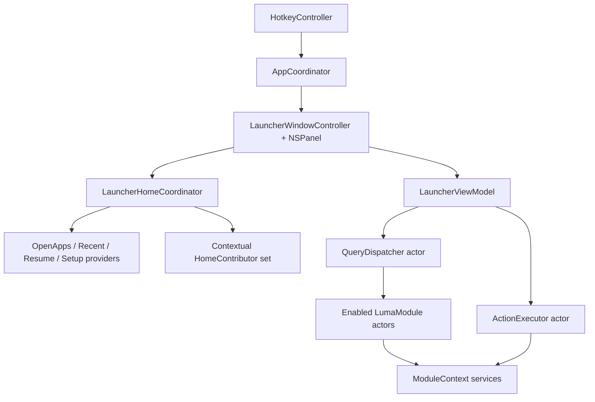

# Architecture

## Shape

Luma is a single native macOS app with a pre-instantiated AppKit launcher panel, a timeout-protected query dispatcher, in-process actor modules, shared services, and local-first persistence in Application Support, UserDefaults, and Keychain.

## Layers

- `LumaApp`: app lifecycle, hotkey, launcher panel, unified list UI, view model.
- `LumaCore`: protocols, data models, home section model, query dispatch, ranking, action execution, persistence boundary.
- `LumaModules`: built-in modules.
- `LumaServices`: macOS/system service wrappers.
- `LumaInfrastructure`: logging, metrics, configuration.
- `Features`: human-readable feature specs and maintenance notes.
- `docs`: product and implementation guidance.

## Feature Modules

### Active (registered through `ModuleRegistry.allBundles`)

| Module | Default enabled | Query trigger | Notes |
| --- | --- | --- | --- |
| Apps | yes | root search | Open Apps home section |
| Clipboard | yes | `clip` / `clip <query>` / global search (3+ chars) | |
| Commands | no | built-in commands | Default off; enable in Settings → Modules |
| Notes | yes | `n` / `note` / `notes` | warmup index |
| Todo | yes | `t` / `t <task>` / `todo` | |
| Translate | yes | `tr <text>` / `translate <text>` | |
| Wordbook | yes | `word` / `word <query>` | |
| Snippets | yes | `s` / `snip` / exact trigger word | requires Accessibility for paste; typing a snippet trigger and pressing Return expands inline |
| Secrets | yes | `sec` / `secret` / `secrets` | |
| Records (`luma.media`) | no | `rec` / `record` / `log` / `m` / `media` | Default off; enable in Settings → Modules |
| Window Layouts | yes | `layout` / `win` / `wl` | requires Accessibility; command-only |
| Projects | yes | `proj` / `p` / `project` | config + warmup index; no per-query disk scan |
| Quicklinks | yes | exact triggers + `ql` | |
| Menu Bar Search | yes | `mb` / `menu` | requires Accessibility |
| Kill Process | yes | `kill` / `quit` / `k` | |
| Browser Tabs | no | `tab` / `tabs` | Default off; requires Automation per browser |

`FeatureCatalog.moduleDetailMetadata()` supplies detail-header chrome only under Route C; it is not the home-screen entry model.

Module bundle registration is the single built-in module manifest surface. Each `*ModuleBundle` owns manifest forwarding, warmup tier, command definitions, feature-card metadata, optional detail presentation, and module construction. `BuiltInModules.makeAll()` and `BuiltInCommandRegistry` derive from `ModuleRegistry`; adding a module should only require the module folder, the bundle entry in `ModuleRegistry.allBundles`, an optional detail factory, and focused tests.

### Deferred (source retained, excluded from `makeAll()`)

- **Windows** — window focus list via CGWindow / Accessibility (distinct from Window Layouts presets).

### Accessibility-dependent when active

`BuiltInModules.accessibilityDependentModuleIDs`: Snippets (paste), Window Layouts (move focused window), Menu Bar Search (AX menu traversal). The deferred Windows module is also in this set but is not registered at launch. Permission banner surfaces when an active module requires AX and trust is missing.

### Module persistence (selected)

| Module | Store path |
| --- | --- |
| Projects | `~/Library/Application Support/Luma/projects.json` |
| Snippets | `~/Library/Application Support/Luma/snippets.json` |
| Clipboard | Application Support (history store) |
| Apps | Application Support (index cache) |

## Data Flow

1. Global hotkey fires.
2. `LauncherWindowController` shows the already-created panel and focuses the search field.
3. `LauncherViewModel` converts text input into `Query` values with monotonic sequence numbers (12 ms debounce).
4. `QueryDispatcher` fans out to enabled modules with per-module timeouts.
5. Module results are merged, ranked, truncated, and emitted progressively.
6. UI applies row-level diffs and preserves selection by `ResultID`.
7. Return triggers `ActionExecutor`, panel dismisses immediately, and usage is recorded asynchronously.
8. Esc: close action panel → detail → home → clear search → close panel.

## Home List Flow (Route C)

1. Empty query: `LauncherHomeCoordinator` aggregates Open Apps and Suggested sections.
2. Non-empty query: `QueryDispatcher` results render as a flat list (max 8 rows).
3. Tab / ⌘K opens `LauncherActionPanel` for primary and secondary actions.
4. Module detail entry: trigger keyword → result row → Return (or contextual suggestion).
5. Some command-style modules, including Wordbook, first surface a starter row whose primary action opens in-panel detail.
6. `FeatureCatalog.moduleDetailMetadata()` supplies detail header chrome only.
7. **Snippet trigger expansion**: if the raw query exactly matches a snippet's `trigger` field (case-insensitive) and the `CommandRouter` classifies it as a global search, Return expands and pastes the snippet inline without opening detail.

Contextual suggestions are composed from `HomeContributor` implementations:

- `ProjectHomeContributor` surfaces current project continue rows plus project Snippet / Quicklink / Commands create actions.
- `ClipboardHomeContributor` surfaces clipboard transforms, note capture, snippet draft, and URL-to-Quicklink draft rows.
- `SelectionHomeContributor` surfaces selected-text translation.
- `ContinueHomeContributor` surfaces module continue rows such as daily note, Todo, Records, and Wordbook.

Cross-module creation uses narrow draft builders such as `ProjectContextSuggestions`, `SnippetDraft.fromClipboard`, and `QuicklinkDraftSource` instead of App-layer ad hoc model construction.

## Suggested Section Limits

The `ContextualHomeProvider` enforces a maximum of **2 continue-flow items** and **1 create item** (3 total) per Home render. This keeps the suggestion surface signal-dense rather than exhaustive. `HomeSuggestionMemory` further gates eligibility and adjusts priority based on recency and completion history.

## Ranking

`Ranker.score` applies four weighted factors: fuzzy match (0.45), recency (0.20), frequency (0.15), module base priority (0.10). Items whose title exactly matches the query receive an additive +0.30 boost, ensuring precise matches (e.g. an exact app name or snippet trigger) rank above near-matches from other modules.

## Warmup Strategy

`ModuleHost` tracks warmup state per module. `ConfigurationStore.pinnedModuleIDs()` controls which enabled modules are kept hot at startup; Settings → Modules lets users pin or unpin modules from the hot path. The default policy is `eagerPinnedOnly`:

1. Register modules from `ModuleRegistry.allBundles`.
2. Apply the enabled-module set.
3. Warm `pinned ∩ enabled` with a 1-second per-module budget.
4. Mark the launcher ready.
5. If `warmupPolicy == eagerAllEnabled`, warm the remaining enabled modules in the background.

Queries and detail opens call `warmupIfNeeded`, so on-demand modules are warmed only when the user targets them. When the launcher hides, `AppCoordinator` schedules `ModuleHost.teardownIdleModules` after a short delay; reopening the panel cancels that task, and pinned modules are not torn down.

## Boundary Rules

- Modules may import Core and Services, but never Launcher.
- Launcher may use Core, but never reach directly into a concrete module (uses `ModuleDetailRegistry` + callbacks).
- Core does not depend on AppKit views.
- Services wrap system APIs; modules consume services through `ModuleContext`.
- Shared mutable state lives in actors.
