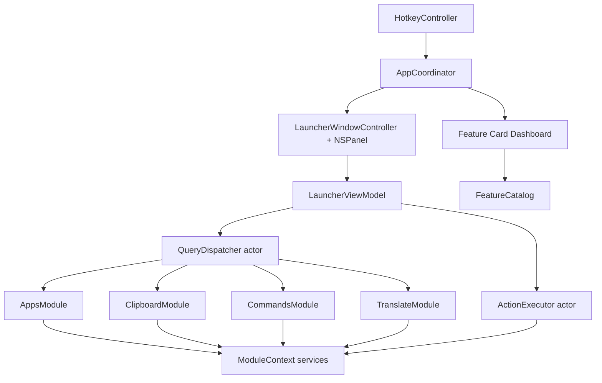

# Architecture

## Shape

Luma is a single native macOS app with a pre-instantiated AppKit dashboard launcher panel, a timeout-protected query dispatcher, in-process actor modules, shared services, and local-first persistence in Application Support, UserDefaults, and Keychain.

## Layers

- `LumaApp`: app lifecycle, hotkey, launcher panel, dashboard, card views, view model.
- `LumaCore`: protocols, data models, feature card model, query dispatch, ranking, action execution, persistence boundary.
- `LumaModules`: built-in modules.
- `LumaServices`: macOS/system service wrappers.
- `LumaInfrastructure`: logging, metrics, configuration.
- `Features`: human-readable feature specs and maintenance notes.
- `docs`: product and implementation guidance.

## Feature Modules

### Active (registered at launch)

- **Translate:** typed translation with Apple Translation / Shortcuts fallback; dashboard detail + `tr`/`translate` queries.
- **Clipboard History:** local clipboard search/history with sensitive filtering, pin, and metadata.
- **Apps:** app search and launch (sidebar + query dispatch).
- **Commands:** built-in app commands such as reload and quit.

### Deferred (source retained, not in active dashboard/warmup)

- Calculator, Windows, Secrets Vault, Window Layouts, Notes Graph, Wordbook, Todo.

## Data Flow

1. Global hotkey fires.
2. `LauncherWindowController` shows the already-created panel and focuses `QueryField`.
3. `LauncherViewModel` converts text input into `Query` values with monotonic sequence numbers.
4. `QueryDispatcher` fans out to enabled modules with per-module timeouts.
5. Module results are merged, ranked, truncated, and emitted progressively.
6. UI applies row-level diffs and preserves selection by `ResultID`.
7. Return triggers `ActionExecutor`, panel dismisses immediately, and usage is recorded asynchronously.

## Card Flow

1. `FeatureCatalog.dashboardCoreCards()` provides the active **Translate + Clipboard** dashboard card descriptors.
2. `CardLayoutStore` reads persisted card layout by `ModuleIdentifier`.
3. Card activation opens a same-panel detail view where the module has registered one.
4. Drag/reorder editing remains a product polish item unless the current code path explicitly implements it.

## Boundary Rules

- Modules may import Core and Services, but never Launcher.
- Launcher may use Core, but never reach directly into a concrete module.
- Core does not depend on AppKit views.
- Services wrap system APIs; modules consume services through `ModuleContext`.
- Shared mutable state lives in actors.
