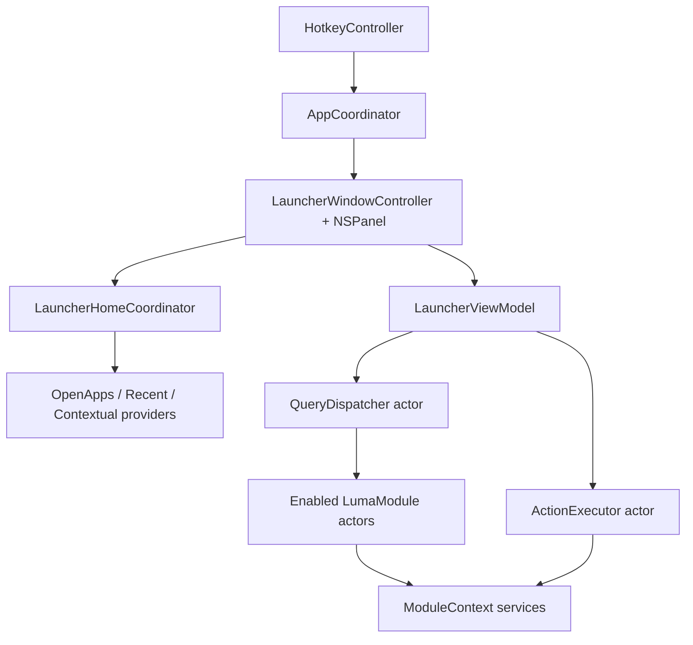

# Architecture

## Shape

Luma is a single native macOS app with a pre-instantiated AppKit launcher panel, a timeout-protected query dispatcher, in-process actor modules, shared services, and local-first persistence in Application Support, UserDefaults, and Keychain.

## Layers

- `LumaApp`: app lifecycle, hotkey, launcher panel, unified list UI, view model.
- `LumaCore`: protocols, data models, home section model, query dispatch, ranking, action execution, persistence boundary.
- `LumaModules`: built-in modules.
- `LumaServices`: macOS/system service wrappers.
- `LumaInfrastructure`: logging, metrics, configuration.
- `Features`: human-readable feature specs and maintenance notes.
- `docs`: product and implementation guidance.

## Feature Modules

### Active (registered at launch via `BuiltInModules.makeAll()`)

| Module | Default enabled | Query trigger | Notes |
| --- | --- | --- | --- |
| Apps | yes | root search | Open Apps home section |
| Clipboard | yes | `clip` / `clip <query>` | |
| Commands | no | built-in commands | |
| Notes | yes | `note` / `note <query>` | warmup index |
| Todo | yes | `t` / `t <task>` / `todo` | |
| Translate | yes | `tr <text>` / `translate <text>` | |
| Wordbook | yes | `word` / `word <query>` | |
| Snippets | yes | `s` / `snip` | requires Accessibility for paste |
| Secrets | yes | `secret` / `secrets` | |
| Media | no | `m` / `media` | |
| Window Layouts | yes | `layout` / `win` / `wl` | requires Accessibility; command-only |
| Projects | yes | `proj` / `p` / `project` | config + warmup index; no per-query disk scan |

`FeatureCatalog.dashboardCoreCards()` remains for detail-header metadata only under Route C; it is not the home-screen entry model.

### Deferred (source retained, excluded from `makeAll()`)

- **Windows** — window focus list via CGWindow / Accessibility (distinct from Window Layouts presets).

### Accessibility-dependent when active

`BuiltInModules.accessibilityDependentModuleIDs`: Snippets (paste), Window Layouts (move focused window). Permission banner surfaces when an active module requires AX and trust is missing.

### Module persistence (selected)

| Module | Store path |
| --- | --- |
| Projects | `~/Library/Application Support/Luma/projects.json` |
| Snippets | `~/Library/Application Support/Luma/snippets.json` |
| Clipboard | Application Support (history store) |
| Apps | Application Support (index cache) |

## Data Flow

1. Global hotkey fires.
2. `LauncherWindowController` shows the already-created panel and focuses the search field.
3. `LauncherViewModel` converts text input into `Query` values with monotonic sequence numbers (12 ms debounce).
4. `QueryDispatcher` fans out to enabled modules with per-module timeouts.
5. Module results are merged, ranked, truncated, and emitted progressively.
6. UI applies row-level diffs and preserves selection by `ResultID`.
7. Return triggers `ActionExecutor`, panel dismisses immediately, and usage is recorded asynchronously.
8. Esc: close action panel → detail → home → clear search → close panel.

## Home List Flow (Route C)

1. Empty query: `LauncherHomeCoordinator` aggregates Open Apps, Suggested, and Recent sections.
2. Non-empty query: `QueryDispatcher` results render as a flat list (max 8 rows).
3. Tab / ⌘K opens `LauncherActionPanel` for primary and secondary actions.
4. Module detail entry: trigger keyword → result row → Return (or contextual suggestion).
5. `FeatureCatalog.dashboardCoreCards()` remains for detail header metadata only.

## Boundary Rules

- Modules may import Core and Services, but never Launcher.
- Launcher may use Core, but never reach directly into a concrete module (uses `ModuleDetailRegistry` + callbacks).
- Core does not depend on AppKit views.
- Services wrap system APIs; modules consume services through `ModuleContext`.
- Shared mutable state lives in actors.
