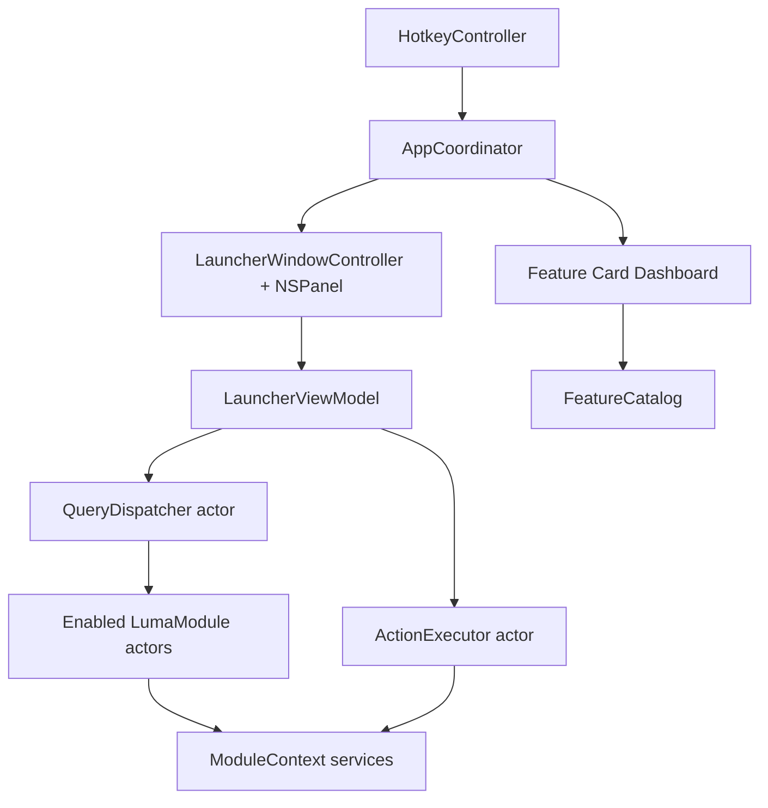

# Architecture

## Shape

Luma is a single native macOS app with a pre-instantiated AppKit dashboard launcher panel, a timeout-protected query dispatcher, in-process actor modules, shared services, and local-first persistence in Application Support, UserDefaults, and Keychain.

## Layers

- `LumaApp`: app lifecycle, hotkey, launcher panel, dashboard, card views, view model.
- `LumaCore`: protocols, data models, feature card model, query dispatch, ranking, action execution, persistence boundary.
- `LumaModules`: built-in modules.
- `LumaServices`: macOS/system service wrappers.
- `LumaInfrastructure`: logging, metrics, configuration.
- `Features`: human-readable feature specs and maintenance notes.
- `docs`: product and implementation guidance.

## Feature Modules

### Active (registered at launch via `BuiltInModules.makeAll()`)

| Module | Default enabled | Dashboard card | Query trigger |
| --- | --- | --- | --- |
| Apps | yes | — (open-apps sidebar) | root search |
| Clipboard | yes | yes | `clip` / `clip <query>` |
| Commands | no | — | built-in commands |
| Notes | yes | yes | `note` / `note <query>` |
| Todo | yes | yes | `t` / `t <task>` / `todo` |
| Events | no | — | `e` / `event` |
| Translate | yes | yes | `tr <text>` / `translate <text>` |
| Wordbook | yes | yes | `word` / `word <query>` |
| Snippets | yes | yes | `s` / `snip` |
| Secrets | yes | yes | `secret` / `secrets` |
| Media | no | — | `m` / `media` |

### Deferred (source retained, excluded from `makeAll()`)

- **Calculator** — stub query handler; detail view exists but unreachable.
- **Windows** — window focus via Accessibility.

### Orphan (source only, not registered)

- **Window Layouts** — `WindowLayoutsModule` exists but is not wired into `BuiltInModules`.

## Data Flow

1. Global hotkey fires.
2. `LauncherWindowController` shows the already-created panel and focuses the search field.
3. `LauncherViewModel` converts text input into `Query` values with monotonic sequence numbers (12 ms debounce).
4. `QueryDispatcher` fans out to enabled modules with per-module timeouts.
5. Module results are merged, ranked, truncated, and emitted progressively.
6. UI applies row-level diffs and preserves selection by `ResultID`.
7. Return triggers `ActionExecutor`, panel dismisses immediately, and usage is recorded asynchronously.
8. Esc: detail → home → clear search → close panel.

## Card Flow

1. `FeatureCatalog.dashboardCoreCards()` provides seven dashboard card descriptors (Translate, Clipboard, Notes, Todo, Wordbook, Snippets, Secrets).
2. `CardLayoutStore` reads persisted card layout by `ModuleIdentifier`.
3. Card activation opens a same-panel detail view where the module has registered one via `ModuleDetailRegistry`.
4. Card badges show Wordbook/Todo due counts when non-zero.

## Boundary Rules

- Modules may import Core and Services, but never Launcher.
- Launcher may use Core, but never reach directly into a concrete module (uses `ModuleDetailRegistry` + callbacks).
- Core does not depend on AppKit views.
- Services wrap system APIs; modules consume services through `ModuleContext`.
- Shared mutable state lives in actors.
