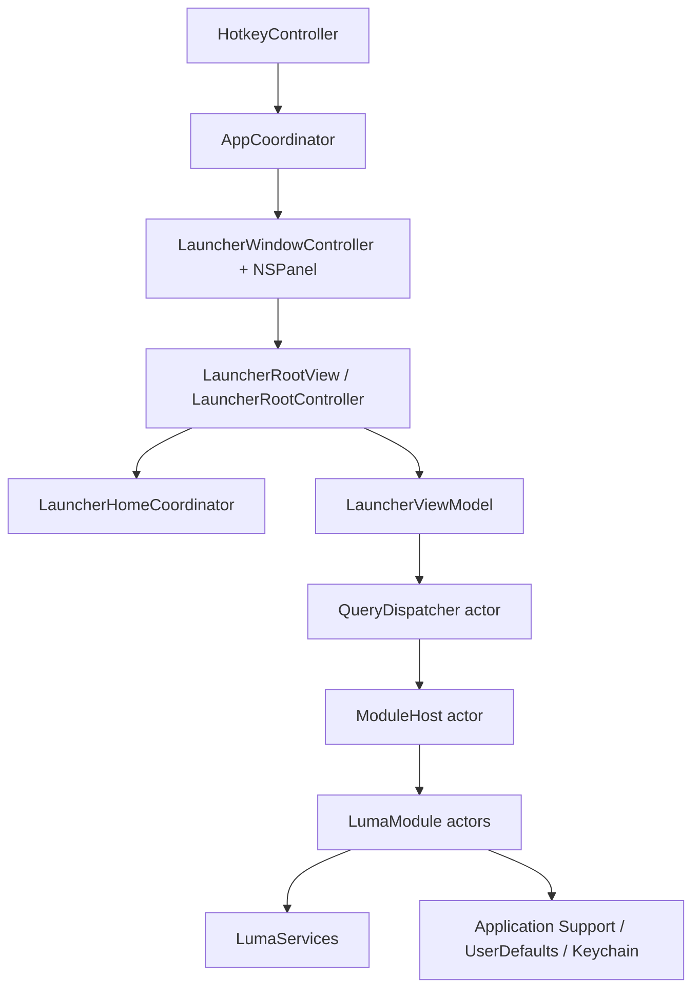

# Luma Engineering Handbook

This is the primary engineering source of truth for Luma. It replaces the older split across PRD, architecture, specs, roadmap, non-goals, and integration notes.

## Product Shape

Luma is a personal, local-first macOS launcher for one keyboard-heavy developer.

- Native Swift 6 + AppKit primary UI.
- Default hotkey: Command+Space.
- Active UI route: Route C, command-first unified launcher.
- Empty-query home: Open Apps in the left column; command guide or module detail in the right column.
- Non-empty query: single result list, capped and stable.
- Module details stay in the launcher panel.
- Settings may use SwiftUI; launcher hot path stays AppKit.
- Current stage: finish, connect, and stabilize existing workflows. Do not add new product surface area by default.

## Architecture



Layer ownership:

| Layer | Owns | Must not own |
| --- | --- | --- |
| `LumaApp` | App lifecycle, AppKit launcher, detail views, hotkey, settings | Module business logic |
| `LumaCore` | Protocols, models, query, ranking, actions, persistence helpers, design tokens | AppKit detail implementations |
| `LumaModules` | Built-in module actors, module stores/indexes, module actions | Launcher view hierarchy |
| `LumaServices` | System API wrappers for AX, CGWindow, EventKit, Keychain, AppleScript, processes | Product routing |
| `LumaInfrastructure` | Logging, metrics, configuration | User-facing flows |

Module detail views read shared module instances through `ModuleDetailRegistry` in `LumaApp`. Modules do not import or call the registry. Deprecated bridge APIs should not be used for new code.

## Launcher Contract

Home and panel behavior are frozen unless a new decision in `docs/DECISIONS.md` supersedes this section.

Home:

- Empty home shows only Open Apps on the left and a compact module guide on the right.
- Module detail replaces the guide on the right; Open Apps remains visible.
- The guide is read-only, not a second navigable list.
- Do not add setup rows, recent rows, project rows, create rows, dashboard cards, or suggestion sections to home.
- Open Apps lists regular running apps, excludes Luma itself, and may show child window rows for multi-window apps.
- Empty Open Apps column distinguishes cache warming (`module.warming`) from a completed refresh with no running apps (`home.openApps.empty`).
- Background Open Apps cache changes must not repaint the visible home list while the panel is open.
- Showing the launcher must not rebuild Open Apps for the first visible frame.

Panel:

- Default geometry: 940 x 760 pt.
- Responsive bounds: 720-980 pt wide, 640-820 pt high.
- Presentation screen is the screen with the active app, menu-bar context, key window, or cursor fallback.
- Show/hide may fade alpha; avoid geometry animation.
- Set frame atomically before ordering the panel front.
- Full-width content hosts must not use their own layer-backed root that changes anchor-point behavior. Put layer-backed chrome inside child views.
- Overlay hit testing is disabled during list/detail cross-fades.
- Text, buttons, table rows, and toolbars must not resize the panel or cause horizontal drift.

Show/hide generation guards (Swift 6):

- `LauncherPanelVisibilitySession` in LumaCore backs `LauncherWindowController` show/hide tokens.
- `show()` calls `cancelPanelHideAnimation()` before ordering front (cancels `panelHideTask`, clears `panel.animations`, zero-duration alpha reset) so rapid show during fade does not leave the panel transparent.
- `finishHide(generationAtHide:)` calls `shouldCompleteHide` before `orderOut`; `hideImmediatelyForAction` uses the same guard.
- Deferred show work (`focusSearchFieldAfterShow`, permission polling, `restoreLastSessionIfNeeded`) uses `shouldCompleteDeferredShow`.
- `CancellationGeneration` backs `LauncherRootController.restoreGeneration`; `cancelPendingRestore()` bumps on hide; async restore apply calls `isCurrent`.
- `cancelLauncherAsyncWork()` cancels in-flight query dispatch, snapshot apply, home refresh, permission refresh, workbench preview, action panel, and detail presentation generation, and invalidates split cross-fade completions (with detail-close tearDown fallback when a guide cross-fade was in flight). It does **not** change `isPanelActiveForQueryApply` or emit session panel events.
- `cancelActiveQueryAndSnapshotApply()` (panel hide only) calls `cancelLauncherAsyncWork()` then sets `isPanelActiveForQueryApply = false` and applies `panelHideBegan` when the panel is visible or showing. `cancelAllLauncherWork()` is a hide-path alias. Detail UI state is preserved across ordinary hide; show re-enables apply via `activatePanelForQueryApply()`.
- `handleModulesDisabled(removed:)` calls `cancelLauncherAsyncWork()` only (not the hide path), then evicts detail modules and invalidates caches while the panel may remain visible and query apply stays active.
- `LauncherSnapshotApplyPolicy` gates `apply(snapshot:)` while the panel is inactive or the visible query is empty (dropped applies increment `snapshot.applyDropped`).
- Detail search mode is owned by `LauncherSearchDetailMode` via `LumaSearchBar` (`LauncherSearchDetailModeState`); chrome exit uses `LauncherDetailExitPlanner`, typing exit uses `cancelDetailMode`.
- Per-keystroke routing uses `QueryView` (event snapshot from `searchBar.stringValue`); permission banner routes from the live search field, not a stale normalized snapshot.
- `LauncherContentMode` in `LauncherContentCoordinator` is the single source for home/results/detail presentation.
- Notes detail tree reload uses `NotesDetailRefreshGate` generation guards; stale async refresh must not write outline UI after deactivate/hide/close.
- Cmd+Space: Carbon hotkey shows when hidden only (`showFromCarbonHotkey`); visible panel hide is `LauncherPanel.performKeyEquivalent` → `hideFromVisibleHotkey`. Show/hide use separate debounce clocks so a visible Carbon no-op cannot block hide; `toggle()` keeps its own debounce.
- `LauncherSnapshotApplyCoalescer.cancel()` runs on hide via `cancelPendingRestore()` and `cancelActiveQueryAndSnapshotApply()`.
- Cmd+Space: Carbon hotkey when hidden; `LauncherPanel.performKeyEquivalent` when visible (`guard isVisible`). No duplicate handlers in search field or list view.

Keyboard:

| Key | Behavior |
| --- | --- |
| Esc | Action panel -> detail/results/home -> close |
| Return | Primary action for selected row |
| Command+Return | First secondary action |
| Tab or Command+K | Open action panel; close it when already open |
| Shift+Tab | Close action panel when open |
| Command+1...9 | Jump to result/action index where the active surface allows it |
| Arrow keys | Move list selection unless detail subview owns navigation |

In module detail, the search field is read-only and shows an "In <Module> -- Esc to go back" placeholder. Every detail exit path must restore search editability.

## Query And Module Contract

Modules implement `LumaModule`. Concrete modules should be actors unless stateless.

Required semantics:

- `manifest`: static metadata.
- `warmup`: load indexes and caches; soft budget 1 second.
- `handle`: answer from memory only; no disk, network, AppleScript, AX traversal, process enumeration, or large JSON parsing. Cold caches return warming/degraded/permission rows and schedule background refresh; explicit refresh/doctor commands may do heavier work.
- `perform`: execute actions; soft budget 2 seconds via `ActionExecutor`.
- `teardown`: cancel background work and flush state.

Query rules:

- Global search requires at least 2 characters unless a command prefix is used.
- Bare commands open module detail or return a starter row as documented in `docs/MODULES.md`.
- Prefix search uses the selected module only.
- On-demand modules do not participate in global search unless explicitly documented.
- Disabled or permission-blocked modules return diagnostic rows, not silent empty results.
- Result IDs must be stable.
- Query tasks are cancelled on every new keystroke.
- Targeted cold modules may emit a warming or refreshing informational row.

Action rules:

- Panel hides before external actions complete.
- In-panel intents may keep the panel visible.
- Destructive persistent actions require confirmation or an undo/status path.
- Failures must surface a short status or diagnostic row.

## Performance Contract

Budgets:

| Metric | p95 target | Hard ceiling |
| --- | ---: | ---: |
| Hotkey -> interactive panel | 50 ms | 80 ms |
| Hotkey -> home painted | 50 ms | 80 ms |
| Keystroke -> first ranked paint | 30 ms | 60 ms |
| Module `handle` | Module timeout | 80 ms |
| Panel hide after action | 20 ms | 40 ms |

Hot path rules:

- Panel is pre-instantiated at app launch.
- Hotkey show reuses the already-rendered launcher/home UI.
- Empty persisted-session restore is a no-op for home rendering.
- Stale-while-revalidate is the default for slow system surfaces.
- Global search uses tiered fan-out: fast modules (apps, quicklinks, kill-process, snippets) run first; deferred modules follow after a short yield.
- Global search fan-out is limited to **contributing** modules (`apps`, `quicklinks`, `clipboard`); other hot-path modules return empty for unprefixed queries and are not scheduled.
- Progressive global snapshots are coalesced to at most one emit per 16 ms frame, with a forced final snapshot when dispatch completes.
- UI snapshot apply uses the same 16 ms coalescer in `LauncherRootController` so progressive query results do not repaint faster than one frame.
- Repeat global queries may paint from `QuerySnapshotCache` immediately (stale-while-revalidate); cache hits return cached rows then revalidate in a background task bound to the query sequence. Only **secrets** and **snippets** are excluded from query cache (clipboard may appear in cached global snapshots).
- Session search-query persistence is debounced (~400 ms); keystrokes do not write UserDefaults synchronously.
- Non-empty query input skips split-layout work unless home/detail/results layout state may have changed.
- Workbench command preview reads `PanelSignalsCache` (2 s TTL); selection fetch is lazy except for attach/capture commands.
- Detail views reuse pooled instances; `activate(generation:)` skips redundant reloads when content generation is unchanged.
- Pooled detail views keep their view hierarchy in `detailContainer` when reopening the same module; `closeDetail` hides rather than removing pooled subviews.
- Returning from detail paints cached home first, then revalidates Open Apps in the background.
- Open Apps refresh is bound to panel visibility; hidden panel must not grow `openApps.refresh` counters.
- `LauncherPerfCounters` and `LauncherDurationRecorder` in `LumaCore` track layout, session, snapshot, module warmup/handle, action perform, and panel-hide durations for tests. `DiagnosticsExport` writes redacted local JSON to `~/Library/Logs/Luma/diagnostics.json`; trigger via `cmd export-diagnostics` (`HostClient.exportDiagnostics`, includes `CrashLogBuffer` breadcrumbs + latency p95).
- `SelectionSnapshotService` may capture the frontmost PID on MainActor; AX IPC runs off-main.
- Browser Tabs must not await AppleScript on the keystroke path.
- Kill Process must not do process memory sampling on MainActor.
- Notes and Projects must query memory indexes, not scan disk.
- Menu Bar Search must query a cache, not traverse AX per keystroke.

Warmup:

- Pinned modules warm after startup.
- On-demand modules warm when targeted or opened.
- Warmup timeouts must not mark a module warm when the warmup did not complete.
- Fire-and-forget cache refreshes must still show a clear cold-cache state if the user queries before data arrives.

Memory:

- Idle teardown after hide should release on-demand module resources.
- Reserved modules and pinned modules are not torn down while they are expected to stay hot.
- Large stores should cap retained history and avoid loading unbounded data into detail views.

## Data And Privacy

Persistence:

- Application Support: JSON stores and module data.
- UserDefaults: lightweight settings.
- Keychain: secret values.
- EventKit: Todo reminders.
- Markdown files: Notes canonical content.

Privacy:

- No cloud sync, account, telemetry server, updater infrastructure, or public plugin marketplace in v1.
- Clipboard history has hard source/type/size/age filters.
- Secrets values are never exposed in global search.
- Browser Tabs is default-off because AppleScript and Automation prompts are sensitive.
- Accessibility permission is lazy: show the banner only on AX-dependent surfaces or after the user interacts with Open Apps window controls.

## Notes Format

Notes is a Markdown workspace manager, not an in-app editor.

- Markdown files and folders are the canonical store.
- `notes.json` is a local root/config/index helper, not the note database.
- Luma may read frontmatter, filenames, tags, wiki links, backlinks, and diagnostics.
- Typora or `NSWorkspace.open` owns editing/rendering.
- No proprietary note format, SQLite vault, multi-vault sync product, AI writing surface, or Obsidian-style graph product in v1.

`NotesRootConfig` schema v1 remains readable for at least three years. New fields should be optional; existing fields must not be repurposed.

## Non-Goals

- Cross-platform support.
- Electron, Tauri, or WebView primary UI.
- Public plugin API or plugin marketplace.
- Cloud sync, account system, analytics, or telemetry server.
- General theming beyond system light/dark.
- Dashboard home, home widgets, onboarding home, or home suggestion rows.
- Full-panel module detail that hides Open Apps on empty query.
- First-class note editor/renderer.
- Obsidian clone, required graph, or AI notes product.
- Notion-style Luma-owned todo database. Todo is EventKit pass-through.
- Full password manager, TOTP, browser autofill, or website-login vault.
- Media metadata enrichment, posters, streaming integration, social/discovery, or episode-level TV tracking.
- Kill Process daemon management or raw signal UI.

## Repo Map

```text
Sources/
  LumaApp/              App lifecycle, AppKit launcher, hotkey, settings
  LumaCore/             Protocols, models, query, actions, ranking, persistence, design tokens
  LumaModules/          Built-in modules and module stores/indexes
  LumaServices/         System API wrappers
  LumaInfrastructure/   Logging, metrics, configuration
Tests/
  LumaCoreTests/
  LumaModulesTests/
  LumaInfrastructureTests/
  LumaServicesTests/
docs/
  ENGINEERING.md        Current architecture, constraints, performance, non-goals
  MODULES.md            Current user-visible module behavior
  DECISIONS.md          Compact decision log
  QA.md                 Testing, manual QA, release
```

## Change Checklist

Before changing launcher home, panel layout, keyboard routing, module contracts, or hot-path behavior:

- Update this handbook and `docs/MODULES.md` if user-visible behavior changes.
- Add or update tests near the touched layer.
- Run `swift test` and `scripts/scan_appkit_executor_risk.sh`.
- For UI changes, run `./scripts/build_app.sh` and the relevant manual QA checks in `docs/QA.md`.
- AppKit `NSView` subclasses: follow `docs/swift6-appkit-boundaries.md` (`@preconcurrency import AppKit`, `nonisolated override`, no selector-based `NotificationCenter` observers).
- Do not revive deleted historical behavior unless `docs/DECISIONS.md` records the new decision.
