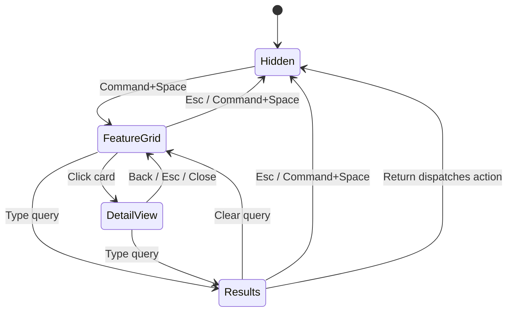

# Dashboard Widget Strategy

Status: alternative implementation route  
Date: 2026-06-22  
Source: Opus dashboard implementation guidance, consolidated for project docs

## Purpose

This document captures the implementation plan for the route where Luma remains a single-window experience:

> Launcher + dashboard in one panel, with module detail views opened in the same panel.

This route conflicts with `LAUNCHER_CONVERGENCE_STRATEGY.md`, which recommends pure launcher convergence. Use this document when the product decision is to keep the dashboard/widget direction despite the higher UI and maintenance cost.

The primary risk of this route is complexity: compared with a pure launcher, the UI state space is larger by roughly 50%. The mitigation is strict visual specs, a small card set, and clear state transitions.

## Product Shape

The panel contains:

1. A fixed top search bar.
2. A left sidebar showing open/running apps.
3. A main content area that switches among:
   - widget-style feature grid
   - search result list
   - module detail view

The target visual direction is iOS/macOS liquid glass plus widget-style feature icons.

## Panel Specification

| Item | Value |
| --- | --- |
| Size | 860 x 540 pt fixed |
| Corner radius | 20 pt continuous |
| Outer padding | 20 pt |
| Shadow | `NSPanel.hasShadow = true` |
| Position | Horizontally centered; panel top around 28% below visibleFrame maxY |
| Background | Liquid glass stack |

## Liquid Glass Stack

Use four layers:

1. `NSVisualEffectView`
2. top highlight gradient
3. 1 pt inner border
4. default panel shadow

| Layer | Type | Spec |
| --- | --- | --- |
| Blur | `NSVisualEffectView` | `material = .underWindowBackground`, `blendingMode = .behindWindow`, `state = .active` |
| Top highlight | `CAGradientLayer` | white alpha 0.18 -> 0.0, locations 0.0 / 0.35 |
| Inner border | `CALayer.borderWidth` | 1 pt, white alpha 0.18 |
| Shadow | `NSPanel` | default shadow only |

Do not use `.hudWindow`; it disappears on light desktops.

## Layout

```text
+----------------------------------------------------------+
|  Search                                                  | 52 pt
+------------------+---------------------------------------+
|                  |                                       |
|  OPEN APPS       |          Feature Grid / Results        |
|  180 pt fixed    |          / Module Detail               |
|                  |                                       |
+------------------+---------------------------------------+
```

Rules:

- Sidebar width: 180 pt fixed.
- Main content area fills remaining width.
- Search bar always remains visible.
- Sidebar always remains visible.
- Results list overlays/replaces the feature grid when query is non-empty.
- Module detail replaces the main content area, not the whole panel.

## Search Bar

| Item | Value |
| --- | --- |
| Height | 52 pt |
| Placeholder | `Search` |
| Font | 20 pt regular |
| Left icon | SF Symbol `magnifyingglass`, 16 pt medium |
| Icon left padding | 18 pt |
| Icon/text gap | 10 pt |
| Control | custom `NSView` + `NSTextField`; avoid `NSSearchField` focus chrome |
| Border | none |

## Sidebar: Open Apps

| Item | Value |
| --- | --- |
| Width | 180 pt |
| Header | `OPEN APPS`, 11 pt semibold uppercase secondary |
| Row height | 40 pt |
| Row icon | real app icon, 24 x 24, 5.4 pt corner radius |
| Row label | 13 pt medium |
| Row gap | 2 pt |
| Separator | right 1 pt separator alpha 0.25 |
| Max visible | 10 apps, scroll beyond |

Sidebar order should use app activation frecency:

```text
score = recency_score * 0.6 + frequency_score * 0.4
recency_score = exp(-(now - lastUsed) / 3600)
frequency_score = log(1 + activationCount) / log(1 + 50)
```

Data file:

```text
~/Library/Application Support/Luma/app-activations.json
```

Record activations through `NSWorkspace.didActivateApplicationNotification`.

## Feature Grid

Feature grid cards are iOS-widget-style controls.

| Item | Value |
| --- | --- |
| Card size | 120 x 120 pt |
| Columns | 4 |
| Row/column gap | 16 pt |
| Card radius | 27 pt continuous |
| Icon | SF Symbol, 48 pt, white |
| Title | 13 pt semibold, white |
| Title bottom padding | 14 pt |
| Hotkey badge | top-right `Command+1`...`Command+6`, 10 pt medium, white alpha 0.7 |
| Hover | scale 1.04, 120 ms easeOut |
| Pressed | scale 0.96, 60 ms |
| Shadow | none |

Recommended maximum: 8 cards. More than 8 creates visual overload.

### Card Gradients

| Module | Top | Bottom | Symbol |
| --- | --- | --- | --- |
| Translate | `#5AC8FA` | `#0A84FF` | `character.bubble.fill` |
| Clipboard | `#FF9F0A` | `#FF6B00` | `doc.on.clipboard.fill` |
| Calculator | `#5856D6` | `#3634A3` | `function` |
| Windows | `#30D158` | `#248A3D` | `macwindow` |
| Notes, if retained | `#FFCC02` | `#FFA000` | `note.text` |
| Wordbook, if retained | `#FF375F` | `#D70015` | `text.book.closed` |

## Search Results

When the query is non-empty:

- Feature grid alpha -> 0.
- Results list alpha -> 1.
- Both occupy the same content area.

| Item | Value |
| --- | --- |
| Row height | 56 pt |
| Row radius | 12 pt |
| Row padding | 14 pt left/right |
| Icon | 36 x 36, 8 pt radius |
| Title | 15 pt medium |
| Subtitle | 12 pt regular secondary |
| Title/subtitle gap | 2 pt |
| Selected background | accent color alpha 0.22 |
| Unselected background | clear |
| Return hint | selected row only, `↩`, 13 pt medium tertiary |
| Visible rows | 6, scroll beyond |

Selection changes must be instant, no animation.

## Module Detail In Same Panel

Clicking a feature card opens its detail view in the main content area.

```text
+------------------+---------------------------------------+
|                  |  < Back       Translate          x     | 40 pt
|  OPEN APPS       +---------------------------------------+
|                  |                                       |
|                  |        Module detail content           |
|                  |                                       |
+------------------+---------------------------------------+
```

Detail top bar:

- Left: SF Symbol `chevron.left` + `Back`.
- Center: module name, 15 pt semibold.
- Right: SF Symbol `xmark`.
- Height: 40 pt.
- Bottom separator: 1 pt.

Detail content:

- 16 pt inner padding.
- 4 pt accent strip at top.
- `NSScrollView` for overflow.

Navigation:

- Card click -> detail view.
- Back/Esc/x -> feature grid.
- Sidebar remains visible.
- Search bar remains visible.

## State Model



Important difference from the pure launcher route: Esc is contextual here. In detail view it goes back; in grid/results it closes.

## Design Tokens

Only use these spacing values:

```text
4, 8, 12, 16, 20
```

Typography:

| Use | Font |
| --- | --- |
| Section headers | 11 pt semibold uppercase |
| Sidebar rows / card titles | 13 pt medium |
| Result row titles | 15 pt medium |
| Search field | 20 pt regular |
| Detail major titles | 24 pt semibold |

Semantic colors only for text and controls:

- `.labelColor`
- `.secondaryLabelColor`
- `.tertiaryLabelColor`
- `.separatorColor`
- `.controlAccentColor`
- `.quaternaryLabelColor`

Use hex colors only for feature-card gradients.

## Animation

| Scenario | Duration | Timing |
| --- | ---: | --- |
| Panel show | 120 ms | easeOut |
| Panel hide | 100 ms | easeInOut |
| Grid -> detail | 128 ms | easeOut |
| Detail -> grid | 128 ms | easeOut |
| Selection change | 0 ms | none |
| Hover scale | 120 ms | easeOut |
| Press scale | 60 ms | easeOut |
| Results list show | 80 ms | easeOut |

## Risk Controls

- Do not exceed 8 feature cards.
- Do not add decorative shadows to cards.
- Do not hide sidebar in detail state.
- Do not hide search bar in detail state.
- Do not accumulate multiple result/grid/detail regions on screen.
- Do not leave debug HUD in the production panel.

