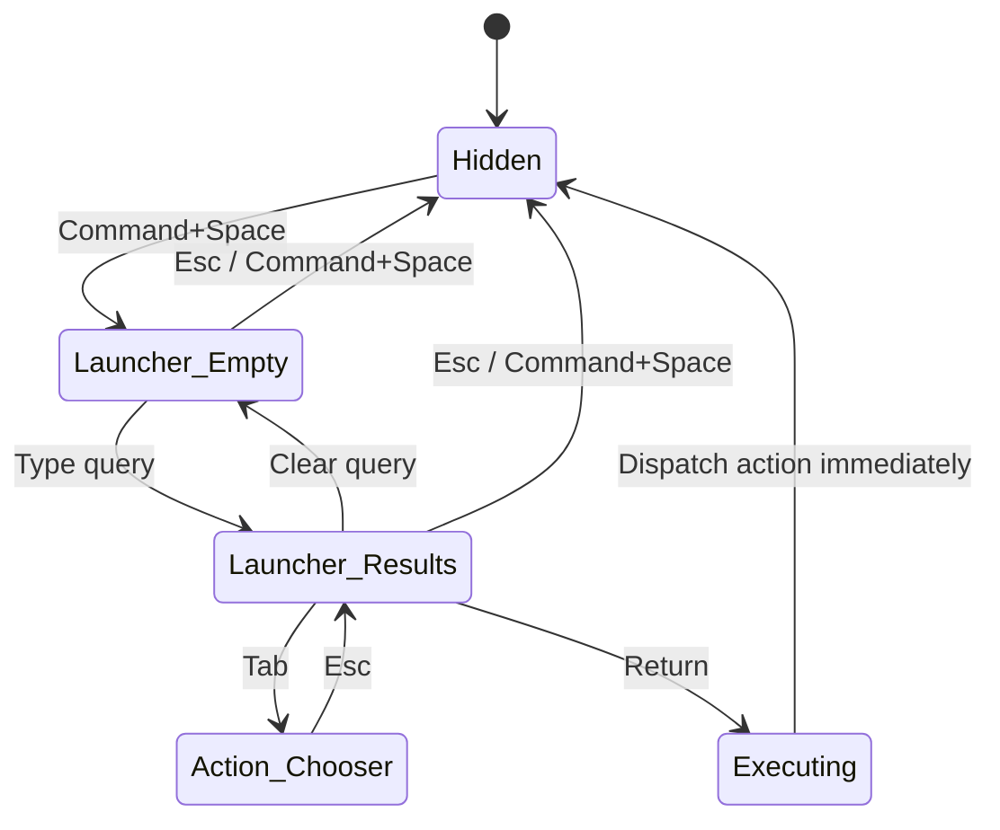
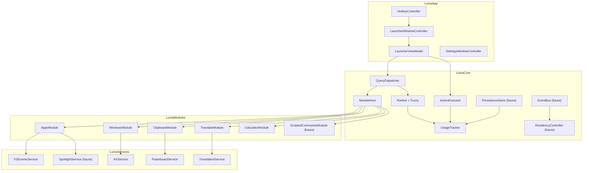

# Luma Launcher Convergence Strategy

Status: active strategic recommendation  
Date: 2026-06-22  
Source: Opus strategic review, consolidated for implementation

## Executive Decision

Luma should converge back to a pure, keyboard-first macOS launcher before it grows further as a dashboard or personal workbench.

The recommended product route is:

> Command+Space -> type -> ranked results -> action. Fast every time.

The strongest strategic criticism is that Luma currently tries to be too many products at once: Spotlight replacement, Raycast-style command center, dashboard, notes graph, wordbook, secrets vault, and window manager. That breadth creates product drift and makes the main launcher experience worse.

The near-term goal is not to add more modules. The goal is to make the launcher path feel good enough that the user is willing to hand Command+Space fully to Luma.

## Product Boundary

Luma's durable value is not replacing every productivity tool. Its durable value is becoming the fastest personal command entrance for the user's actual habits.

| Neighbor | Their strength | Luma boundary |
| --- | --- | --- |
| Spotlight | System search and indexing | Do not rebuild file indexing. Use system facilities when needed. |
| Raycast | Extension ecosystem and polished command rows | Borrow command/action UX, not marketplace scope. |
| Alfred | Workflow automation | Do not build a visual workflow editor. |
| Quicksilver | Object-action model | Keep and deepen ResultItem -> Action semantics. |
| Hammerspoon | Lua automation platform | Do not become a scripting runtime. |
| Obsidian | Vault, backlinks, graph, editing | Do not become a notes app. At most open/search files. |
| Rectangle/Magnet | Window layout | Do not rebuild tiling. At most expose focus and external commands. |
| 1Password/Keychain | Secret management | Avoid first-class password manager scope. |
| LaunchBar | Strict keyboard workflow | Borrow keyboard discipline. |

## Recommended Route

### Route A: Pure Launcher

This is the recommended route.

- Shape: one small launcher panel, no dashboard.
- Scope: App Search, Window Focus, Clipboard History, Translate, Frecency Recents, Quick Calculator.
- Engineering cost: medium.
- Maintenance cost: low.
- Personal utility: high because it is used dozens of times per day.

### Route B: Personal Command Center

- Shape: launcher plus module pages and management surfaces.
- Engineering cost: high.
- Maintenance cost: medium.
- Decision: possible later, only after Route A is excellent.

### Route C: Personal OS Layer

- Shape: command center plus plugin runtime, automation, scripts, and public extensibility.
- Engineering cost: very high.
- Maintenance cost: high.
- Decision: not appropriate for v1.

## Core Feature Set

Keep the mainline focused on these six features:

1. App Search / Launcher
2. Window Focus
3. Clipboard History
4. Translate
5. Frecency Recent Items
6. Quick Calculator

These should be optimized as one coherent launcher experience rather than separate dashboard cards.

## Scope To Remove Or Defer

The strategy recommends removing the following from the v1 launcher path:

| Scope | Strategic reason | Recommended handling |
| --- | --- | --- |
| Dashboard Cards | They split the product between dashboard and launcher. | Remove from launcher panel. |
| Notes Graph | Rebuilds Obsidian poorly. | Defer. Replace with thin file opener only if needed. |
| Wordbook | A separate learning product, not launcher core. | Keep `wordbot` separate or build a separate app. |
| Secrets Vault | Drifts toward password manager scope. | Defer or keep behind explicit experimental flag. |
| Window Layout | Rectangle/Magnet already solve this. | Prefer external command/hotkey integration. |
| Plugin Marketplace | Too much ABI/runtime maintenance for one person. | Do not build in v1. |

Important implementation note: this document is a strategic recommendation. Existing code can be retained temporarily behind disabled modules while the launcher converges, but it should not shape the primary UX.

## Launcher UX Model

The launcher panel should have only two primary states:

1. Empty query: show recents and frequent items from real usage.
2. Non-empty query: show ranked results.

No feature dashboard, no card grid, no in-panel detail pages.



### Empty Query Layout

The first screen should be dense and quiet:

```text
+------------------------------------------------------+
|  Search                                              |
+------------------------------------------------------+
|  RECENTS                                             |
|  Safari                         2 min ago       Ret  |
|  Visual Studio Code             5 min ago       Ret  |
|  Slack                         12 min ago       Ret  |
|                                                      |
|  FREQUENT                                            |
|  Terminal                       78 times        Ret  |
|  Calculator                     54 times        Ret  |
+------------------------------------------------------+
```

Rules:

- Fixed 6-8 visible rows.
- Search field at top.
- Results start immediately below.
- Recents must come from `PersistentUsageTracker` and `UsageResultCache`, not decorative placeholders.

### Keyboard Model

| Key | Behavior |
| --- | --- |
| Command+Space | Toggle launcher. |
| Esc | Close launcher. If action chooser is open, close chooser first. |
| Up / Down | Move selection. |
| Return | Run selected primary action. |
| Command+Return | Run first secondary action. |
| Tab | Open action chooser overlay. |
| Command+1...9 | Run nth visible result. |
| Command+, | Open Settings. |
| Command+C | Copy selected result title or primary value where safe. |
| Command+Backspace | Clear query. |

Mouse should remain secondary: click executes, right-click opens actions, hover should not steal keyboard selection.

## Visual Direction

Design principle: native, calm, fast.

| Element | Spec |
| --- | --- |
| Panel size | 720 x 440 pt fixed for v0.1. |
| Panel corner radius | 14 pt. |
| Row corner radius | 10 pt. |
| Button radius | 8 pt. |
| Material | Prefer `NSVisualEffectView.Material.popover`; avoid heavy custom chrome. |
| Border | 1 pt separator color at low opacity. |
| Shadow | Use default panel shadow. |
| Spacing scale | 4 / 8 / 12 / 16 / 24. |
| Search font | 22 pt regular. |
| Result title | 14 pt medium. |
| Subtitle | 12 pt regular secondary. |
| Group title | 11 pt semibold uppercase secondary. |
| Icons | SF Symbols, 24 pt in result rows. |
| Selection changes | No animation. Keyboard cadence matters. |
| Panel show/hide | 120 ms or less. |

Details such as Settings, Clipboard Browser, and Translation Result should be separate windows, never detail pages inside the launcher panel.

## Architecture Direction

Keep:

- `LumaApp`, `LumaCore`, `LumaModules`, `LumaServices`, `LumaInfrastructure` target split.
- `LumaModule` protocol.
- `QueryDispatcher` fan-out with per-module timeout.
- `ActionExecutor` actor.
- `ResultItem` and `Action` data model.

Add when justified:

- `PersistenceStore`: a single namespaced persistence boundary for JSON now, SQLite later.
- `EventBus`: lightweight events for usage, config changes, memory pressure, and module lifecycle.
- `ResidencyController`: Tier 1/2/3 module residency and warmup policy.
- `SpotlightService`: wrapper around system search facilities.
- `ScriptedCommandsModule`: YAML-defined shell/AppleScript/Shortcut commands, as an alternative to plugins.

Avoid:

- XPC until plugin isolation is genuinely needed.
- JavaScript/Lua runtime in v1.
- Public plugin API in the first year.
- SQLite until JSON data crosses clear thresholds.



## Performance Targets

| Metric | p50 | p95 | p99 | Hard failure |
| --- | ---: | ---: | ---: | ---: |
| Command+Space -> interactive panel | 20 ms | 50 ms | 100 ms | 200 ms |
| Keystroke -> first result paint, warm | 12 ms | 30 ms | 60 ms | 120 ms |
| Keystroke -> first result paint, cold | 30 ms | 80 ms | 150 ms | 300 ms |
| Return -> action dispatch | 1 ms | 5 ms | 16 ms | 33 ms |
| Return -> panel hidden | 1 ms | 5 ms | 16 ms | 33 ms |
| Idle memory | 60 MB | 80 MB | 100 MB | 150 MB |
| Active memory | 100 MB | 150 MB | 200 MB | 300 MB |

Any change that pushes warm keystroke p95 above 30 ms should be treated as a regression.

## Persistence And Safety

Use JSON until data size justifies SQLite.

SQLite migration triggers:

- Any single persistence file exceeds 50 MB.
- Total application data exceeds 100 MB.
- Any record set exceeds 100k records.

Recommended layout:

```text
~/Library/Application Support/Luma/
├── Configuration.json
├── Usage/
│   └── usage-records.json
├── Clipboard/
│   └── history.json
├── Cache/
│   └── apps-index.json
└── Logs/
    └── luma-YYYY-MM-DD.log
```

Safety rules:

- Do not log user content.
- Keep OSLog values private unless they are metadata.
- Clipboard filters should prefer UTI/type blocking over content inspection.
- Corrupt JSON should be renamed to `.corrupted` and rebuilt.
- Permissions errors should appear inline as actionable rows, not alerts.

## Competitive Lessons

| Source | Borrow | Avoid |
| --- | --- | --- |
| Spotlight | Instant feedback, system search integration. | Suggestion clutter. |
| Raycast | Clean result rows, action chooser. | Marketplace, telemetry, cloud scope. |
| Quicksilver | Object -> action model. | Old icon-grid interaction. |
| LaunchBar | Strict keyboard semantics. | Dated visual language. |
| Alfred | Some command/action discipline. | Visual workflow editor. |
| Obsidian | Local-first files. | Graph and backlink app scope. |
| Hammerspoon | Respect automation power users. | Becoming a Lua platform. |
| ueli/Cerebro/Zazu | Cautionary examples. | Electron launcher baseline cost. |

## Strategic Rule

Before adding any new module, ask:

> Is this one of the core six launcher functions?

If no, do not add it to the launcher path. Add it as an external tool, separate app, scripted command, or deferred experiment.

