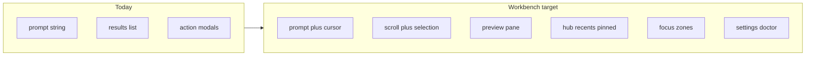

# Backlog

Living optimization queue for Luma as a **personal, long-running TUI workbench**.

**Doc split**

| Doc | Role |
| --- | --- |
| [MODULES.md](./MODULES.md) | Capability **status** (what works today) |
| [adr/](./adr/) | **Decisions** (why) |
| This file | Optimization **queue** (what next) — checkbox progress |

**Product constraints:** long-running personal TUI ([ADR-0001](./adr/0001-rust-tui-product-shape.md)); agent deferred ([ADR-0002](./adr/0002-defer-luma-agent.md)).

**State-model pain (today):** UI state still centers on “one search + one action.”  
**Target:** a stayable, browsable, restorable personal workspace.

## North star (UX)

Modern daily-driver habits — personal project, but open-and-use, little need for help:

1. **Input is first-class** — cursor editing, clear-line shortcuts, Ctrl chords close to terminal norms.
2. **Selection has visible consequence** — selecting a row shows detail; destructive work always confirms and is Esc-cancellable.
3. **Discoverability** — empty states offer entry points; footer hints follow the route; commands are findable (not only `:doctor` by memory).
4. **Consistency** — one path per intent (quit confirm, layered cancel, Tab semantics that do not fight focus).
5. **Honest failure** — permission / not configured / warming use plain language + next step; never a silent empty list.
6. **Restorable** — recents / pinned / last context (the “personal” in personal workbench).
7. **Felt performance** — typing stays responsive; search is cancellable; first paint before warmup finishes.

Items that fight these rules (destructive defaults, silent failures) must not be marked Done.

## How to use this doc

- Finish an item: check the box → update [MODULES.md](./MODULES.md) when capability status changes → add an ADR when the product boundary changes.
- Keep **Now** to **3–5** parallel themes so this stays a queue, not a wish list.
- Park new ideas in **Later**. Promote to **Next** / **Now** only with clear **user value** and **dependencies**.
- Prefer implementing from **Now**; after Done, promote the next dependency-ready item from **Next**.

## Now

TUI workbench foundation (daily-driver friction first):

- [ ] Prompt editing model: `cursor` + Left/Right/Home/End, mid-string insert/delete, `Ctrl-u` / `Ctrl-w`
- [ ] List navigation: `PgUp` / `PgDn`; ActionPicker digit keys `1`–`9`
- [ ] Quit consistency: empty-prompt `Esc` and `Ctrl-C` both go through `QuitConfirm`
- [ ] Route-aware footer hints (include ↑↓ Enter primary path)

## Next

Depends on solid selection / scroll:

- [ ] Persist list scroll in `ResultsView`; keep selection in viewport
- [ ] Adaptive preview pane (auto-hide when narrow): v1 projects title / subtitle / actions / risk only; Notes / Clipboard get `LoadPreview` later
- [ ] Move Actions off `Tab` to `Ctrl-k`; then introduce focus zones (prompt / list / preview)
- [ ] Empty-state Hub: module entry points + pinned; then query history (`Ctrl-p`/`Ctrl-n` for history while prompt focused; ↑↓ always move the list)

## Later

- [ ] Settings route (wire existing `GetSettings` / `UpdateSettings`)
- [ ] Scrollable Doctor panel (not a fixed-height JSON dump overlay)
- [ ] Command palette (`:` / command mode coexisting with type-to-search)
- [ ] Projects / Notes browse drill-down
- [ ] Manifest workbench display metadata: icon override, empty copy, suggested queries, preview / browse capability
- [ ] Module depth and architecture / quality items below (promote when Now/Next have room)

## Tracks (detail)

### TUI workbench

**Foundation (Now)**

- [ ] Prompt: store cursor index; map keys in `luma-tui` (`app.rs` → `Msg` → `reducer.rs`); render caret in `render.rs`
- [ ] `PgUp` / `PgDn` for results; ActionPicker `1`–`9` runs / selects corresponding action
- [ ] Empty-prompt `Esc` → `QuitConfirm` (same as `Ctrl-C`); do not set `should_quit` immediately
- [ ] Footer hints per `Route` include navigation + primary action + quit

**Workbench shell (Next)**

- [ ] `ResultsView` owns scroll offset; selection changes adjust scroll; render reads state (no divergent scroll math only in render)
- [ ] Preview pane beside results when width allows; v1 content from existing `SearchItem` fields only
- [ ] Protocol/effect path for `LoadPreview(result_id)` when Notes / Clipboard need body text (avoid stuffing large bodies into search chunks)
- [ ] Remap Actions: `Ctrl-k` opens action list; free `Tab` (or later use for focus cycling)
- [ ] Focus zones: prompt / list / preview; hints and key routing respect focus
- [ ] Hub empty state: module triggers + pinned rows; not only “Type to search” tips
- [ ] Query history: `Ctrl-p` / `Ctrl-n` while prompt focused; ↑↓ remain list selection

**Workbench depth (Later)**

- [ ] `Route::Settings` + TUI editing for module enable and key settings
- [ ] Doctor: dedicated scrollable surface + structured summary, not raw `to_string()` only
- [ ] Command palette entry for doctor / settings / modules / theme
- [ ] Browse / drill-down UX for Projects and Notes
- [ ] Extend `ModuleManifest` (or projection DTO) with workbench display fields; stop hardcoding empty-state copy in render

**Primary code (when implementing):** `rust/crates/luma-tui/src/{app,msg,reducer,view_model,render,theme}.rs`; preview loading later touches `luma-protocol` / `luma-domain` / application ports.

### Modules depth

Prefer high-frequency daily modules; keep gated modules honest.

- [ ] **Notes** — on-demand body preview; Hub discoverability for Inbox / daily / today
- [ ] **Clipboard** — full-text preview; pins visible from Hub; keep sensitive-suppression messaging honest
- [ ] **Projects** — shallow → drill-down browse (not only open)
- [ ] **Apps / Snippets / Quicklinks** — richer detail surface + empty-state suggested queries
- [ ] **Todo / Secrets / Kill** — permission / gated guidance; never look “finished” when unavailable

### Architecture / ports

Support long-term module growth without a brittle crate graph.

- [ ] Extract remaining ports (Accessibility, OpenPath, AppsCatalog, stores, …); modules depend on ports, not platform/storage concrete types
- [ ] Per-module fallible factory; one module failure must not take down the shell
- [ ] First paint, then parallel warmup (session usable before all modules Ready)
- [ ] Registry / manifest-driven routing and TUI display metadata (joins TUI workbench Later)

### Quality / safety

Easy to use also means predictable and testable.

- [ ] PTY / TUI soak coverage; cancel awaits work as documented
- [ ] Side-effect isolation in tests (no focus steal, no real pasteboard mutation in CI/soak defaults)
- [ ] Confirm / Destructive contract tests; primary action must not silently fall back to “first action”
- [ ] CI quality gates (`cargo-deny` and related) enabled and kept green as the repo already configures them

## Done

Recent completions land here (roll or trim as needed). Newest first.

_None yet for this backlog file — start checking boxes in **Now**._
