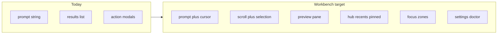

# Backlog

Living optimization queue for Luma as a **personal, long-running TUI workbench**.

**Doc split**

| Doc | Role |
| --- | --- |
| [MODULES.md](./MODULES.md) | Capability **status** (what works today) |
| [adr/](./adr/) | **Decisions** (why) |
| This file | Optimization **queue** (what next) — checkbox progress |

**Product constraints:** long-running personal TUI ([ADR-0001](./adr/0001-rust-tui-product-shape.md)); agent deferred ([ADR-0002](./adr/0002-defer-luma-agent.md)).

**State-model pain (today):** UI state still centers on “one search + one action.”  
**Target:** a stayable, browsable, restorable personal workspace.

## North star (UX)

Modern daily-driver habits — personal project, but open-and-use, little need for help:

1. **Input is first-class** — cursor editing, clear-line shortcuts, Ctrl chords close to terminal norms.
2. **Selection has visible consequence** — selecting a row shows detail; destructive work always confirms and is Esc-cancellable.
3. **Discoverability** — empty states offer entry points; footer hints follow the route; commands are findable (not only `:doctor` by memory).
4. **Consistency** — one path per intent (quit confirm, layered cancel, Tab semantics that do not fight focus).
5. **Honest failure** — permission / not configured / warming use plain language + next step; never a silent empty list.
6. **Restorable** — recents / pinned / last context (the “personal” in personal workbench).
7. **Felt performance** — typing stays responsive; search is cancellable; first paint before warmup finishes.

Items that fight these rules (destructive defaults, silent failures) must not be marked Done.

## How to use this doc

- Finish an item: check the box → update [MODULES.md](./MODULES.md) when capability status changes → add an ADR when the product boundary changes.
- Keep **Now** to **3–5** parallel themes so this stays a queue, not a wish list.
- Park new ideas in **Later**. Promote to **Next** / **Now** only with clear **user value** and **dependencies**.
- Prefer implementing from **Now**; after Done, promote the next dependency-ready item from **Next**.

## Now

Architecture / quality (promoted):

- [ ] Module depth polish and architecture / quality items in Tracks
- [ ] Parallel warmup / fallible module factory (Architecture track)

## Next

_(Promote from Tracks when Now has room.)_

## Later

_(Park new ideas here before promoting.)_

## Tracks (detail)

### TUI workbench

**Foundation (Now)** — done 2026-07-13

- [x] Prompt: store cursor index; map keys in `luma-tui` (`app.rs` → `Msg` → `reducer.rs`); render caret in `render.rs`
- [x] `PgUp` / `PgDn` for results; ActionPicker `1`–`9` runs / selects corresponding action
- [x] Empty-prompt `Esc` → `QuitConfirm` (same as `Ctrl-C`); do not set `should_quit` immediately
- [x] Footer hints per `Route` include navigation + primary action + quit

**Workbench shell (Now)** — done 2026-07-13

- [x] `ResultsView` owns scroll offset; selection changes adjust scroll; render reads state
- [x] Preview pane beside results when width ≥ 100; v1 content from existing `SearchItem` fields
- [x] Remap Actions: `Ctrl-k` opens action list; `Tab` cycles focus
- [x] Focus zones: prompt / list / preview
- [x] Hub empty state: module triggers (pinned deferred — needs pin projection)
- [x] Query history: `Ctrl-p` / `Ctrl-n` while prompt focused; ↑↓ remain list selection

**Workbench depth (Now)** — partial 2026-07-13

- [x] `Route::Settings` + GetSettings / Space toggle via UpdateSettings (persisted)
- [x] Scrollable Doctor panel (↑↓ / PgUp/Dn, pretty JSON)
- [x] Command palette (`Ctrl-/`, `:commands`, `:settings`)
- [x] Protocol/effect `LoadPreview(result_id, preview_id)` for Notes / Clipboard bodies
- [x] Browse / drill-down UX for Projects and Notes (`proj browse`, `n browse`, Enter on directory)
- [x] Extend `ModuleManifest.workbench` + `ModuleInfoDto` display fields; Hub uses suggested_query
- [x] Hub pinned rows via `LoadHub` + ClipboardModule::hub_pins

### Modules depth

Prefer high-frequency daily modules; keep gated modules honest.

- [x] **Notes** — on-demand body preview; Hub discoverability for Inbox / daily / today
- [x] **Clipboard** — full-text preview; pins visible from Hub; keep sensitive-suppression messaging honest
- [x] **Projects** — shallow → drill-down browse (not only open)
- [ ] **Apps / Snippets / Quicklinks** — richer detail surface + empty-state suggested queries
- [ ] **Todo / Secrets / Kill** — permission / gated guidance; never look “finished” when unavailable

### Architecture / ports

Support long-term module growth without a brittle crate graph.

- [ ] Extract remaining ports (Accessibility, OpenPath, AppsCatalog, stores, …); modules depend on ports, not platform/storage concrete types
- [ ] Per-module fallible factory; one module failure must not take down the shell
- [ ] First paint, then parallel warmup (session usable before all modules Ready)
- [ ] Registry / manifest-driven routing and TUI display metadata (joins TUI workbench Later)

### Quality / safety

Easy to use also means predictable and testable.

- [ ] PTY / TUI soak coverage; cancel awaits work as documented
- [ ] Side-effect isolation in tests (no focus steal, no real pasteboard mutation in CI/soak defaults)
- [ ] Confirm / Destructive contract tests; primary action must not silently fall back to “first action”
- [ ] CI quality gates (`cargo-deny` and related) enabled and kept green as the repo already configures them

## Done

Recent completions land here (roll or trim as needed). Newest first.

- [x] 2026-07-13 — Review fixes: path containment, preview generation, settings persist, hub pin select
- [x] 2026-07-13 — Projects/Notes browse drill-down; WorkbenchMeta + Hub pins (LoadHub / clipboard pins)
- [x] 2026-07-13 — `LoadPreview` protocol + Notes file body / Clipboard text in preview pane
- [x] 2026-07-13 — Settings route, scrollable Doctor, command palette (Ctrl-/ / :settings / :commands)
- [x] 2026-07-13 — Workbench shell: persisted scroll, adaptive preview (≥100 cols), Ctrl-k actions, Tab focus zones, module Hub, query history Ctrl-p/n
- [x] 2026-07-13 — TUI foundation: prompt cursor editing (`Ctrl-u`/`Ctrl-w`, arrows/Home/End), `PgUp`/`PgDn`, ActionPicker `1`–`9`, empty `Esc` → `QuitConfirm`, route-aware footer hints
- [x] 2026-07-13 — Living backlog doc + MODULES cross-link
